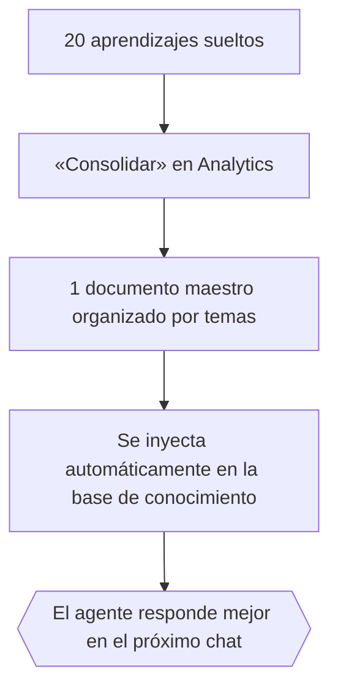

# 6. Analytics y Consumo de la Plataforma

> **Versión documentada:** v5.20.13 · **Última revisión:** 2026-05-29

> Un agente de IA no es algo que «configurás y te olvidás». Es más parecido a un empleado nuevo que necesita seguimiento, retroalimentación y mejora continua. Senda te da todas las herramientas para medir, optimizar y demostrar valor — a nivel de chat, de agente, y de automatización.

---

## Las 4 Dimensiones de la Medición en Senda

| Dimensión | ¿Qué mide? | ¿Dónde se ve? |
|---|---|---|
| **Consumo** | Tokens, modelos, costo por función | AI Admin → Dashboard |
| **Actividad** | Chats, agentes seleccionados, acciones ejecutadas | Analytics → Global |
| **Calidad** | Efectividad, aprendizajes, etiquetas por conversación | Analytics → Por Agente |
| **ROI de Automatizaciones** | Valor económico generado por schedules y observers | Mission Control → Panel 💰 |
| **Auditoría de Acciones** | Ejecuciones, payloads, respuestas técnicas y errores | Configuración → Auditoría de Acciones |

---

## 1. El Dashboard de AI Admin (Consumo)

### ¿Por qué un mensaje puede consumir miles de tokens?

Cuando el usuario envía un mensaje, Senda no envía solo ese mensaje al modelo. Envía un paquete completo:

```
Tokens de entrada =
  System Prompt del agente         (~200–500 tokens)
  + Perfil del usuario             (~50 tokens)
  + Documentos RAG recuperados     (~300–1.000 tokens)
  + Historial de la conversación   (~200–2.000 tokens)
  + Contexto de acción (si aplica) (~200–500 tokens)
  + Mensaje del usuario            (~20–100 tokens)
```

### ¿Cuántas llamadas a la IA genera un mensaje?

| Llamada | Propósito | Cuándo ocurre |
|---|---|---|
| **1. Router** | Qué agente atiende | Solo si aún no se asignó agente al chat |
| **2. Evaluador** | ¿El usuario quiere ejecutar una acción? | Si el agente tiene acciones activas |
| **3. Extractor** | Recopilar parámetros de la acción | Si el evaluador detectó intención de acción |
| **4. Respuesta** | La respuesta final al usuario | Siempre |

```
Chat simple (saludo):           1 llamada  
Chat con RAG:                   2 llamadas
Chat con acción ejecutada:      4 llamadas
```

### KPIs del Dashboard

| Métrica | Ideal | Señal de alerta |
|---|---|---|
| **Tokens/Chat promedio** | < 6.000 | > 10.000 → prompts muy largos o historial acumulado |
| **Tasa de Fallback** | < 5% | > 10% → problema con proveedor de IA principal |
| **Consumo por función** | `agent_response` dominante | `action_extractor` muy alto → muchas acciones activas innecesarias |

### Modelos de IA disponibles

| Modelo | Uso típico | Costo |
|---|---|---|
| GPT-4o | Respuestas complejas, acciones, análisis | 💰💰💰 Alto |
| GPT-4o-mini | Router, evaluaciones rápidas | 💰 Bajo |
| Llama-3.3-70B | Fallback cuando OpenAI no está disponible | 💰 Bajo (Workers AI) |

---

## 2. Analytics de Agentes (Calidad)

### Los 3 tipos de análisis por conversación

Para que funcionen, el agente debe tener configurados los prompts de analytics correspondientes (ver Manual Funcional, cap. 03 — Configurar Espacios y Agentes).

#### A) Aprendizajes

Senda analiza cada conversación y extrae lecciones que el agente puede usar en el futuro.

```
Ejemplos de aprendizajes reales extraídos:

📖 «Cuando los usuarios dicen "pantalla blanca", siempre se refieren
   al módulo de reportes FI/CO. La solución es limpiar caché.»

📖 «Los usuarios del sector Norte confunden Solicitud de Compra
   con Orden de Compra. Clarificar siempre la diferencia.»

📖 «El error ERR-405 = usuario sin permisos. Escalar a admin de SAP.»
```

**Cómo ejecutar el análisis:**
1. Analytics → Seleccionar espacio → Tipo: «Aprendizaje»
2. «Disparar Análisis»
3. Senda analiza conversaciones no procesadas y extrae insights

**Consolidación** — el ciclo de mejora real:


> 🚀 **La ventaja compuesta**: Un agente que lleva 6 meses con ciclos de consolidación mensuales tiene una base de conocimiento que ningún competidor puede replicar — porque está hecha de las conversaciones reales de ESE cliente.

#### B) Efectividad

Puntaje (1–100) que evalúa qué tan bien resolvió el agente cada conversación.

- **80–100**: Resolvió completamente, usuario satisfecho
- **50–79**: Resolvió parcialmente o con fricción
- **< 50**: No resolvió, usuario se fue sin respuesta

**Acciones según el puntaje:**

| Efectividad promedio | Causa probable | Acción |
|---|---|---|
| < 60 sistemáticamente | Falta documentación en el área | Agregar documentos específicos |
| Varía mucho entre conversaciones | Documentación inconsistente | Unificar y estandarizar documentación |
| Baja en un tema específico | Gap identificado | Crear FAQ o sección específica |
| Mejora al consolidar aprendizajes | Ciclo funcionando bien | Mantener la cadencia mensual |

#### C) Etiquetado

Categorización automática de cada conversación para encontrar patrones.

```
Conversación #1847: [«SAP», «Módulo FI/CO», «Error Técnico», «Ticket Generado»]
Conversación #1848: [«Salesforce», «Reportes», «Consulta Funcional», «Resuelto»]
Conversación #1849: [«RRHH», «Vacaciones», «Duda Política», «Derivado a Email»]
```

**Uso práctico:**
- Filtrar por «Ticket Generado» → ver volumen real de incidentes que Senda procesa
- Filtrar por «Error Técnico» → identificar sistemas con problemas recurrentes
- Filtrar por «No Resuelto» → encontrar gaps de conocimiento
- Top etiquetas del mes → saber qué temas tienen más demanda

---

## 3. ROI de Automatizaciones (Mission Control)

Esta es la dimensión más poderosa para la conversación con el cliente sobre renovación de contrato. Ver detalles completos en cap. 05.

### Resumen del cálculo

```
Valor mensual = Σ (valor_por_ejecución × ejecuciones_exitosas_del_mes)
Acumulado = Σ histórico
Proyección anual = valor mensual × 12
```

### Lo que el analista debe configurar desde el día 1

- Badge 💰 en cada schedule y observer
- Tipo de valor (tiempo / costo / ingreso) coherente con el proceso
- Etiqueta descriptiva legible («equivale a 3h de trabajo manual»)

---

## 4. Guía de Optimización

### Optimizar Costos (Tokens)

| Técnica | Cómo | Ahorro esperado |
|---|---|---|
| Acortar system prompts | Eliminar texto repetitivo | 10–20% |
| Documentos más enfocados | Dividir en archivos temáticos pequeños | 15–30% en RAG |
| Usar GPT-4o-mini para el router | Modelo más liviano para decisiones de routing | 50–70% en routing |
| Limitar historial largo | Crear chats nuevos para temas distintos | 20–40% en chats largos |
| Desactivar acciones innecesarias | Menos evaluadores activos | 10–15% |

### Optimizar el Router

| Síntoma | Causa | Solución |
|---|---|---|
| Siempre elige al Principal | Resúmenes de responsabilidades vacíos o genéricos | Reescribirlos con especificidad |
| Elige al agente incorrecto | Resúmenes solapados entre agentes | Diferencia de alcance más clara |
| Reroutea cada turno | El agente no se persiste en el historial | Verificar configuración de sesión |

### Optimizar Calidad de Respuestas

| Síntoma | Causa | Solución |
|---|---|---|
| Respuestas genéricas | Sin documentos relevantes | Subir documentación específica |
| Inventa información | El prompt no prohíbe inventar | Agregar regla explícita |
| Respuestas demasiado largas | El prompt no limita extensión | «Máximo 3 párrafos. Sé conciso.» |
| No usa la documentación | Documentos asignados al agente incorrecto | Verificar asignación |
| No escala cuando debe | El prompt no tiene instrucción de escalamiento | Agregar sección de escalamiento |

### Optimizar Acciones

| Síntoma | Causa | Solución |
|---|---|---|
| Ejecuta sin que el usuario pida | Threshold muy bajo | Subir a 80–85 |
| Nunca ejecuta | Threshold muy alto o descripción vaga | Bajar threshold y mejorar descripción |
| Pide datos que ya tiene | Directiva no indica usar historial | «Usá la información del historial» |
| Muchos turnos para recopilar datos | No usa Form Nodes | Configurar directiva con form_node |
| Falla al ejecutar | Error de endpoint o credenciales | Revisar logs en Mission Control |

### Auditoría de Acciones

La vista de **Auditoría de Acciones** permite revisar ejecuciones con mayor detalle que el historial resumido. Es la fuente principal para investigar por qué una acción falló, qué parámetros recibió, qué endpoint llamó y qué respondió el sistema externo.

Buenas prácticas:

1. Filtrar por `chat_id`, agente, acción o rango de fechas antes de investigar.
2. Revisar el payload enviado y confirmar que no haya parámetros vacíos o duplicados.
3. Validar que headers y credenciales aparezcan redactados.
4. Usar la respuesta técnica completa para diagnóstico, pero no copiarla al usuario final sin traducirla.
5. Si existe `response_directive`, verificar que la respuesta final del agente haya respetado esa instrucción.

---

## 5. Rutina del Analista: Ciclo de Monitoreo

### Cada semana

```
Lunes (10 min):
  ☐ Revisar Dashboard AI Admin
    → ¿Subieron los tokens? ¿Hay fallbacks inusuales?
  ☐ Revisar Historial de Mission Control
    → ¿Falló algún schedule u observer?
    → ¿Se acumularon errores consecutivos?

Miércoles (15 min):
  ☐ Ejecutar Análisis de Aprendizaje (si hay conversaciones nuevas)
  ☐ Revisar Etiquetas — ¿qué temas generan más consultas?

Viernes (15 min):
  ☐ Revisar Efectividad por Agente
    → ¿Hay agentes con puntaje < 60?
  ☐ Consolidar Aprendizajes (si hay 20+ acumulados)
  ☐ Actualizar documentación donde se detectaron gaps
```

### Cada mes

```
  ☐ Reporte de consumo de tokens al cliente
  ☐ Top 5 temas más consultados (vía etiquetas)
  ☐ Agentes con mejor y peor rendimiento
  ☐ Acciones más ejecutadas vs. más fallidas
  ☐ Exportar resumen de ROI de Mission Control para el cliente
  ☐ Propuesta de mejoras para el próximo mes
```

### Cada trimestre

```
  ☐ Revisión de arquitectura — ¿hay nuevos dominios que merecen un agente?
  ☐ Revisión de documentación — ¿hay manuales desactualizados?
  ☐ Revisar alertas de documentos desactualizados en la Base de Conocimiento
  ☐ Revisión de templates — ¿hay nuevas automatizaciones por activar?
  ☐ Presentación de ROI acumulado al sponsor del cliente
```

---

## Tablero de Estado Operacional (Health) — v5.6.46+

El **Tablero de Estado Operacional (Health)** es una herramienta esencial para que el administrador de IT supervise el estado de salud, rendimiento y colas del sistema en tiempo real. 

**Ruta:** AI Admin → **Health & Performance** (o desde la consola general → Monitoreo Operacional).

### ¿Qué se monitorea en este tablero?

1.  **Estado de las Colas de Ingesta (Document Ingestion Queues)**:
    *   Muestra el número de archivos en cola, procesándose y completados en segundo plano.
    *   Tasa de rendimiento de la cola de procesamiento en background (documentos indexados/minuto).
2.  **Estado de Conectividad con Modelos de IA (LLM Handshake & Latency)**:
    *   Tasa de ping y latencia (ms) de los proveedores principales (OpenAI, Cloudflare Workers AI).
    *   Tasa de errores de red o Rate Limits (HTTP 429) por proveedor.
3.  **Logs de Integraciones y Webhooks Activos**:
    *   Alertas tempranas de fallos consecutivos en endpoints externos.
    *   Supervisión de salud del EventBus interno.
4.  **Consumo de Memoria y Carga del Edge (Cloudflare Workers)**:
    *   Gráficos en tiempo real de uso de CPU, memoria de Workers y cuotas de base de datos D1.

---

## Export CSV: Exportar Datos para Auditoría y Análisis — v5.0.9+

Senda permite exportar dos tipos de datos en formato CSV directamente desde el panel de administración:

### 1. Historial de Conversaciones

Exporta el historial completo de chats con filtros de fecha y espacio.

**Quién puede exportar:** `r_admin`, `r_tenant_owner`, `r_security_officer`

**Campos del CSV:**
| Campo | Descripción |
|---|---|
| `chat_id` | Identificador de la conversación |
| `space_name` | Espacio donde ocurrió |
| `agent_name` | Agente que atendió |
| `user_email` | Email del usuario (si estaba logueado) |
| `started_at` | Fecha y hora de inicio |
| `message_count` | Número de mensajes del chat |
| `messages_json` | JSON con el historial de mensajes |

**Límite:** 50.000 filas por exportación (para evitar timeouts en exports históricos masivos)

### 2. Métricas de Uso

Exporta un CSV multi-sección con indicadores de rendimiento de la plataforma:

- Volumen de chats por período
- Ejecución de acciones (nombre, cantidad, tasa de éxito)
- Uso de AI por función (tokens, llamadas, costos estimados)

**Cuándo usar los exports:**

| Caso de uso | Tipo de export |
|---|---|
| Auditoría interna de conversaciones | Historial de Conversaciones |
| Reporte mensual al CFO de uso real | Métricas de Uso |
| Presentación de ROI con datos concretos | Métricas de Uso |
| Investigación de incidente (qué dijo el agente) | Historial de Conversaciones |
| Compliance / auditoría regulatoria | Ambos |

> **Nota de privacidad:** El export de conversaciones contiene datos de usuarios. Tratar con los mismos protocolos de seguridad que cualquier otro export de datos de empleados. No compartir externamente sin autorizar el DPA correspondiente.


---

## Alertas Proactivas de la Plataforma — v5.7.0+

A partir de v5.7.0, Senda genera **alertas automáticas** sobre condiciones que requieren atención del administrador. Estas alertas se generan sin intervención humana.

### Documentos Desactualizados

Senda revisa automáticamente una vez al día si hay documentos en la Base de Conocimiento que no se hayan actualizado en más de **180 días** (6 meses). Cuando detecta documentos antiguos, genera una alerta agrupada por agente.

| Campo | Valor |
|---|---|
| **Frecuencia de revisión** | Automática, 1 vez por día |
| **Umbral de antigüedad** | 180 días desde la carga del documento |
| **Agrupación** | Por agente (una alerta por agente con documentos antiguos) |
| **Severidad** | ⚠️ Warning |
| **Acción recomendada** | Revisar los documentos listados, actualizarlos o confirmar que siguen vigentes |

> ⚠️ **¿Por qué importa?** Un documento de hace 6+ meses puede contener procedimientos, políticas o datos que ya cambiaron. Si el agente responde con información desactualizada, pierde credibilidad ante los usuarios.

**Buenas prácticas:**
- Incorporar la revisión de alertas a la rutina mensual (ver ciclo de monitoreo arriba)
- Documentos que siguen vigentes pueden re-cargarse para resetear la fecha
- Considerar agregar la fecha de vigencia (`Vigencia: 2026-Q2`) en el encabezado de cada documento

---

## Analytics SQL Agent: Consultas en Lenguaje Natural (BETA)

> 🔖 **BETA** — Disponible desde v5.19.0. Protegido bajo flag `feature_conversational_analytics`.

El **Analytics SQL Agent** permite hacer preguntas sobre los datos de la plataforma **en lenguaje natural** y obtener respuestas con gráficos automáticos. En lugar de exportar CSVs y analizarlos en Excel, preguntás directamente: *"¿Cuáles son las 5 acciones más ejecutadas este mes?"* y Senda te responde con una tabla o gráfico.

### ¿Cómo funciona internamente?

El proceso tiene 4 etapas con múltiples capas de seguridad:

| Etapa | ¿Qué hace? | Seguridad |
|---|---|---|
| 1️⃣ **Generación SQL** | La IA traduce tu pregunta a una consulta SQL SELECT | Solo genera SELECT, nunca modificaciones |
| 2️⃣ **Validación** | Un gate de seguridad verifica que la consulta sea segura | Bloquea 14 palabras DML/DDL + inyecciones SQL |
| 3️⃣ **Ejecución** | Ejecuta la consulta contra vistas aisladas del tenant | Solo accede a vistas `v_analytics_*`, nunca a tablas reales |
| 4️⃣ **Presentación** | La IA formatea el resultado como respuesta + visualización | 6 tipos de presentación: tabla, barras, líneas, donut, KPIs, texto |

### Datos accesibles (vistas de solo lectura)

El agente solo puede consultar **3 vistas pre-definidas**, todas aisladas por tenant:

| Vista | Datos que contiene | Preguntas que responde |
|---|---|---|
| `v_analytics_conversations` | Conversaciones, título, grupo, usuario, estado, fecha | *"¿Cuántas conversaciones hubo este mes?"*, *"¿Qué grupos generan más consultas?"* |
| `v_analytics_actions` | Ejecuciones de acciones, estado, errores, tipo, carpeta | *"¿Cuáles acciones fallan más?"*, *"¿Cuántas acciones HTTP se ejecutaron esta semana?"* |
| `v_analytics_agents` | Agentes activos, resumen, grupo, cantidad de acciones | *"¿Qué agentes tienen más acciones?"*, *"¿Cuántos agentes activos hay?"* |

> ⚠️ **Seguridad crítica:** El agente **nunca** accede directamente a las tablas reales (`chats`, `agents`, `users`, `tenants`, `messages`). Solo trabaja con vistas de solo lectura que exponen campos no sensibles. El contenido de los mensajes y datos personales de usuarios no están disponibles.

### Tipos de visualización automática

La IA elige automáticamente la mejor forma de presentar los resultados:

| Tipo | Cuándo se usa | Ejemplo |
|---|---|---|
| 📊 `chart_bar` | Comparaciones entre categorías | Top 5 acciones por ejecuciones |
| 📈 `chart_line` | Tendencias temporales | Conversaciones por semana |
| 🍩 `chart_donut` | Proporciones | Distribución de acciones por tipo |
| 📝 `data_table` | Datos detallados | Lista de acciones fallidas con errores |
| 🎯 `kpi_cards` | Métricas clave | Total conversaciones, % resueltas, promedio diario |
| — `none` | Solo texto | Respuesta narrativa sin gráfico |

### Preguntas sugeridas para empezar

El panel ofrece 4 sugerencias rápidas:

- *"¿Cuáles son las top 5 acciones más ejecutadas?"*
- *"¿Cuántas conversaciones hubo por mes este año?"*
- *"¿Cuántos agentes activos tenemos?"*
- *"¿Cuál es el tiempo promedio entre acciones?"*

También podés escribir cualquier pregunta en lenguaje natural. La IA muestra la consulta SQL generada en un acordeón desplegable para transparencia.

### Límites y consideraciones

| Límite | Valor | Notas |
|---|---|---|
| Máximo de filas por consulta | 1.000 | Para proteger rendimiento |
| Tablas accesibles | Solo 3 vistas `v_analytics_*` | Nunca tablas reales |
| Operaciones permitidas | Solo `SELECT` | No INSERT/UPDATE/DELETE/DROP |
| Historial de sesión | Se mantiene durante la sesión | Podés hacer preguntas de seguimiento |

### Ruta en la plataforma

**Acceso:** Navegación principal → Analytics → SQL Agent (o directamente `/analytics`)

---

## Checklist del Capítulo

- [ ] ¿El Dashboard de Consumo se revisa semanalmente?
- [ ] ¿Hay un proceso para investigar conversaciones con puntaje de efectividad < 50?
- [ ] ¿Los reportes mensuales de ROI se envían al sponsor del proyecto?
- [ ] ¿Las exportaciones de conversaciones se manejan con los protocolos de privacidad adecuados?
- [ ] ¿Se monitorean los KPIs de tokens promedio, latencia P95 y tasa de fallback?
- [ ] ¿Los aprendizajes consolidados se revisan antes de inyectarse en la base de conocimiento?
- [ ] ¿Se revisan las alertas de documentos desactualizados (>180 días) cuando aparecen?
- [ ] ¿Conozco el Analytics SQL Agent y qué tipo de preguntas puedo hacerle?
- [ ] ¿Entiendo que solo accede a vistas de solo lectura, nunca a tablas reales?

---

> 📖 **Anterior:** [05 — Modelos de IA y Funciones IA](./05_modelos_y_funciones_ia.md)
> 📖 **Siguiente:** [07 — Modo Simple y Modo Enterprise](./07_modo_simple_y_enterprise.md)
