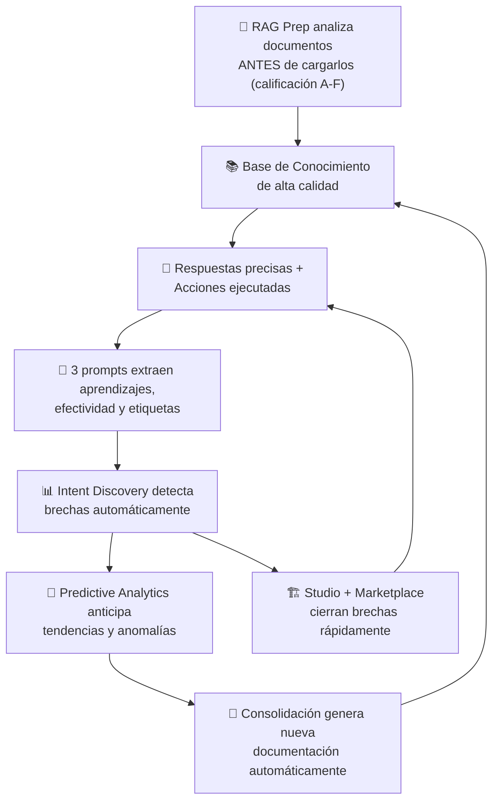

# ¿Qué es Senda? El Nuevo Paradigma de la IA Empresarial

> **Versión documentada:** v5.20.13 · **Última revisión:** 2026-05-29

---

## Antes de Empezar: El Error de Categoría

Cuando las empresas escuchan "inteligencia artificial" por primera vez, su mente va a ChatGPT. Eso genera un error de categoría que destruye implementaciones antes de que comiencen.

**ChatGPT, Copilot, Gemini y similares son herramientas de productividad personal.** Son increíblemente útiles para que un individuo redacte emails más rápido, resuma documentos o genere código. Pero tienen un límite estructural: son genéricas, no saben nada de tu empresa, no tienen acceso a tus sistemas, no pueden ejecutar operaciones y olvidan todo en cada sesión.

**Senda es una categoría completamente diferente.** Senda es una plataforma de orquestación de agentes de IA diseñada para operar dentro de la infraestructura de una empresa, con acceso a sus sistemas, con conocimiento de sus procesos, y con la capacidad de ejecutar tareas autónomamente.

Esta diferencia no es de grado. Es de especie.

---

## Senda No Es un Chatbot: Es una Categoría Nueva

Cuando presentás Senda en una empresa, la primera reacción suele ser compararlo con algo que ya conocen: ChatGPT, Copilot, el chatbot del banco, o las automatizaciones de RPA. Pero Senda no compite en ninguna de esas categorías — **las trasciende**.

Un chatbot tradicional entiende palabras clave y navega un árbol rígido. Un asistente como ChatGPT o Copilot comprende el lenguaje natural, pero solo genera texto — no accede a tus sistemas, no ejecuta acciones reales y no trabaja cuando nadie escribe. Las herramientas de RPA automatizan clics en pantallas, pero no comprenden el contexto y se rompen ante el menor cambio.

Senda combina lo mejor de todas estas categorías y agrega lo que ninguna ofrece:

- **Comprende** el lenguaje natural como un LLM moderno, pero con conocimiento específico de tu empresa
- **Ejecuta** acciones reales sobre sistemas reales (APIs, ERPs, CRMs), no solo genera texto
- **Guía** al usuario con flujos paso a paso ([Intent Graph](00_glosario.md#intent-graph)), botones de acción persistentes ([Space Tools](00_glosario.md#space-tools)) y procesos visuales ([Pipeline Canvas](00_glosario.md#pipeline-canvas))
- **Diseña procesos** en un canvas visual drag-and-drop que Senda ejecuta automáticamente — como un diagrama de Visio, pero vivo
- **Muestra** datos con interfaces visuales interactivas (gráficos, tablas, dashboards adaptativos) directamente en el chat
- **Trabaja** de forma autónoma cuando nadie escribe, con schedules, observers y agentes que persiguen objetivos de negocio
- **No inventa** — si no tiene la información en sus documentos, lo dice en lugar de alucinar
- **Aprende** de cada conversación, analiza la calidad de los documentos antes de cargarlos, detecta qué le piden que no puede resolver, y anticipa tendencias futuras
- **Se auto-construye** — describís lo que necesitás en lenguaje natural y Senda genera agentes, acciones y configuraciones automáticamente (Senda Studio)
- **Se integra** con cualquier sistema mediante APIs, MCP bidireccional, OAuth2 y webhooks

> 🔑 **La forma más simple de explicarlo:** Senda no es un chatbot al que le agregaron funciones. Es una **plataforma de orquestación de agentes de IA** que incluye un chat como uno de sus canales. La diferencia es de arquitectura, no de features.

### El Futuro del Trabajo: Equipos Híbridos Humano + IA

La visión detrás de Senda no es reemplazar personas por IA. Es crear un **nuevo modelo de empresa** donde humanos y agentes inteligentes trabajan juntos como un equipo unificado.

Pensá en cómo funciona un equipo hoy: tenés especialistas en finanzas, soporte, ventas, compliance. Cada uno conoce su área, tiene acceso a sus herramientas y actúa con autonomía dentro de su rol. Ahora imaginá que podés duplicar ese equipo con agentes de IA que:

- **Tienen su propio rol y responsabilidades** — definidos por el implementador, no genéricos
- **Acceden a los mismos sistemas** — Jira, SAP, Salesforce, sistemas propios
- **Trabajan bajo las mismas políticas** — SSO, RBAC, auditoría, compliance
- **Operan 24/7 sin fatiga** — schedules, observers, goal agents
- **Aprenden de cada interacción** — 6 capas de inteligencia que los hacen mejores cada día
- **Se auto-construyen** — Studio genera nuevos agentes desde una descripción

**El resultado:** una empresa con un equipo híbrido de Senda opera a una velocidad y consistencia imposible de alcanzar solo con personas. No es que los humanos hagan menos — es que hacen **lo que importa**: decisiones de criterio, relaciones con clientes, estrategia. Los agentes se ocupan del resto.

> 💬 **Cómo presentarlo en la empresa:** *"No estamos reemplazando al equipo. Estamos duplicándolo. Cada agente de Senda es un nuevo miembro que trabaja al lado de las personas, con las mismas reglas, los mismos sistemas y la misma misión — pero disponible 24/7 y mejorando cada día."*

| Modelo Tradicional | Modelo Híbrido con Senda |
|---|---|
| Solo humanos → limitados por horario, volumen y fatiga | Humanos + Agentes → capacidad ilimitada en tareas repetitivas |
| El conocimiento está en la cabeza de las personas | El conocimiento está documentado, verificado y accesible para todos |
| Los procesos dependen de que alguien los ejecute | Los procesos se ejecutan solos; los humanos supervisan y deciden |
| La mejora es lenta y depende de la capacitación | La mejora es continua: 6 capas de inteligencia que aprenden solas |
| Escalar = contratar más personas | Escalar = crear más agentes (en minutos, con Studio) |


---

## Lo Que Senda Hace Que Nadie Más Hace

Senda no tiene una sola ventaja competitiva — tiene un ecosistema completo de capacidades que, combinadas, forman algo que no existe en ninguna otra plataforma. Las organizamos en 5 categorías para que puedas explicarlas con claridad.

---

### 🧠 Categoría A — El Cerebro: Inteligencia y Conocimiento

#### 1. El Enjambre Especializado

Senda no es un único agente genérico. Es un **enjambre de especialistas** que se coordinan automáticamente. El [Agente Principal](00_glosario.md#agente-principal) recibe el mensaje del usuario y lo deriva al especialista correcto, exactamente como una empresa real tiene departamentos especializados.

El resultado: respuestas que son 10 veces más precisas porque el agente que responde solo sabe de su dominio, no de todo el mundo.

#### 2. La IA Que No Inventa

Ésta es la garantía que ningún proveedor de IA genérica puede ofrecer: **Senda no fabrica respuestas**.

Senda resuelve la alucinación con dos capas de protección:

**Capa 1 — La Regla Absoluta:** Si la respuesta no está en los documentos cargados por la empresa, el agente dice honestamente que no tiene esa información. No improvisa, no ofrece una solución genérica, no alucina.

**Capa 2 — Verificación Paso a Paso (Chain of Thought):** Para agentes de alta criticidad, Senda activa un razonamiento interno en el que el agente se pregunta, antes de responder: *¿lo que encontré en los documentos realmente responde esta pregunta?* Solo si la respuesta es "sí" el agente escribe.

> 💬 **Cómo explicarlo en una reunión:** *"Un contador que no sabe la respuesta no se la inventa. Dice 'voy a verificarlo'. Senda hace exactamente eso."*

> 📖 **Para el detalle técnico de cómo funciona:** ver capítulo 02, sección "Paso 2b — Auto-Verificación".

#### 3. AI Gateway Multi-Modelo con Fallback Automático

Senda no depende de un solo proveedor de IA. Cada agente puede usar **el modelo que mejor se adapte a su tarea** — GPT-4o para conversación compleja, Llama 3.3 para velocidad, Claude para razonamiento largo — y si el modelo principal falla, Senda activa automáticamente un **modelo de respaldo** sin que el usuario se entere.

Esto es posible gracias al **AI Gateway**, que funciona como un switch inteligente con circuit breaker: si un proveedor tiene un corte o responde lento, el tráfico se redirige al respaldo en milisegundos. Ningún chatbot competidor ofrece esta resiliencia multi-proveedor de forma nativa.

#### 4. Las 6 Capas de Inteligencia: De la Memoria al Aprendizaje Predictivo

Senda no tiene un solo mecanismo de aprendizaje — tiene **6 capas de inteligencia** que trabajan juntas para que el sistema sea cada vez más inteligente con el tiempo.

| Capa | Nombre | ¿Qué hace? |
|---|---|---|
| 1️⃣ | **Calidad Preventiva (RAG Prep)** | Antes de cargar un documento, Senda lo analiza automáticamente y le asigna una calificación A-F. Detecta datos sensibles, inyecciones de prompt, problemas de estructura y falta de coherencia. Esto garantiza que el agente aprende de documentos de calidad, no de cualquier cosa. |
| 2️⃣ | **Memoria Institucional (Base de Conocimiento)** | Los documentos de la empresa — manuales, procedimientos, reglamentos, FAQ — se cargan y el agente los consulta antes de responder. Con búsqueda híbrida (semántica + palabras clave), encuentra la respuesta correcta incluso cuando el usuario usa términos diferentes. |
| 3️⃣ | **Aprendizaje Conversacional** | Tres prompts configurables por agente — aprendizaje, efectividad y etiquetado — extraen lecciones de cada conversación real. El implementador define QUÉ aprender y Senda lo ejecuta automáticamente. |
| 4️⃣ | **Consolidación Automática** | Los insights acumulados se consolidan periódicamente en un documento maestro que se inyecta automáticamente de vuelta a la Base de Conocimiento. Es un ciclo cerrado: el agente aprende de las conversaciones y usa ese aprendizaje en futuras respuestas. |
| 5️⃣ | **Detección de Brechas (Intent Discovery)** | Senda analiza las conversaciones reales y detecta automáticamente patrones de consultas que ningún agente puede resolver. Te dice: *"47 usuarios preguntaron por X y nadie pudo responder"*. El implementador sabe exactamente qué falta. |
| 6️⃣ | **Anticipación (Predictive Analytics)** | No solo aprende del pasado — anticipa el futuro. Detecta anomalías (*"las devoluciones están 340% arriba del promedio"*), genera pronósticos (*"al ritmo actual, el inventario se agota en 12 días"*) y emite alertas predictivas antes de que el problema ocurra. |

Después de 3 meses de uso, un agente bien implementado con las 6 capas activas sabe responder preguntas que el implementador nunca anticipó, detecta sus propias brechas y anticipa problemas antes de que ocurran.

> 💬 **Cómo explicarlo en una reunión:** *"Senda no solo tiene memoria — tiene inteligencia. Verifica la calidad de lo que le das, aprende de cada conversación, detecta lo que le falta, y anticipa lo que viene."*

---

### 🔧 Categoría B — Las Manos: Ejecución e Integración

#### 5. La Acción Real sobre Sistemas Reales

Senda no solo responde, **opera**. Crea tickets en Jira. Actualiza registros en SAP. Envía emails con PDF adjunto. Genera una cotización y la envía al cliente. Todo desde el chat, en segundos.

El catálogo de acciones soporta 5 motores distintos: **HTTP** (llamadas API), **Formulario** (recolección de datos), **Fórmula** (cálculos automáticos), **Pipeline** (encadenamiento multi-paso) y **Script** (lógica avanzada con el Bridge SDK). Esto convierte a Senda de una herramienta de asistencia en una **capa de automatización empresarial completa**.

#### 6. La Bóveda de Credenciales

Todas las contraseñas, tokens y API keys de los sistemas externos se almacenan en una **bóveda cifrada con AES-256-GCM**. Las credenciales nunca se exponen en la configuración de acciones ni en los logs — se referencian con variables seguras (`{{TENANT_CREDS.jira_token}}`). Esto permite que un implementador configure acciones sin ver ni manejar credenciales sensibles.

#### 7. MCP: El Protocolo de Interoperabilidad Bidireccional

Senda implementa el Model Context Protocol (MCP) en **dos direcciones**:

- **Senda como Cliente MCP:** Conectá servidores MCP externos (ERPs, herramientas de BI, sistemas legacy) y Senda descubre automáticamente sus herramientas disponibles.
- **Senda como Servidor MCP:** Exponé las capacidades de Senda a otras plataformas — Claude Desktop, Slack, Microsoft Teams, o cualquier herramienta que soporte MCP puede invocar a Senda como un "agente experto".

Pero el MCP de Senda va más allá de la interoperabilidad. Habilita **dos capacidades únicas** que ningún competidor ofrece:

**Testing automatizado con IA:** Un implementador puede conectar Claude Code, Google Antigravity, Cursor o ChatGPT Codex al servidor MCP de Senda, cargar un documento con casos de prueba, y **el agente de IA ejecuta toda la batería de testing automáticamente** — enviando preguntas, evaluando respuestas, verificando documentos RAG, testeando acciones y generando un reporte de resultados. Lo que manualmente toma 2-3 horas se resuelve en una instrucción de 30 segundos. (Ver capítulo 07, sección "Testing Automatizado con Agentes de IA y MCP".)

**Configuración remota con IA:** Con el MCP Admin, un analista funcional puede configurar espacios completos — crear agentes, diseñar acciones, subir documentos, armar barras de herramientas — usando lenguaje natural desde herramientas de IA, sin abrir el panel de Senda. La estrategia más poderosa: descargar los manuales de Senda, alimentar un agente de IA con ellos, y darle instrucciones de alto nivel que el agente traduce en configuraciones reales. (Ver capítulo 03, sección "Configuración Remota con Asistentes de IA".)

Esta visión de **Equipo Híbrido** es fundacional: humanos y agentes IA interactúan como pares, con los mismos permisos, roles y trazabilidad de auditoría.

---

### 🖥️ Categoría C — El Escritorio de Trabajo: El Paradigma Que Cambia Todo

> 🎯 **Esta es la innovación más disruptiva de Senda.** Mientras todos los competidores ofrecen un campo de texto donde el usuario escribe y recibe texto, Senda transforma el chat en un **centro de trabajo interactivo** con botones, formularios, flujos guiados y visualizaciones de datos.

#### 8. Space Tools: El Chat Que Se Convierte en Escritorio

Los **Space Tools** son botones persistentes que aparecen siempre visibles en la interfaz del chat. No son sugerencias del LLM ni desaparecen entre mensajes — son **puntos de entrada permanentes** a las operaciones más frecuentes.

Cada Space Tool puede disparar una acción directa, pedir un dato al usuario, abrir un formulario completo o iniciar un flujo conversacional guiado. El resultado: el usuario no necesita saber qué escribir ni recordar comandos — simplemente toca un botón.

**Ejemplo real — Mesa de Ayuda IT:**

| Space Tool | Tipo | Qué hace |
|---|---|---|
| 🎫 **Nuevo Ticket** | Formulario | Abre un formulario con título, prioridad y descripción |
| 🔍 **Estado de Ticket** | Prompt | Le pide al usuario el número y consulta Jira |
| 📊 **Dashboard SLA** | Acción directa | Muestra un gráfico de cumplimiento de SLA en el chat |
| 🚨 **Emergencia** | Acción directa | Escala un incidente P1 inmediatamente |

La combinación de Space Tools + Acciones + Intent Graph permite construir **aplicaciones completas dentro de la conversación**, sin salir del chat, sin abrir otra pantalla, sin programar una línea de código.

> 📖 **Configuración paso a paso:** ver capítulo 03, sección "Space Tools: El Paradigma de las Aplicaciones Conversacionales".

#### 9. Intent Graph: Flujos Guiados Sin Código

El **Intent Graph** es un motor de flujos conversacionales que guía al usuario paso a paso, como un wizard, sin depender del LLM en cada turno. Es un grafo visual de nodos que se diseña en un editor drag-and-drop:

- **Nodos de Mensaje**: Muestran información al usuario
- **Nodos de Pregunta**: Recolectan un dato con validación
- **Nodos de Formulario**: Presentan un formulario completo con hasta 9 tipos de campo
- **Nodos de Acción**: Ejecutan acciones del catálogo con los datos recolectados
- **Nodos de Condición**: Bifurcan el flujo según reglas (si el monto > 10.000 → aprobación adicional)
- **Nodos de Salto**: Conectan flujos entre sí para crear workflows multi-intent

El resultado es un flujo determinista, predecible y auditable que no depende del humor del modelo de IA. Ideal para procesos regulados, onboarding de empleados, workflows de aprobación y cualquier proceso donde la consistencia es obligatoria.

> 📖 **Cómo diseñar flujos:** ver capítulo 03, sección "Intent Graph".

#### 10. Generative UI y Ephemeral Workspaces

Senda no se limita a responder con texto. El motor de **Generative UI** permite que los agentes construyan **componentes visuales interactivos** directamente en la conversación:

- 📊 **Gráficos** (barras, líneas, torta, radar) para datos numéricos
- 📋 **Tablas interactivas** con ordenamiento y filtrado
- 🃏 **Tarjetas de información** con campos organizados visualmente
- 📅 **Propuestas de agenda** para coordinación de reuniones
- 📝 **Formularios dinámicos** para recolección estructurada de datos

**El Siguiente Nivel: Ephemeral Workspaces**
Para problemas multidimensionales (como simulaciones financieras o ajustes de presupuestos), Senda agrupa estos componentes creando un **Espacio de Trabajo Efímero**. Se trata de un mini-dashboard interactivo ensamblado al vuelo (ej. un gráfico de proyección + controles deslizantes + una tabla pivot). El usuario interactúa ajustando parámetros y viendo proyecciones en tiempo real. Cuando aplica su decisión, la interfaz desaparece, funcionando como **software de un solo uso** y eliminando la necesidad de programar cientos de pantallas estáticas.

#### 11. Pipeline Canvas: Diseñá Procesos Dibujándolos

Senda permite diseñar flujos de procesos de forma visual, arrastrando nodos en un canvas interactivo — como un diagrama de Visio, pero que Senda ejecuta automáticamente.

El **Pipeline Canvas** es un editor drag-and-drop donde se arman flujos con 4 tipos de nodos:

| Nodo | Función | Ejemplo |
|---|---|---|
| ⚡ **Trigger** | El evento que inicia el proceso | Nuevo ticket de soporte creado |
| ⚙️ **Action** | Un paso que hace algo concreto | Consultar prioridad del cliente en el CRM |
| 🔀 **Condition** | Bifurca el flujo según una regla | ¿Es cliente Premium? → Sí / No |
| 📤 **Output** | El resultado final del proceso | Enviar email con resolución |

**Ejemplo real — Proceso de Onboarding:**
Trigger(nuevo empleado) → Action(crear cuenta en AD) → Condition(¿requiere laptop?) → Action(solicitar laptop a IT) → Output(email de bienvenida personalizado).

El implementador diseña el flujo visualmente, y Senda lo ejecuta paso a paso con validación automática. No requiere escribir código.

> 🎯 **Impacto en identidad:** El Pipeline Canvas demuestra que Senda es una plataforma de diseño de procesos, no un chatbot. Los usuarios no chatean — dibujan flujos de negocio.

#### 12. Chatless UI: Senda Sin Necesidad de Escribir

Esta es quizás la funcionalidad que más desafía la idea de que Senda "es un chat". Con **Chatless UI**, los usuarios abren Senda y reciben widgets proactivos con información relevante — **sin escribir una sola palabra**.

Senda evalúa el contexto del usuario (hora del día, rol, historial, eventos recientes) y muestra automáticamente:

- 📊 Dashboards con los KPIs del día
- ✅ Tareas pendientes de aprobación
- 🔔 Alertas y notificaciones relevantes
- 📋 Resúmenes ejecutivos personalizados
- ⚡ Acciones sugeridas con un solo clic

**Ejemplo real:** Un gerente abre Senda un lunes a las 9 AM. Sin escribir nada, ve: los KPIs de la semana anterior, 3 tickets pendientes de aprobación, y un botón para aprobar todos de una vez.

> 💡 **Analogía:** Es como llegar a tu escritorio y encontrar un resumen ejecutivo personalizado esperándote — preparado por un asistente que sabe exactamente qué necesitás hoy.

#### 13. Action Cards: Formularios Interactivos en la Conversación

En lugar de que el agente pregunte datos uno por uno ("¿cuál es el título del ticket? ¿cuál es la prioridad?"), las **Action Cards** presentan un formulario visual completo con todos los campos necesarios — el usuario lo completa de una vez y confirma.

El resultado: conversaciones de 6 turnos se resuelven en 1 turno, con una experiencia visual que se siente como una mini-aplicación dentro del chat.

---

### 🔗 El Poder Combinado: Flujos Inteligentes de Negocio

> 🎯 **Las funcionalidades anteriores no son herramientas aisladas. Son bloques de construcción que se combinan para crear soluciones empresariales completas.**

La diferencia fundamental: un chatbot resuelve preguntas aisladas. Senda resuelve **procesos de negocio de principio a fin**.

Un **flujo inteligente** es un proceso empresarial diseñado en Senda que combina:
- Un **punto de entrada** — Space Tool, Chatless trigger, Observer o Schedule
- **Recolección de datos** — Intent Graph, Action Cards, formularios
- **Lógica de decisión** — condiciones, bifurcaciones, aprobaciones humanas
- **Ejecución sobre sistemas reales** — acciones HTTP, Pipelines, Scripts
- **Visualización de resultados** — Generative UI, Adaptive Dashboards
- Opcionalmente, **seguimiento autónomo** — Goal Agent que persigue el objetivo

#### 5 Flujos Que Podés Construir Hoy

**1. Proceso de Aprobación de Compras**

```
Space Tool "Nueva compra" → Intent Graph (formulario: monto, proveedor, área)
    → Pipeline Canvas:
        → Si monto < $5.000 → aprobación automática
        → Si monto $5.000-$50.000 → Chatless UI notifica al gerente + Action Card de aprobación
        → Si monto > $50.000 → cadena de 3 aprobadores
    → Acción HTTP crea orden en SAP
    → GenUI muestra estado + timeline del proceso
```

**Resultado:** Lo que antes tomaba 3-5 días de email chains se resuelve en minutos. El flujo es auditable, trazable y consistente.

**2. Onboarding de Empleados Completo**

```
Space Tool "Nuevo empleado" → Pipeline Canvas (8 pasos automáticos):
    1. Crear cuenta en Active Directory
    2. Generar email corporativo
    3. Asignar laptop (si el puesto lo requiere)
    4. Enviar accesos a sistemas internos
    5. Programar capacitaciones obligatorias
    6. Notificar al líder del equipo
    7. Enviar kit de bienvenida por email
    8. Programar seguimiento a 30 días
→ Chatless UI muestra checklist diario al nuevo empleado
→ Goal Agent: objetivo "completar onboarding en 5 días hábiles"
```

**Resultado:** De 2 semanas de gestión manual y emails perdidos a un proceso automático de 3 días con seguimiento inteligente.

**3. Centro de Inteligencia Comercial**

```
Chatless UI (lunes 9 AM) → Dashboard automático:
    📊 KPIs de la semana anterior
    📈 Predictive Analytics: pronóstico de ventas del mes
    ⚠️ Alerta: "3 clientes con riesgo de churn detectado"
    ✅ 4 propuestas pendientes de seguimiento
→ Goal Agent: objetivo "mantener conversión arriba de 3%"
→ Si conversión baja → Observer escala al director con reporte automático
```

**Resultado:** El equipo comercial abre Senda y ve su día planificado — sin escribir una palabra, sin buscar en 5 sistemas diferentes.

**4. Mesa de Ayuda IT Autónoma**

```
Space Tools:
    🎫 Nuevo Ticket (Intent Graph → formulario de 5 campos → Jira)
    🔍 Estado (prompt → consulta Jira en tiempo real)
    📊 Dashboard SLA (acción directa → GenUI con gráficos)
    🚨 Emergencia P1 (acción directa → escalamiento inmediato)
→ Intent Discovery detecta: "42 usuarios preguntaron por VPN y no hay documentación"
→ Implementador crea documento de VPN → carga con RAG Prep (calificación A)
→ Analytics SQL Agent: "¿cuántos tickets se resolvieron sin humano este mes?"
```

**Resultado:** 60% de tickets resueltos sin intervención humana. El sistema detecta sus propias brechas y le dice al implementador qué falta.

**5. Compliance Regulatorio Proactivo**

```
Pipeline Canvas: Auditoría SOC2 (12 controles)
    → Cada control tiene una acción que verifica automáticamente
    → Chatless UI: alertas de vencimiento 30 días antes
    → Goal Agent: objetivo "100% compliance en todo momento"
    → GenUI: dashboard de cumplimiento con semáforo por control
    → Action Card: formulario de evidencia cuando se requiere documentación
    → Schedule: reporte mensual automático al CISO
```

**Resultado:** De auditorías reactivas que cuestan semanas a compliance proactivo 24/7 con alertas anticipadas.

> 🔑 **La idea clave:** Cada flujo combina 4-7 funcionalidades de Senda trabajando juntas. Ningún competidor ofrece esta combinación. Senda no es una herramienta que usás — es una plataforma donde **construís** las soluciones que tu empresa necesita.

---

### 🚀 Categoría D — La Autonomía: Proactividad y Evolución

#### 14. Autonomía Proactiva y Notificaciones Push (Mission Control)

Senda trabaja aunque nadie esté hablando con él. Los [Schedules](00_glosario.md#schedule) ejecutan tareas en horarios definidos. Los [Observers](00_glosario.md#observer) vigilan eventos y reaccionan en tiempo real. El [Mission Control](00_glosario.md#mission-control) centraliza toda esa actividad autónoma con un Chain Debugger paso a paso. Además, a través de **Web Push Notifications**, Senda alerta proactivamente al usuario en el sistema operativo cuando un proceso finaliza o requiere atención (sin necesidad de instalar aplicaciones nativas).

Una empresa con Senda bien configurado tiene procesos que se ejecutan solos, 24/7.

Senda tiene **4 motores de autonomía** que trabajan en capas complementarias:

| Motor | ¿Qué hace? | Ejemplo |
|---|---|---|
| ⏰ **Schedules** | Tareas programadas en horarios fijos | Lunes 9 AM: enviar reporte semanal de SLA al equipo |
| 👁️ **Observers** | Reacción en tiempo real a eventos | Ticket P1 creado → escalar inmediatamente al on-call |
| 🎯 **Goal Agents** | Persecución autónoma de objetivos de negocio | Objetivo: mantener SLA arriba de 95% → si baja, ejecutar plan de acción |
| 🔔 **Web Push** | Alertas en tiempo real al navegador del usuario | Pipeline finalizado → notificación al escritorio del empleado |

Juntos, estos 4 motores convierten a Senda en un sistema que trabaja **24/7**: ejecuta lo programado, reacciona a lo inesperado, persigue los objetivos del negocio y avisa de forma inmediata — todo sin que nadie escriba.

#### 15. El ROI Medible

Cada automatización tiene un valor asignado por ejecución. Senda acumula esos valores y genera un dashboard de ROI exportable para el directorio del cliente. Por primera vez, la IA deja de ser un "gasto de innovación" y se convierte en un activo con retorno documentado.

---

### 🧬 Categoría E — La Evolución: IA Que Se Auto-Construye

#### 16. Senda Studio: Describí Lo Que Necesitás y Senda Lo Construye

Senda Studio es la funcionalidad que cambia la forma de implementar. En lugar de configurar agentes y acciones manualmente paso a paso, el implementador **describe lo que necesita en lenguaje natural** y Senda genera la configuración automáticamente.

**Ejemplo:** Escribís *"Necesito un agente que gestione tickets de Jira, pueda crear, consultar y cerrar tickets, y responda preguntas de soporte basándose en la wiki interna"*. Senda Studio genera el agente, las acciones HTTP hacia Jira, los Space Tools y las directivas de respuesta — todo en una sola operación.

> 🎯 **Impacto en identidad:** Senda no solo ejecuta procesos — se auto-configura. Es una plataforma que se construye a sí misma a partir de instrucciones de alto nivel.

#### 17. Marketplace de Skills: Instalá Capacidades en 2 Minutos

El **Marketplace** permite instalar paquetes de capacidades pre-armados ("Skill Packs") que incluyen agentes, acciones, prompts y documentación listos para usar. Es como instalar una app en tu celular: buscás, instalás y funciona.

Los Skill Packs oficiales cubren los casos de uso más frecuentes (Mesa de Ayuda IT, Onboarding de RRHH, Soporte al Cliente) y cualquier implementador puede publicar los suyos para la comunidad.

#### 18. Intent Discovery: Senda Te Dice Qué Le Piden Que No Puede Resolver

El **Intent Discovery Engine** analiza las conversaciones reales con los usuarios y detecta automáticamente patrones de consultas que ningún agente puede resolver todavía. Senda te dice: *"En las últimas 2 semanas, 47 usuarios preguntaron por el estado de su envío y ningún agente pudo responder"*.

El resultado: un ciclo de mejora continua donde Senda señala sus propias brechas y sugiere cómo llenarlas.

---

> 🔑 **El diferencial completo:** Ningún competidor combina las 5 categorías. Otros tienen IA conversacional (A). Algunos integran acciones (B). Pero **nadie** ofrece el ecosistema completo: un escritorio de trabajo con Space Tools, Pipeline Canvas y Chatless UI (C), autonomía proactiva con schedules y observers (D), y una plataforma que se auto-construye con Studio, Marketplace y Discovery (E). Senda no es una herramienta que usás — es una plataforma que evoluciona con tu empresa.

---

## La Arquitectura en 7 Capas

Para gobernar el sistema, necesitás entender sus componentes. No para programarlos — sino para saber qué palanca tocar cuando algo no funciona como esperás.

```ui-mockup
┌─────────────────────────────────────────────────────────────────┐
│  CAPA 7: EVOLUCIÓN & AUTO-CONSTRUCCIÓN                          │
│  Senda Studio · Marketplace · Intent Discovery · Predictive     │
├─────────────────────────────────────────────────────────────────┤
│  CAPA 6: MISIÓN CRÍTICA & AUTONOMÍA                             │
│  Schedules · Observers · Mission Control · ROI Dashboard        │
├─────────────────────────────────────────────────────────────────┤
│  CAPA 5: ESCRITORIO DE TRABAJO                                   │
│  Space Tools · Intent Graph · Generative UI · Pipeline Canvas   │
│  Chatless UI · Action Cards · Formularios                       │
├─────────────────────────────────────────────────────────────────┤
│  CAPA 4: EJECUCIÓN & ACCIÓN                                     │
│  Acciones HTTP · Fórmulas · Pipelines · Scripts · Bridge SDK    │
├─────────────────────────────────────────────────────────────────┤
│  CAPA 3: COGNICIÓN & CONOCIMIENTO                               │
│  Base de Conocimiento (RAG) · Anti-Alucinación (CoT) ·          │
│  AI Gateway Multi-Modelo · Analytics · Citación de Fuentes      │
├─────────────────────────────────────────────────────────────────┤
│  CAPA 2: ENJAMBRE DE AGENTES                                    │
│  Espacios · Agente Principal · Sub-Agentes · Prompts · MCP      │
├─────────────────────────────────────────────────────────────────┤
│  CAPA 1: AISLAMIENTO & SEGURIDAD                                │
│  Multi-Tenancy · Cifrado AES-GCM · Bóveda · Feature Flags      │
└─────────────────────────────────────────────────────────────────┘
```

**Cómo leer este diagrama:**
- Como **Implementador**, principalmente trabajás en las Capas 2, 3, 4, 5 y 7.
- La Capa 5 (Escritorio de Trabajo) es donde se arman las aplicaciones: Space Tools, Intent Graph, Pipeline Canvas y Chatless UI.
- La Capa 6 (Autonomía) la configurás pero trabaja sola.
- La Capa 7 (Evolución) es donde Senda se auto-construye: Studio, Marketplace e Intent Discovery.
- La Capa 1 (Seguridad) la opera el equipo técnico; vos solo necesitás entender sus garantías.

---

## Tu Rol: El Arquitecto del Equipo Híbrido

Implementar Senda no es trabajo de programadores. Es trabajo de personas que entienden profundamente los procesos del negocio y saben diseñar el equipo híbrido ideal: qué agentes necesita la organización, qué sabe cada uno, qué puede hacer, y cómo trabaja junto a las personas.

**Lo que vos hacés:**
- Diseñar qué agentes existen y cuál es su especialidad
- Definir las reglas de comportamiento de cada agente (los [prompts](00_glosario.md#prompt))
- Cargar el conocimiento de la empresa (manuales, reglamentos, FAQ)
- Configurar las herramientas que los agentes pueden usar ([acciones](00_glosario.md#catálogo-de-acciones))
- Diseñar los flujos autónomos (schedules, observers)
- Diseñar procesos visuales con el Pipeline Canvas
- Usar Senda Studio para generar configuraciones desde lenguaje natural
- Instalar Skill Packs desde el Marketplace
- Medir y optimizar el rendimiento
- Analizar documentos con RAG Prep antes de cargarlos a la Base de Conocimiento
- Revisar hallazgos de Intent Discovery para cerrar brechas de conocimiento
- Monitorear predicciones y anomalías de Predictive Analytics
- Configurar triggers de Chatless UI para experiencias proactivas sin chat

**Lo que delega al equipo técnico:**
- Configurar las credenciales de acceso a sistemas externos (una sola vez)
- Desarrollar integraciones cuando el sistema externo no tiene API estándar
- Administrar la infraestructura del servidor

**Lo que delega a la IA nativa de Senda:**
- Redactar prompts complejos (el botón "✨ Mejorar con IA")
- Generar estructuras [JSON](00_glosario.md#json) para actions
- Sugerir criterios de efectividad

La proporción es clara: **el 80% del trabajo de implementación es funcional, no técnico**.

---

## El Ciclo Virtuoso de Senda: 7 Engranajes de Mejora Continua

Una implementación bien hecha no es estática. Es un sistema vivo con **7 engranajes** que se retroalimentan:



**Cómo leer este ciclo:**
- **Engranaje 1 (RAG Prep):** Antes de que nada entre al sistema, se verifica la calidad. Documentos con calificación D o F se corrigen primero.
- **Engranaje 2-3 (Conocimiento → Respuestas):** Documentos de calidad producen respuestas precisas. Respuestas precisas generan confianza.
- **Engranaje 4 (Aprendizaje triple):** Cada conversación genera 3 outputs: qué aprendió el agente, cuán efectiva fue la respuesta, y cómo categorizar la consulta.
- **Engranaje 5 (Intent Discovery):** El sistema detecta automáticamente qué le piden que no puede resolver — el implementador sabe exactamente qué falta.
- **Engranaje 6 (Predictive):** No solo aprende del pasado — anticipa el futuro. Detecta anomalías y tendencias antes de que se conviertan en problemas.
- **Engranaje 7 (Consolidación):** Todo lo aprendido se consolida en documentación nueva que vuelve a la Base de Conocimiento. El ciclo se cierra.

Después de 3 meses de uso, un agente bien implementado con los 7 engranajes activos no solo responde preguntas que nunca anticipaste — detecta sus propias brechas, anticipa problemas, y se fortalece con cada conversación.

---

## Glosario de Este Capítulo

Los términos técnicos usados en este capítulo están definidos en el [Glosario para Implementadores](00_glosario.md). Los más relevantes para este capítulo:

- [API](00_glosario.md#api) — El "enchufe" entre sistemas
- [Agente](00_glosario.md#agente) — El especialista virtual
- [Base de Conocimiento / RAG](00_glosario.md#rag) — La memoria del agente
- [Space Tools](00_glosario.md#space-tools) — Botones persistentes en el chat
- [Intent Graph](00_glosario.md#intent-graph) — Flujos guiados sin código
- [Multi-Tenancy](00_glosario.md#multi-tenancy) — El aislamiento de datos por empresa
- [Mission Control](00_glosario.md#mission-control) — El centro de autonomía proactiva
- [ROI](00_glosario.md#roi) — El retorno medible de cada automatización
- [Pipeline Canvas](00_glosario.md#pipeline-canvas) — Diseñador visual de flujos de proceso
- [Chatless UI](00_glosario.md#chatless-ui) — Widgets proactivos sin necesidad de chatear
- [Senda Studio](00_glosario.md#senda-studio) — Creación de agentes desde lenguaje natural
- [Marketplace](00_glosario.md#marketplace) — Paquetes de capacidades instalables

## Checklist del Capítulo

- [ ] ¿Puedo explicar qué es un equipo híbrido humano/IA y por qué es el futuro del trabajo?
- [ ] ¿Puedo argumentar por qué los agentes de Senda son miembros del equipo y no chatbots?
- [ ] ¿Puedo explicar la tabla comparativa Modelo Tradicional vs Modelo Híbrido?
- [ ] ¿Puedo explicar la diferencia entre Senda y un chatbot genérico (ChatGPT, Copilot)?
- [ ] ¿Puedo describir las 7 capas de la arquitectura de Senda?
- [ ] ¿Entiendo qué hacen las acciones, los schedules y los observers?
- [ ] ¿Puedo explicar por qué Senda no inventa respuestas (anti-alucinación)?
- [ ] ¿Puedo explicar qué son los Space Tools y cómo transforman el chat en un escritorio de trabajo?
- [ ] ¿Puedo describir qué es el Intent Graph y para qué tipo de procesos es ideal?
- [ ] ¿Entiendo qué es la Generative UI y qué tipo de visualizaciones genera Senda?
- [ ] ¿Sé qué es el AI Gateway multi-modelo y por qué importa la resiliencia?
- [ ] ¿Puedo explicar qué es el Pipeline Canvas y cómo permite diseñar procesos visualmente?
- [ ] ¿Puedo describir la Chatless UI y por qué demuestra que Senda no depende del chat?
- [ ] ¿Puedo explicar qué es Senda Studio y cómo permite crear agentes desde lenguaje natural?
- [ ] ¿Sé qué es el Marketplace de Skills y cómo instalar un Skill Pack?
- [ ] ¿Sé qué tareas son mi responsabilidad y cuáles delego al equipo técnico?
- [ ] ¿Puedo explicar el Ciclo Virtuoso de mejora continua de Senda?

---

> 📖 **Siguiente:** [02 — Las Capacidades de Senda y la Cadena de Pensamiento](09_capacidades_y_cadena_de_pensamiento.md)
