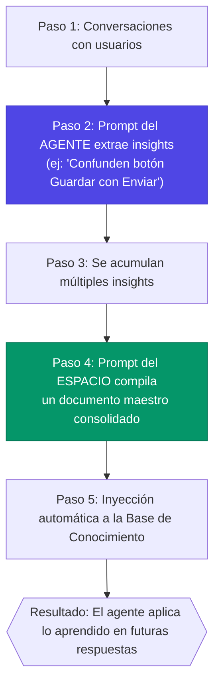

# La Base de Conocimiento: Dar Memoria a tus Agentes

> **Versión documentada:** v5.20.13 · **Última revisión:** 2026-05-29

## ¿Qué es la Base de Conocimiento?

Imagina que contratas a un nuevo empleado. El primer día no sabe nada de tu empresa. Le entregas manuales, procedimientos y guías. Conforme los lee, se vuelve más competente.

Lo mismo pasa con los agentes de Senda. Sin documentos, un agente solo puede responder con su "conocimiento general" (lo que el modelo de IA sabe por su entrenamiento). **Con documentos, el agente puede responder con información específica de tu empresa.**

### Antes vs. Después

| Sin Base de Conocimiento | Con Base de Conocimiento |
|---|---|
| "No tengo información específica sobre el procedimiento de facturación de su empresa" | "Según el Manual de Facturación v3.2, para generar una nota de crédito debe ir a SAP → Transacción VF01 → Seleccionar tipo 'ZCR'..." |
| Respuestas genéricas | Respuestas específicas con datos reales |
| El usuario desconfía | El usuario siente que habla con un experto |

---

## ¿Cómo funciona? (Sin tecnicismos)

Cuando subes un documento a un agente, Senda hace 3 cosas automáticamente:

```
1. 📖 LEE el documento completo
2. 🧠 ENTIENDE de qué trata (genera un resumen y palabras clave)
3. 🗂️ INDEXA el contenido para poder consultarlo después
```

Después, cuando un usuario hace una pregunta:

```
1. 📩 El usuario pregunta "¿Cómo hago una nota de crédito?"
2. 🔍 Senda busca en los documentos del agente: "¿Tengo algo sobre notas de crédito?"
3. ✅ Encuentra el fragmento relevante del Manual de Facturación
4. 💬 El agente usa esa información para dar una respuesta precisa
```

> 💡 **Lo importante para vos**: No necesitás saber cómo funciona por dentro. Lo que necesitás saber es qué documentos subir, cómo prepararlos, y cómo diagnosticar cuando el agente no encuentra lo que necesita.

---

## Formatos de Archivo Soportados

| Formato | Ideal para | Notas |
|---|---|---|
| **TXT** / **MD** | Manuales, procedimientos, FAQs | El más limpio y confiable |
| **DOCX** | Documentos de Word | Soporte nativo para extracción de texto |
| **PDF** | Documentos formales, políticas | Senda extrae el texto. Si el PDF es imagen (escaneado), no funcionará bien |
| **CSV** | Tablas de datos, catálogos | Útil para listas de productos, precios, configuraciones |

> 💡 **Tip de Carga y Procesamiento**: En la Bóveda de Conocimiento del agente, podés cargar estos archivos simplemente **arrastrándolos y soltándolos** sobre el área punteada, o **haciendo clic** en ella para abrir el explorador de archivos.
>
> Senda procesa las cargas en segundo plano mediante una **cola de procesamiento múltiple**, lo que te permite arrastrar decenas de archivos a la vez y continuar trabajando. Podrás supervisar el avance a través de una **barra de progreso de 5 pasos** en tiempo real:
> 1. 📋 **Indexando**: Se lee y analiza la estructura global del documento.
> 2. 🔬 **Análisis semántico**: La IA genera el resumen automático y temas clave del archivo.
> 3. ✂️ **Fragmentando**: El texto largo se divide en trozos óptimos (chunks) para la consulta.
> 4. 🔏 **Embeddings**: Los fragmentos se convierten a vectores matemáticos legibles por la IA.
> 5. 💾 **Guardado**: Se almacena la información vectorizada en la base de datos de conocimiento del agente.
>
> Además, junto a cada archivo cargado, se dispone del botón **"Descargar Original"**, el cual permite recuperar la versión de texto plano del documento guardada en la base de datos para respaldos rápidos.

> ⚠️ **Importante**: Los PDFs escaneados (imágenes de texto) no se pueden leer. Usa PDFs con texto seleccionable o convierte a TXT.

---

## Reglas de Oro para la Base de Conocimiento

### Regla 1: Un agente = Solo sus documentos

❌ **NO hagas esto**: Subir el mismo manual de SAP al agente de Salesforce y al agente de Impresoras.

✅ **Haz esto**: Subir el manual de SAP SOLO al agente de SAP, el manual de Salesforce SOLO al agente de Salesforce.

**¿Por qué?** El Agente Principal (Router) usa los resúmenes y el índice temático de los documentos para decidir a quién derivar. Si todos los agentes tienen los mismos documentos, el Router no puede diferenciarlos.

> ⚡ **Consecuencia importante**: Como el Router ya lee los temas desde los documentos, **no necesitás listar los temas de los documentos en el System Prompt del agente**. Hacerlo duplica información y desperdicia tokens en cada mensaje. El prompt debe definir *cómo se comporta* el agente, no *qué temas conoce* — eso lo resuelven los documentos automáticamente.

### Regla 2: Calidad > Cantidad

Un documento bien escrito y organizado es infinitamente más valioso que 20 documentos desordenados.

| ❌ Documento malo | ✅ Documento bueno |
|---|---|
| Párrafos interminables sin estructura | Secciones claras con títulos y subtítulos |
| Información desactualizada | Información vigente y verificada |
| Jerga interna sin explicar | Términos definidos y consistentes |
| Información irrelevante mezclada | Solo contenido relevante para el agente |

### Regla 3: Documentos enfocados y cortos

Es mejor subir 5 documentos de 2 páginas cada uno (cada uno sobre un tema específico) que un solo documento de 10 páginas que mezcla todo.

**¿Por qué?** Cuando Senda busca información, encuentra fragmentos relevantes. Si el documento mezcla muchos temas, puede traer fragmentos irrelevantes junto con los relevantes.

### Regla 4: Usa formato instruccional

Escribe los documentos como si fueran instrucciones para el agente, no como documentos literarios.

| ❌ Estilo literario | ✅ Estilo instruccional |
|---|---|
| "La empresa fue fundada en 1985 y desde entonces se ha dedicado a la distribución de gas natural..." | "DATOS DE LA EMPRESA: Nombre: Camuzzi Gas. Fundación: 1985. Rubro: Distribución de gas natural." |
| "Para realizar una factura, el proceso comienza cuando el departamento comercial..." | "PROCEDIMIENTO: Crear Factura
1. Ir a SAP
2. Transacción VF01
3. Seleccionar tipo de documento
4. Completar campos..." |

### Regla 5: Incluye preguntas frecuentes

Si sabes qué preguntan los usuarios, inclúyelas directamente como FAQ en el documento:

```
PREGUNTAS FRECUENTES - Módulo de Reportes

P: ¿Cómo exporto un reporte a Excel?
R: Desde la pantalla de reportes, haz clic en el ícono de descarga 
   (esquina superior derecha) y selecciona "Exportar a XLSX".

P: ¿Por qué el reporte muestra datos del mes pasado?
R: Verifica el filtro de fechas en la barra superior. Por defecto 
   muestra el período anterior. Cambia las fechas y presiona "Aplicar".
```

---

## Sanitizar Documentos Antes de Subirlos a RAG

Sanitizar no significa "hacer más lindo" el documento. Significa convertirlo en una fuente que Senda pueda leer, fragmentar, indexar y citar sin ruido. Un documento excelente para humanos puede ser malo para RAG si contiene índices duplicados, pies de página repetidos, capturas sin explicación o versiones mezcladas.

### Checklist de Sanitización

| Elemento | Qué hacer | Por qué importa |
|---|---|---|
| Índices automáticos | Quitar el índice del documento si Senda genera índice temático al ingerirlo | Evita que el buscador traiga una tabla de contenidos en lugar de la respuesta |
| Encabezados y pies repetidos | Eliminar números de página, disclaimers repetidos y logos textuales por página | Reducen ruido en cada chunk |
| PDFs escaneados | Aplicar OCR o convertir a DOCX/MD/TXT con texto seleccionable | El RAG no puede recuperar texto que solo existe como imagen |
| Tablas | Convertir a tabla Markdown/CSV con columnas explícitas y unidades | El agente entiende mejor relaciones y valores |
| Capturas de pantalla | Agregar una descripción textual debajo de cada imagen | La imagen sola no siempre alcanza para responder |
| Versiones viejas | Conservar solo la versión vigente o marcar claramente vigencia | Evita respuestas con procedimientos obsoletos |
| Datos sensibles | Quitar contraseñas, tokens, DNI, emails reales innecesarios y datos personales | Reduce riesgo de exposición |
| Duplicados | No subir el mismo contenido en varios documentos o agentes | Evita respuestas contradictorias y routing débil |
| Glosario | Definir siglas, nombres internos y términos de negocio | Mejora recuperación semántica |
| Pruebas | Agregar preguntas frecuentes y respuestas esperadas | Facilita QA y entrenamiento |

### Estructura Recomendada de Documento RAG

```markdown
# Titulo del procedimiento

Owner: Area responsable
Version: 2026-05-27
Vigencia: aplica a [sistema/proceso/pais]
Audiencia: usuarios finales / mesa de ayuda / administradores

## Cuándo usar este procedimiento
Describe el caso de uso.

## Requisitos previos
Lista permisos, datos necesarios o condiciones.

## Paso a paso
1. Paso observable.
2. Resultado esperado.
3. Error frecuente y corrección.

## Preguntas frecuentes
P: ...
R: ...

## Cuándo escalar
Define límites y contacto.
```

### Antes y Después

| Documento sin sanitizar | Documento listo para RAG |
|---|---|
| Incluye índice automático de Word, 40 páginas, headers repetidos y capturas sin texto | Tiene secciones por tema, sin índice duplicado, pasos numerados y texto descriptivo |
| Mezcla versiones 2023, 2024 y 2026 | Declara una versión vigente y archiva versiones anteriores |
| Dice "ver imagen" sin explicar qué muestra | Describe la pantalla, el botón, el estado esperado y el error posible |
| Contiene emails y datos reales de clientes | Usa ejemplos ficticios o anonimizados |

### Regla Especial sobre Índices Automáticos

Si el sistema genera un índice automático de cada documento ingerido, el documento original **no debería incluir su propio índice automático**. El índice original suele contener títulos, números de página y referencias internas que no ayudan a responder preguntas. En RAG, esos fragmentos compiten con contenido real y pueden provocar respuestas superficiales como "el tema aparece en el capítulo 4" en lugar de explicar el procedimiento.

---

## Diagnosticar Problemas de Base de Conocimiento

### Síntoma: "El agente no usa la documentación que le subí"

**Checklist de diagnóstico:**

1. **¿El documento se subió correctamente?** → Verificar que aparece en la lista de archivos del agente con estado "Vectorizado"
2. **¿El documento tiene contenido legible?** → Si es un PDF escaneado, no tendrá texto extraíble
3. **¿La pregunta del usuario es relevante al contenido?** → Si el documento habla de "facturación" pero el usuario pregunta sobre "impresoras", no habrá match
4. **¿El documento está en el agente correcto?** → Verificar que el documento está asignado al sub-agente que responde, no al Principal
5. **¿El mensaje del usuario es muy corto?** → Mensajes de menos de 10 caracteres (ej: "hola") no activan la búsqueda en documentos. Esto es por diseño para ahorrar recursos.

### Síntoma: "El agente inventa información que no está en los documentos"

**Posibles causas:**
1. **El prompt no prohíbe inventar** → Agregar: "No inventes funcionalidades que no estén en tu documentación"
2. **El documento es ambiguo** → El agente "interpreta" información vaga y la completa con su conocimiento general
3. **No hay documentos relevantes** → Cuando el agente no encuentra nada en su base, recurre a su conocimiento general

**Solución**: Agregar esta regla al system prompt:
```
REGLA CRÍTICA: Si la respuesta NO está explícitamente en tu base de 
conocimiento, NO inventes. Responde: "No tengo información documentada 
sobre ese tema. ¿Deseas que escale tu consulta?"
```

---

## Límites Técnicos y Comportamiento Interno del RAG

> 💡 Esta sección es para implementadores que necesitan entender POR QUÉ el agente a veces no encuentra información relevante, y cómo optimizar la configuración.

### Límites de Archivos y Procesamiento

| Parámetro | Valor | Nota |
|-----------|-------|------|
| **Tamaño máximo por archivo** | 10 MB | Para archivos más grandes, dividir en archivos temáticos |
| **Formatos soportados** | TXT, MD, DOCX, PDF, CSV | PDFs escaneados (imagen) no se indexan |
| **Archivos simultáneos** | Cola de procesamiento múltiple | Podés arrastrar decenas de archivos a la vez |
| **Vectorización** | Cloudflare Vectorize | Embeddings generados automáticamente |
| **Tiempo de procesamiento** | 5-30 seg por archivo (según tamaño) | Archivos grandes toman más; la barra de 5 pasos muestra el progreso |

### Cómo Funciona el Chunking (Fragmentación)

Cuando subís un documento, Senda lo divide en **fragmentos (chunks)** antes de vectorizarlo. Esto es fundamental porque el LLM tiene un límite de tokens que puede procesar por turno, y necesita recibir solo los fragmentos relevantes — no el documento completo.

```
Documento original (20 páginas)
        │
        ▼
    Chunking automático
        │
        ├── Chunk 1: "Procedimiento de facturación..." (~500 tokens)
        ├── Chunk 2: "Casos especiales de nota de crédito..." (~500 tokens)
        ├── Chunk 3: "Error ERR-405 y solución..." (~300 tokens)
        └── ... (N chunks según el tamaño)
```

**¿Cómo afecta esto a las respuestas?**

| Situación | Causa | Impacto |
|-----------|-------|---------|
| El agente responde con información parcial | El fragmento recuperado no tiene toda la info necesaria | Dividir la sección en un documento independiente |
| El agente mezcla datos de temas distintos | Dos temas están en el mismo fragmento | Separar en documentos temáticos |
| El agente no encuentra la respuesta | El término de búsqueda no coincide semánticamente con el chunk | Agregar sinónimos y FAQs al documento |

### Búsqueda Inteligente: Semántica + Palabras Clave

Desde la versión 5.7.0, Senda utiliza un **sistema de búsqueda híbrida** que combina dos métodos para encontrar la mejor respuesta posible:

1. **Búsqueda semántica** — Entiende el *significado* de la pregunta. Si el usuario pregunta "¿cómo genero una factura?", Senda encuentra un documento titulado "Procedimiento de emisión de comprobantes" aunque no use las mismas palabras.
2. **Búsqueda por palabras clave** — Se activa **automáticamente** cuando la consulta contiene códigos, IDs, SKUs o términos entre comillas. Busca la coincidencia exacta del texto.

**¿Cuándo se usa cada una?** No necesitás elegir: Senda decide por vos.

| Pregunta del usuario | Método activado | Resultado |
|---------------------|----------------|----------|
| "¿Cómo genero una factura?" | Semántico | ✅ Encuentra "Procedimiento de emisión de comprobantes" por significado |
| "ZCR" (código técnico) | Palabra clave | ✅ Encuentra el documento que menciona el código "ZCR" |
| "El sistema no funciona" | Semántico | ✅ Encuentra "Troubleshooting de errores" por contexto |
| `"nota de crédito"` (entre comillas) | Palabra clave | ✅ Busca la frase exacta en los documentos |
| "¿Qué es el SKU A7-320?" | Ambos | ✅ Semántico para el contexto + palabra clave para el código |

> 🎯 **¿Qué resuelve esto?** Antes de v5.7.0, buscar un código como "ZCR" no daba resultados porque la búsqueda semántica no encontraba significado en un código suelto. Ahora, la búsqueda por palabras clave detecta automáticamente estos casos y encuentra la coincidencia exacta.

> 💡 **Mejor práctica**: Aunque la búsqueda híbrida es más inteligente, seguimos recomendando que los documentos incluyan tanto los códigos técnicos como su descripción en lenguaje natural. Ejemplo: en vez de solo "ZCR", escribí "ZCR — Nota de crédito". Esto maximiza las chances de recuperación por ambos métodos.

### Cuándo RAG Funciona vs. Cuándo No

| Escenario | ¿RAG funciona? | ¿Por qué? |
|-----------|---------------|-----------|
| Preguntas sobre procedimientos documentados | ✅ Excelente | Match directo entre pregunta y contenido |
| Preguntas de "sí/no" sobre políticas | ✅ Bien | El fragmento contiene la respuesta completa |
| Razonamiento sobre datos que cambian en tiempo real | ❌ No | RAG es estático — si el dato cambia, el documento debe actualizarse |
| Cálculos numéricos sobre tablas | ⚠️ Parcial | El agente puede citar los datos pero no es confiable para cálculos |
| Comparación entre varios documentos | ⚠️ Parcial | El sistema recupera chunks de cada uno, pero la síntesis depende del LLM |
| Mensajes muy cortos ("hola", "ok") | ❌ No activa | Por diseño: mensajes \< 10 caracteres no disparan búsqueda RAG |

### Optimización Avanzada del RAG

| Técnica | Cómo implementarla | Impacto |
|---------|-------------------|---------|
| **Documentos monotemáticos** | 1 archivo = 1 tema. No mezclar facturación con logística. | ↑ Precisión de recuperación |
| **Incluir FAQs reales** | Agregar las preguntas exactas que hacen los usuarios | ↑ Match semántico directo |
| **Usar metadatos de cabecera** | Incluir Owner, Versión, Audiencia al inicio del documento | ↑ Contexto para el agente |
| **Eliminar ruido** | Quitar headers/footers repetidos, índices, disclaimers | ↓ Chunks de baja calidad |
| **Versionado explícito** | `Vigencia: v3.2 — Mayo 2026` en el header | ↓ Respuestas obsoletas |
| **Consolidar aprendizajes** | Ejecutar consolidación mensual desde Analytics | ↑ Base auto-generada con insights reales |
| **Revisar ciclo trimestral** | Auditar documentos con bajo hit-rate (nunca recuperados) | ↓ Documentos inútiles |
| **Incluir códigos y IDs** | Si el documento usa códigos (SKU, IDs), incluirlos también en forma textual | ↑ Activación de búsqueda híbrida |
| **NO listar temas en el prompt** | Si los temas ya están en los documentos, no los repitas en el System Prompt | ↓ Consumo de tokens por mensaje |

---

## El Aprendizaje Consolidado: La Base de Conocimiento que se Auto-Genera

Una función poderosa de Senda que pocos conocen: **el agente puede generar su propia documentación a partir de sus conversaciones**.

### ¿Cómo funciona?

El ciclo de aprendizaje usa **dos prompts distintos** configurados en dos niveles diferentes:



| Paso | Prompt utilizado | ¿Dónde se configura? | ¿Qué hace? |
|---|---|---|---|
| **Paso 2** (Extracción) | Prompt de Aprendizaje del **Agente** | Configuración del Agente individual | Define QUÉ tipo de lecciones extraer de cada conversación |
| **Paso 4** (Consolidación) | Prompt de Aprendizaje del **Espacio** | Configuración del Espacio/Grupo | Define CÓMO redactar el documento maestro final con todas las lecciones |

> ⚠️ **Ambos prompts son necesarios.** Si solo configurás el del Agente, los insights se extraen pero nunca se consolidan en un documento. Si solo configurás el del Espacio, no hay insights que consolidar. Para la guía completa de configuración, ver [Dominar los Prompts — Arquitectura de 2 Niveles](./03_dominar_los_prompts.md).

> 🚀 **Impacto**: Esto significa que cada conversación hace al agente más inteligente. Un agente que lleva 6 meses funcionando es significativamente mejor que uno recién configurado.

### ¿Cuándo consolidar?
- **Frecuencia recomendada**: Cada 2-4 semanas, o cuando se acumulen 20+ aprendizajes
- **Desde dónde**: Pantalla de Analytics → Seleccionar espacio → Botón "Consolidar"

---

## La Bóveda Visual: Conocimiento Multimodal

La Base de Conocimiento tradicional utiliza texto, pero Senda también cuenta con una **Bóveda Visual** que permite a los agentes "ver" y compartir imágenes en sus respuestas.

### ¿Qué es la Bóveda Visual?
Es un repositorio de imágenes (capturas de pantalla, diagramas, fotos) que se asocian a un agente. Cuando subes una imagen, Senda utiliza inteligencia artificial multimodal (Vision AI) para describirla automáticamente.

### ¿Cómo funciona en el Chat?
1. Cuando un usuario hace una pregunta, Senda busca en los documentos (texto) y en las descripciones de las imágenes.
2. Si encuentra que una imagen es relevante para la respuesta, el agente **inyectará automáticamente la imagen** en su mensaje.
3. El usuario verá la imagen renderizada en el chat y podrá hacer clic para ampliarla.

> 💡 **Ejemplo de uso**: Si el usuario pregunta "¿Dónde está el botón de exportar?", el agente no solo le explicará los pasos, sino que insertará una captura de pantalla que muestra exactamente dónde está el botón.

### Buenas Prácticas para Imágenes
- **Sube capturas de pantalla** de tus sistemas, ERPs o CRMs para que el agente guíe visualmente.
- **Añade diagramas** de procesos complejos.
- No te preocupes por etiquetarlas; la inteligencia visual de Senda describirá automáticamente lo que hay en la imagen al subirla.

---

## Vigencia y Actualización de Documentos

Una base de conocimiento solo es útil si está **actualizada**. Un documento con procedimientos de hace un año puede provocar que el agente dé instrucciones incorrectas o desactualizadas a los usuarios.

### Detección Automática de Documentos Desactualizados

Desde la versión 5.7.0, Senda detecta automáticamente los documentos que **no han sido actualizados en 6 o más meses**. Cuando esto ocurre:

- Aparece una **alerta visual** en el panel de administración del agente, junto al documento afectado.
- El documento sigue activo y se usa para responder, pero la alerta te invita a revisarlo.

> ⚠️ **Riesgo de documentos desactualizados**: Si un procedimiento cambió en tu empresa pero el documento en Senda no se actualizó, el agente seguirá dando la respuesta vieja con total confianza. Los usuarios no sabrán que la información es obsoleta.

### Recomendación: Revisión Trimestral

Establecé un ciclo de **revisión trimestral** de la base de conocimiento:

1. Revisá las alertas de documentos con más de 6 meses sin actualización.
2. Verificá que los procedimientos descritos sigan siendo vigentes.
3. Eliminá o archivá los documentos que ya no aplican.
4. Actualizá las fechas de vigencia en los documentos que confirmés como válidos.

> 💡 **Tip**: Combiná esta revisión con la auditoría de documentos con bajo hit-rate (ver tabla de Optimización Avanzada). Si un documento nunca es recuperado Y tiene más de 6 meses, probablemente puede eliminarse.

---

## Analizar Documentos Antes de Cargar: RAG Prep Engine

> 🔖 **BETA** — Disponible desde v5.6.94.

Antes de subir un documento a la Base de Conocimiento, Senda puede **analizarlo automáticamente** y decirte si está listo o necesita mejoras. El **RAG Prep Engine** es como un editor que revisa tu documento antes de publicarlo: detecta problemas, asigna una calificación y te dice exactamente qué corregir.

### ¿Por qué analizar antes de cargar?

Un documento mal estructurado produce respuestas pobres del agente. Es más barato corregir el documento **antes** de cargarlo que diagnosticar después por qué el agente responde mal.

| Sin RAG Prep | Con RAG Prep |
|---|---|
| Subís el documento y esperamos que funcione | Analizamos el documento y sabemos si va a funcionar |
| El agente responde mal y no sabés por qué | El reporte te dice exactamente qué corregir |
| Perdes horas diagnosticando | Corregís en minutos antes de cargar |

### La Calificación A-F

Cada documento analizado recibe una calificación como en la escuela:

| Nota | Significado | ¿Qué hacer? |
|---|---|---|
| **A** (≥90) | Excelente para RAG | Cargá el documento, va a funcionar muy bien |
| **B** (≥75) | Bueno con mejoras menores | Podés cargarlo, pero conviene aplicar las sugerencias |
| **C** (≥60) | Funcional pero mejorable | Funciona pero las respuestas no van a ser óptimas |
| **D** (≥40) | Requiere correcciones | No recomendado cargar sin corregir primero |
| **F** (<40) | No apto para RAG | Necesita una reestructuración completa |

La calificación se basa en 6 dimensiones: **estructura** del documento (25%), **coherencia** con el propósito del agente (30%), qué tan **amigable** es para la búsqueda (15%), **densidad** de contenido útil (10%), **limpieza** — ausencia de datos sensibles (10%), y **longitud** óptima (10%).

### ¿Qué detecta?

El análisis revisa automáticamente:

- 🔒 **Datos sensibles (PII):** emails, teléfonos, números de documento (DNI/CUIT), tarjetas de crédito, API keys. Te muestra dónde están para que los elimines
- ⚠️ **Inyecciones de prompt:** Texto que podría manipular al agente ("ignorá tus instrucciones", "olvidate de las reglas")
- 📏 **Estructura:** ¿Tiene títulos? ¿Secciones bien separadas? ¿Listas y tablas? ¿O es un bloque de texto sin formato?
- 🎯 **Coherencia:** ¿Este documento es relevante para este agente? Si cargás un manual de ventas en un agente de soporte técnico, te lo va a señalar
- 🔄 **Contradicciones:** Si un documento existente dice "30 días de garantía" y el nuevo dice "15 días", te lo alerta
- 🧩 **Fragmentación:** Simula cómo el sistema va a dividir el documento para buscar, y te alerta si las secciones quedan demasiado grandes o pequeñas
- 🔍 **Duplicados:** Verifica si ya existe un documento similar en otro agente del mismo espacio

### El Flujo de Análisis

1. **Seleccioná** el documento en el panel de análisis (formatos: PDF, DOCX, TXT, MD, CSV)
2. **Esperamos** unos segundos mientras Senda ejecuta el análisis
3. **Revisá** la calificación y los hallazgos en un panel visual con dos columnas: nota general + detalles
4. **Si hay problemas:** Senda genera un **prompt de optimización** que podés copiar y pegar en ChatGPT o Claude para corregir el documento automáticamente
5. **Corregido el documento**, volvé a analizarlo para confirmar la mejora
6. **Cuando estés satisfecho**, cargá el documento en la Base de Conocimiento

> 💡 **Tip práctico:** El prompt de optimización es la funcionalidad más valiosa. En lugar de corregir vos cada problema manualmente, le pedís a otra IA que lo haga automáticamente con las instrucciones que Senda genera.

### Cuándo usar RAG Prep

| Situación | ¿Analizar? | Por qué |
|---|---|---|
| Documento nuevo que nunca se cargó | ✅ Siempre | Prevenir problemas desde el inicio |
| Documento que ya está y el agente responde bien | ❌ No | Si funciona, no tocar |
| El agente responde mal con cierto tema | ✅ Sí | Analizar los documentos de ese tema específico |
| Documento de más de 20 páginas | ✅ Siempre | Los documentos largos son los más propensos a problemas |
| Documento escaneado (PDF imagen) | ✅ Sí | El Prep Engine detecta si el PDF no tiene texto extraíble |

---

## Checklist de Base de Conocimiento

- [ ] Cada sub-agente tiene documentos de SU especialidad únicamente
- [ ] Los documentos están en formato legible (TXT o PDF con texto seleccionable)
- [ ] Los documentos están actualizados (no hay versiones obsoletas)
- [ ] Los documentos usan formato instruccional (listas, pasos, tablas)
- [ ] Se incluyeron FAQs de las preguntas más comunes
- [ ] El estado de cada documento es "Vectorizado" (no "Pendiente" o "Error")
- [ ] Se probó que el agente usa los documentos al responder (Modo Prueba)
- [ ] El system prompt prohíbe inventar información no documentada
- [ ] Los documentos con códigos/IDs incluyen descripción textual además del código
- [ ] ¿Analicé mis documentos con el RAG Prep Engine antes de cargarlos?
- [ ] ¿Se que puedo usar el prompt de optimización para corregir documentos automáticamente?

---

> 📖 **Anterior:** [04 — Dominar los Prompts](./03_dominar_los_prompts.md)
> 📖 **Siguiente:** [06 — Acciones: Conectar Senda con tus Sistemas](./06_acciones_y_automatizaciones.md)
