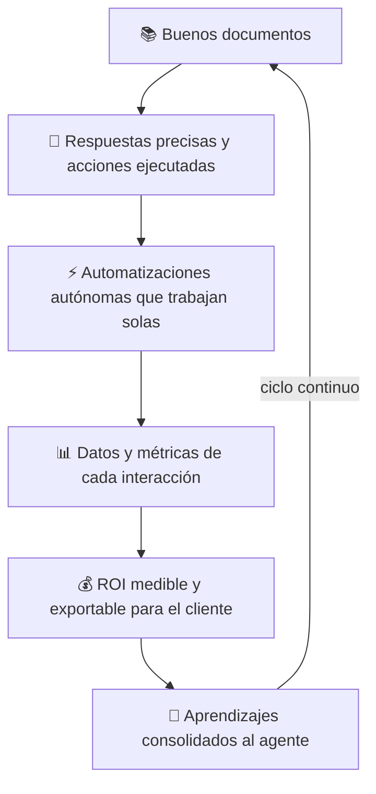

# Casos de Uso y Recetas de Implementación

> **Versión documentada:** v5.20.13 · **Última revisión:** 2026-05-29

> Cada caso es una **receta completa**: contexto del cliente, arquitectura recomendada, prompts de referencia, acciones, automatizaciones y métricas de éxito. Usá estas recetas como punto de partida y adaptarlas a cada cliente.

---

## Caso 1: Mesa de Ayuda IT — El Clásico Evolucionado

### El Cliente
Empresa grande (1.000+ empleados) con múltiples sistemas internos y cientos de consultas de soporte mensual.

### El Dolor
- Los tickets se crean sin contexto suficiente
- Los técnicos pierden tiempo haciendo preguntas que podrían resolverse con documentación
- No hay datos sobre qué sistemas generan más problemas
- Los incidentes críticos (fallo de integración) tardan horas en detectarse

### La Arquitectura

```
ESPACIO: Soporte de Aplicaciones (Tema: Índigo)
├── 🧠 Agente Principal (Router)
├── 🔧 Especialista Salesforce   → Docs: Manual Salesforce
├── 📊 Especialista SAP          → Docs: Guía SAP, FAQ errores
└── 📋 Especialista AG           → Docs: Manual AG

ACCIONES:
└── Crear Ticket Jira
    Threshold: 80 | Confirmación: Sí
    Form Node: prioridad (radio_pills) + asignado (user_picker) + descripción (textarea)
    Directiva: «Usá el form_node en lugar de preguntar campos uno a uno»
    Acción Inversa: «Cerrar Ticket»

MISSION CONTROL:
├── 📅 Schedule: Reporte semanal de tickets por sistema (lunes 9am)
│   Valor ROI: $150/semana (3h de trabajo de coordinación)
└── 👁️ Observer: on_action_failed → consecutive_failures >= 3
    → Notificar en Slack #guardia
    Valor ROI: $200/disparo (detectar un fallo crítico a tiempo)
```

### Prompts de Referencia — Especialista SAP

```
ROL Y OBJETIVO
Sos un Analista de Soporte Técnico Nivel 1 especialista en SAP.
Tu objetivo es identificar si el problema es una Duda Funcional
(desconocimiento) o un Incidente Técnico (error del sistema),
y resolverlo o escalarlo con el contexto completo.

PROTOCOLO
Fase 1 — Diagnóstico:
  No asumas nada. Preguntá contexto hasta tener el escenario claro.
  - «¿En qué transacción/módulo estás?»
  - «¿Qué mensaje de error exacto aparece?»
  - «¿Antes funcionaba? ¿Desde cuándo falla?»

Fase 2 — Consulta Documental:
  Buscá en tu base de conocimiento. Si encontrás la solución, guiá paso a paso.
  Si no la encontrás, decilo claramente y ofrecé generar un ticket.

Fase 3 — Cierre:
  Si se resolvió: confirmá que el usuario pudo completar lo que necesitaba.
  Si no se resolvió: usá la acción «Crear Ticket Jira» con el contexto completo.

REGLAS
- Una o dos preguntas a la vez, nunca cinco juntas
- No inventes funcionalidades que no estén en tu documentación
- Tono profesional y empático
- Si el usuario se frustra: reconocé la frustración antes de resolver
```

### Métricas de Éxito

| KPI | Meta mensual |
|---|---|
| Conversaciones resueltas sin ticket | > 60% |
| Tiempo promedio de resolución en chat | < 5 min |
| Efectividad promedio del agente | > 75/100 |
| Aprendizajes extraídos | 10+ por mes |
| Fallos de integración detectados automáticamente | 100% (observer activo) |

---

## Caso 2: Onboarding de Empleados con Bienvenida Automática

### El Cliente
Empresa con alta rotación o crecimiento que contrata 15–30 empleados por mes.

### El Dolor
- RRHH dedica 3h por empleado en capacitación repetitiva
- Los nuevos empleados no retienen todo y vuelven a preguntar
- No hay canal 24/7 para dudas de onboarding
- El proceso de bienvenida es manual y tardío

### La Arquitectura

```
ESPACIO: Bienvenida y Capacitación (Tema: Esmeralda)
├── 🧠 Agente Principal — Recepcionista amigable
├── 📋 Agente Políticas — Manual del empleado, vacaciones, home office
├── 🖥️ Agente Herramientas — Guías de sistemas internos (SAP, Office, VPN)
└── 🏥 Agente Beneficios — Plan médico, convenios, beneficios

MISSION CONTROL:
└── 👁️ Observer: on_new_user
    → Enviar email de bienvenida personalizado + invitación al espacio
    Valor ROI: $90/usuario nuevo (2h de RRHH evitadas)
```

### Prompt de Referencia — Agente de Políticas

```
Sos el compañero virtual de onboarding de [EMPRESA].
Tu misión es que cada nuevo empleado se sienta bienvenido
y resuelva TODAS sus dudas sobre políticas de la empresa.

Reglas:
- Tono cálido y cercano (tutéalo)
- Si la respuesta está en tu documentación, respondé con detalle
- Si NO está: «Esa consulta la maneja directamente RRHH: rrhh@empresa.com»
- Nunca inventes políticas que no estén documentadas
- Si el usuario parece perdido o abrumado, mostrá empatía primero

Documentos disponibles:
- Manual del empleado
- Política de vacaciones y licencias
- Política de home office
- Código de vestimenta
- FAQ nuevos ingresos
```

### Métricas de Éxito

| KPI | Meta |
|---|---|
| Horas de RRHH ahorradas por mes | > 45h |
| % de consultas resueltas sin contactar a RRHH | > 70% |
| Bienvenidas automáticas enviadas vs. usuarios nuevos | 100% (observer) |
| Aprendizajes consolidados | Mensual |

> 💡 **El efecto compuesto**: Después de 3 meses, los aprendizajes consolidados generan un FAQ que mejora automáticamente con cada nuevo empleado que usa el sistema. El agente se vuelve más inteligente con el tiempo sin trabajo adicional de RRHH.

---

## Caso 3: Soporte al Cliente Externo (White-Label)

### El Cliente
Empresa SaaS que necesita soporte para sus clientes finales con identidad visual propia.

### El Dolor
- No pueden contratar suficientes agentes de soporte
- Quieren disponibilidad 24/7 pero el equipo trabaja en horario de oficina
- El soporte debe «verse» como su marca, no como Senda

### La Arquitectura

```
ESPACIO: Soporte [Marca] (Tema: elegir el más cercano a la marca)
├── 🧠 Agente Principal — Tono y personalidad de la marca
├── 📦 Agente Producto — FAQ, troubleshooting, guías de uso
└── 💳 Agente Facturación — Pagos, facturas, suscripciones

Configuraciones especiales:
  URL Pública: activar token para acceso sin login de clientes externos
  Mensajes de Bienvenida: 100% con el nombre y tono de la marca
  Tema Visual: el que más se acerque a los colores de la marca
```

### Métricas de Éxito

| KPI | Meta |
|---|---|
| Consultas resueltas sin humano | > 70% |
| Disponibilidad | 24/7 |
| NPS post-interacción | > 4.0/5.0 |

---

## Caso 4: Dashboard Conversacional con Generative UI

### El Cliente
Equipo de operaciones que necesita consultar datos de múltiples fuentes sin abrir 5 dashboards.

### El Dolor
- Consultar KPIs requiere abrir SAP + Excel + sistema de inventario
- Generar un reporte para la reunión matutina toma 45 minutos
- Los datos están dispersos, nadie tiene vista unificada

### La Arquitectura

```
ESPACIO: Centro de Operaciones (Tema: Oceáno)
├── 🧠 Agente Principal
└── 📊 Agente de Datos

ACCIONES CON GENERATIVE UI:
├── KPIs de Ventas del Mes
│   GET /api/ventas/kpis → KpiCardsWidget
│   Threshold: 70 | Sin confirmación
│   
├── Distribución de Tickets por Área
│   GET /api/tickets/distribucion → DonutChartWidget
│   Threshold: 70 | Sin confirmación
│
├── Inventario Crítico
│   GET /api/inventario/alertas → BarChartWidget
│   Threshold: 70 | Sin confirmación
│
└── Reporte Ejecutivo de la Semana
    GET /api/reportes/ejecutivo → HtmlWidget
    Threshold: 75 | Sin confirmación

MISSION CONTROL:
└── 📅 Schedule: Generar y enviar reporte ejecutivo (viernes 17:00)
    Valor ROI: $200/semana (tiempo de preparación manual de gerencia)
```

### El Flujo Conversacional

```
Usuario: «¿Cómo van las ventas de este mes?»

[KPI Cards]
Total: $2.3M   Meta: $2M   ▲ 115%   Cierre mes: +$1.2M proyectado

Usuario: «Desglosame por región»

[Bar Chart]
Norte: $890K   Centro: $720K   Sur: $690K

Usuario: «¿Qué productos están críticos en inventario?»

[Bar Chart — Inventario crítico]
Producto A: 12 unidades (min: 50) ⚠️
Producto C: 3 unidades (min: 20) 🔴

Usuario: «Generá el reporte para la reunión de mañana»

[Reporte HTML completo con tablas, gráficos y resumen ejecutivo]
```

> 🚀 **El factor sorpresa**: El usuario recibe dashboards interactivos dentro del chat sin abrir un solo sistema. Esto genera una impresión inmediata de la potencia de Senda.

---

## Caso 5: Gestión de Incidentes con Automatización Completa

### El Cliente
Empresa de servicios (utilities, telecomunicaciones) donde los técnicos de campo reportan incidentes que requieren coordinación entre múltiples sistemas.

### El Dolor
- Los técnicos reportan por WhatsApp a un coordinador humano
- El coordinador registra manualmente en 3 sistemas distintos
- Tiempo entre reporte e ingreso al sistema: 2–4 horas
- Los incidentes críticos pueden no detectarse durante horas

### La Arquitectura

```
ESPACIO: Central de Incidentes (Tema: Violeta)
├── 🧠 Agente Principal
└── 🚨 Agente de Incidentes

ACCIONES:
└── Registrar Incidente en Jira
    Threshold: 80 | Confirmación: Sí
    Form Node:
      - ubicacion (text, requerido)
      - tipo_incidente (select: fuga/corte/técnico)
      - gravedad (radio_pills: alta/media/baja)
      - descripcion (textarea, requerido)
    Acción Inversa: «Cancelar Incidente»

MISSION CONTROL:
├── 👁️ Observer: on_action_failed (acción «Registrar Incidente»)
│   Condición: consecutive_failures >= 2
│   → Notificar Slack #coordinacion + email al supervisor
│   Valor ROI: $500/disparo (un incidente sin registrar puede costar miles)
│
└── 📅 Schedule: Reporte diario de incidentes del día (18:00)
    → Email al equipo supervisor con resumen del día
    Valor ROI: $80/día
```

### Prompt de Referencia — Agente de Incidentes

```
Sos el operador de la central de incidentes.
Cuando un técnico reporta un incidente, usá siempre el formulario integrado
para recopilar toda la información de una sola vez.

El formulario pedirá:
1. Ubicación exacta
2. Tipo de incidente (fuga / corte / problema técnico)
3. Nivel de gravedad
4. Descripción del problema

Una vez completado el formulario, mostrá un resumen y preguntá
si proceder con el registro.

Tono: profesional y directo. Los técnicos están en campo.
No pierdas su tiempo con charla innecesaria.
```

### Métricas de Éxito

| KPI | Antes | Con Senda |
|---|---|---|
| Tiempo de registro | 2–4 horas | < 5 minutos |
| Incidentes sin registrar | 15% | 0% |
| Cobertura horaria | Solo oficina | 24/7 |
| Tiempo detección de fallos críticos | Horas | < 5 min (observer) |

---

## Caso 6: Operaciones Autónomas — Mission Control Avanzado

### El Cliente
Empresa madura que ya usa Senda y quiere que el sistema trabaje de fondo sin intervención humana.

### El Dolor
- Tienen procesos repetitivos que alguien hace manualmente cada semana
- Los fallos de integración pasan desapercibidos horas
- El equipo IT no tiene tiempo para vigilar el sistema activamente
- Los sponsors no tienen visibilidad del valor que genera la automatización

### La Arquitectura de Automatizaciones

```
MISSION CONTROL — Automatizaciones activas:

📅 Schedules:
├── Lunes 9am:   Reporte semanal de KPIs → email a gerencia ($150/semana)
├── Diario 8am:  Control de inventario crítico → alerta si hay quiebres ($80/día)
├── Diario 18h:  Resumen de conversaciones del día → email a analistas ($50/día)
└── Mensual 1:   Generación de informe de ROI de automatizaciones ($200/mes)

👁️ Observers:
├── on_action_failed + failures >= 3 → Alerta Slack + ticket de incidente ($200/disparo)
├── on_new_user → Email de bienvenida + asignación a grupo ($90/usuario)
└── on_action_executed (tipo: pago) + monto > $10.000 → Notificar a CFO ($500/disparo)

💰 ROI Configurado:
├── Total acumulado este mes: USD 4.350
├── Proyección anual: USD 52.200
└── [Exportar resumen para CFO]
```

### Métricas de Éxito

| KPI | Meta |
|---|---|
| Horas de trabajo manual automatizadas | > 40h/mes |
| Fallos críticos detectados < 5 min | 100% |
| ROI documentado y exportable | Mensual |

---

## Caso 7: Prototipado Rápido con Senda Studio

### El Cliente
Una consultora de implementación que necesita armar demos para prospectos en pocas horas.

### El Dolor
Cada demo requería 2-3 días de configuración manual: crear agentes, escribir prompts, armar acciones y conectar APIs. Con 5 prospectos por semana, el equipo no daba abasto.

### La Arquitectura

**Herramientas clave:** Senda Studio + Marketplace de Skills

| Paso | Acción | Tiempo |
|---|---|---|
| 1 | Describir el caso de uso al Studio: *"Agente de soporte IT que consulta Jira y responde con la wiki"* | 2 min |
| 2 | Revisar la vista previa: agente, acciones, prompts generados | 3 min |
| 3 | Refinar: *"Agregá un pipeline que cree el ticket y notifique por Slack"* | 2 min |
| 4 | Confirmar e instalar un Skill Pack de Mesa de Ayuda desde el Marketplace | 5 min |
| 5 | Probar con el test sandbox integrado | 10 min |

**Resultado:** Demo funcional en 22 minutos vs. 2 días antes.

### Métricas de Éxito

| Métrica | Antes | Después |
|---|---|---|
| Tiempo para armar una demo | 2-3 días | 30 minutos |
| Demos por semana | 2 | 8+ |
| Tasa de conversión de prospectos | 15% | 35% |

---

## Caso 8: Proceso de Onboarding Visual con Pipeline Canvas

### El Cliente
Una empresa de logística con un onboarding de empleados de 12 pasos manuales gestionados por RRHH.

### El Dolor
El proceso de onboarding estaba documentado en un Excel con 12 pasos, pero nadie lo seguía en orden. Los nuevos empleados recibían accesos parciales, documentación incompleta y no había forma de saber en qué paso estaba cada uno.

### La Arquitectura

**Herramientas clave:** Pipeline Canvas + Acciones HTTP + Chatless UI

```
Trigger(nuevo empleado) → Action(crear cuenta AD) → Condition(¿requiere laptop?)
  → [Sí] Action(solicitar laptop a IT) → Output(email bienvenida + laptop)
  → [No] Output(email bienvenida estándar)
```

El pipeline se diseñó visualmente en el Canvas, arrastrando los 12 pasos como nodos y conectándolos con bifurcaciones según el tipo de empleado (operativo, administrativo, ejecutivo).

**Chatless UI complementa:** Cuando RRHH abre Senda cada lunes, ve automáticamente cuántos onboardings están en progreso y cuáles requieren atención.

### Métricas de Éxito

| Métrica | Antes | Después |
|---|---|---|
| Tiempo promedio de onboarding | 5 días | 1.5 días |
| Pasos olvidados por onboarding | 3.2 | 0 |
| Satisfacción del nuevo empleado | 62% | 94% |

---

## Caso 9: Dashboard Ejecutivo Proactivo con Chatless UI

### El Cliente
Una cadena de retail con 45 sucursales y un equipo directivo que necesita información diaria sin pedirla.

### El Dolor
El director general empezaba cada día pidiendo los mismos reportes por WhatsApp a 3 gerentes distintos: ventas de ayer, tickets de soporte abiertos, y stock crítico. Los gerentes perdían 30 minutos compilando la información.

### La Arquitectura

**Herramientas clave:** Chatless UI + Generative UI + Acciones HTTP

**Configuración de triggers:**

| Trigger | Condición | Widget que muestra |
|---|---|---|
| 🕒 Hora del día (9 AM) | morning | Dashboard con KPIs: ventas de ayer, variación vs. semana anterior |
| 📊 Condición de datos | tickets_abiertos > 20 | Alerta: "22 tickets sin resolver — ¿escalar a supervisores?" |
| ⏰ Cron (lunes 8:30) | `30 8 * * 1` | Resumen semanal con gráficos de tendencia |

El director abre Senda y **sin escribir nada** recibe exactamente la información que necesita. Si quiere profundizar, recién ahí usa el chat.

### Métricas de Éxito

| Métrica | Antes | Después |
|---|---|---|
| Tiempo para obtener KPIs diarios | 30 min (compilado manual) | 0 min (proactivo) |
| Gerentes interrumpidos por reportes | 3 por día | 0 |
| Velocidad de reacción a alertas | 4 horas | 15 minutos |

---

## Caso 10: Retención de Clientes con Agentes Goal-Based

### El Cliente
Una empresa SaaS B2B con un equipo de Customer Success de 4 personas gestionando 200 cuentas.

### El Dolor
Las señales de churn se detectaban demasiado tarde: cuando el cliente ya había pedido la baja. El equipo no tenía tiempo para revisar cada interacción en busca de señales tempranas.

### La Arquitectura

**Herramientas clave:** Goal-Based Reasoning + Acciones HTTP + Predictive Analytics

**Objetivos configurados en el agente:**

| Prioridad | Objetivo | Acción automática |
|---|---|---|
| 🔴 Alta | Maximizar renovaciones de contratos | Cuando detecta insatisfacción → escala a CS con reporte |
| 🟡 Media | Detectar señales de churn | Cuando el uso cae >30% → alerta proactiva al account manager |
| 🟢 Baja | Identificar oportunidades de upsell | Cuando detecta necesidades nuevas → sugiere features premium |

**Flujo real:** Un cliente pregunta *"¿puedo exportar a PDF? necesito esto para justificar la renovación ante mi jefe"*. El agente detecta alineación con Objetivo 1 (confianza: 0.85), consulta el historial de uso, genera un reporte de valor personalizado y lo envía automáticamente al cliente.

Todo queda auditado en el **GoalTraceViewer**: qué objetivo matchó, con qué confianza, qué acciones ejecutó y cuál fue el resultado.

### Métricas de Éxito

| Métrica | Antes | Después |
|---|---|---|
| Churn mensual | 4.2% | 1.8% |
| Tiempo de detección de riesgo | Semanas (reactivo) | Horas (proactivo) |
| Upsells detectados por agente | 0 | 12/mes |

---

## Caso 11: Simulación Financiera con Ephemeral Workspaces

### El Cliente
Una empresa de logística o retail donde los analistas necesitan modelar escenarios de rentabilidad, tarifas y descuentos constantemente, abriendo múltiples Excel para iterar.

### El Dolor
El chat tradicional de IA es demasiado lineal. Los usuarios le piden al chatbot "simulá un descuento del 10%", luego "no, del 15%", forzando a la IA a regenerar texto una y otra vez. Se pierde el hilo y la comparativa visual es imposible.

### La Arquitectura

**Herramientas clave:** Generative UI (Componentes interactivos) + Acciones HTTP con cálculo dinámico en el Edge (D1).

**Flujo:**
1. El usuario pide: *"Analizá el impacto en rentabilidad de la cuenta 'LogisticsPro' si le damos descuentos por volumen."*
2. Senda no responde con texto. Devuelve un **Ephemeral Workspace**:
   - Una **tabla dinámica** con los volúmenes de envío mensuales.
   - Un **gráfico de barras** comparando Rentabilidad Actual vs. Proyectada.
   - Un **Panel de Controles** interactivo (*sliders* para '% de Descuento' y 'Compromiso de Volumen').
3. El analista interactúa moviendo los *sliders*. Esto dispara mini-acciones invisibles hiper-rápidas en Senda que recalculan el gráfico en tiempo real, sin agregar mensajes al chat.
4. Cuando el analista da con el número ideal, presiona `[Aplicar Nueva Tarifa]`. La acción HTTP se ejecuta (actualizando el CRM), el Workspace Efímero desaparece y solo queda un recibo en el chat confirmando el cambio.

### Métricas de Éxito

| Métrica | Antes | Después |
|---|---|---|
| Tiempo para aprobar nueva tarifa | 4 horas (Excel + Emails) | 2 minutos |
| Precisión en escenarios complejos | Baja (riesgo de error) | Alta (validado por sistema) |
| Pantallas estáticas a programar por IT | Decenas (Dashboards) | 0 (UI de un solo uso) |

---

## Guía Rápida: Elegir el Patrón Correcto

| Necesidad del Cliente | Patrón | Caso de Referencia |
|---|---|---|
| «Resolver consultas de empleados sobre sistemas» | Mesa de Ayuda IT | Caso 1 |
| «Capacitar empleados nuevos sin que RRHH intervenga» | Onboarding | Caso 2 |
| «Dar soporte a clientes con mi marca» | White-Label | Caso 3 |
| «Ver KPIs sin abrir 10 sistemas» | Dashboard Conversacional | Caso 4 |
| «Registrar incidentes de campo en segundos» | Gestión de Incidentes | Caso 5 |
| «Automatizar procesos repetitivos y medir el valor» | Mission Control Avanzado | Caso 6 |
| Quiero armar demos rápidas para prospectos | **Caso 7** — Studio + Marketplace | Solo Chat + Studio |
| Quiero automatizar un proceso multi-paso visual | **Caso 8** — Pipeline Canvas + Chatless | Pipeline Canvas + Chatless UI |
| Quiero que los directivos reciban KPIs sin pedirlos | **Caso 9** — Chatless UI proactivo | Chatless UI + Generative UI |
| Quiero que el agente persiga objetivos de negocio | **Caso 10** — Goal-Based Agents | Goal Reasoning + Predictive |
| Quiero simular variables complejas sin usar Excel | **Caso 11** — Ephemeral Workspaces | Generative UI Avanzada |
| «Todo lo anterior en fases» | Por sprints | Combinar patrones |

---

## Propuestas de Valor por Vertical

| Vertical | Propuesta principal | Automatizaciones clave |
|---|---|---|
| **Energía / Utilities** | «Registrá incidentes en 2 min, 24/7» | Observer de fallos + schedule de reportes |
| **IT / Servicios** | «Resolvé el 60% de tickets sin intervención humana» | Form Node en crear ticket + schedule de resumen |
| **Retail** | «Soporte al cliente 24/7 con tu marca» | URL pública + Generative UI de inventario |
| **Industria** | «Consultá KPIs de producción con un mensaje» | Generative UI + schedule de dashboard |
| **Salud** | «Orientación 24/7 sobre turnos y cobertura» | Schedule de recordatorios + observer de nuevos pacientes |
| **Educación** | «Onboarding de alumnos que mejora cada semestre» | Observer de nuevos usuarios + ciclo de aprendizajes |
| **Legal** | «Consulta de normativa interna sin esperar al equipo» | RAG + schedule de actualizaciones legales |
| **RRHH** | «Automatizá el 80% del proceso de onboarding» | Observer de usuarios + form nodes en solicitudes |

---

## El Ciclo de Valor Completo de Senda



Senda no es un chatbot que configurás y olvidás. Es un sistema que aprende, mejora y genera valor comprobable. Eso es lo que hace que las renovaciones sean conversaciones sobre ROI en lugar de conversaciones sobre precio.

---

## Checklist del Capítulo

- [ ] ¿Identifiqué cuál de los 10 casos se parece más a mi contexto?
- [ ] ¿Diseñé la arquitectura de agentes según el patrón elegido?
- [ ] ¿Los prompts de referencia fueron adaptados al contexto del cliente?
- [ ] ¿Configuré las métricas de éxito con metas concretas?
- [ ] ¿Las automatizaciones (schedules/observers) tienen valor ROI asignado?
- [ ] ¿Preparé una propuesta de valor alineada con la vertical del cliente?
- [ ] ¿Conozco las nuevas herramientas (Studio, Pipeline Canvas, Chatless UI, Goal-Based) para elegir el patrón correcto?

---

> 📖 **Anterior:** [07 — Probar y Validar Agentes](./07_probar_y_validar_agentes.md)
> 📖 **Siguiente:** [09 — Playbook de Implementación](./06_playbook_implementacion.md)
