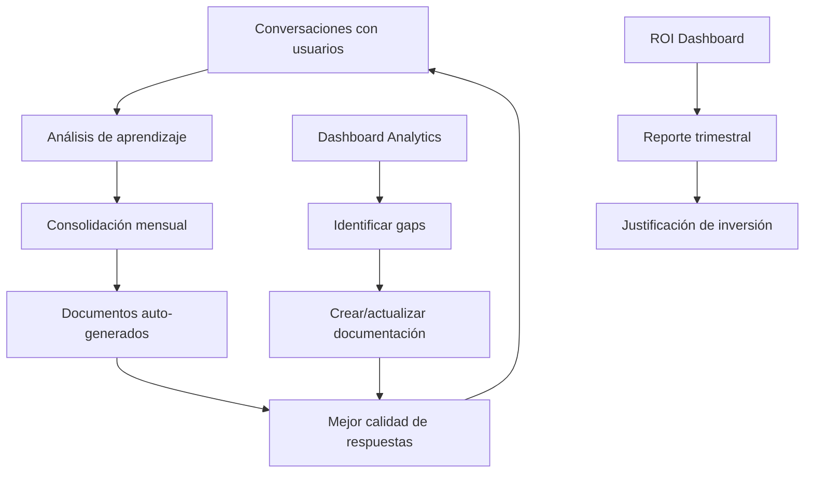

# Playbook de Implementación

> **Versión documentada:** v5.20.13 · **Última revisión:** 2026-05-29

> Implementar Senda en un cliente no es solo «crear agentes y subir documentos». Es un proceso de arquitectura cognitiva donde diseñas el cerebro de la empresa, y estableces un ciclo de gobierno estricto para evitar riesgos en operaciones autónomas.

---

## Las 5 Fases del Orquestador

Senda prohíbe los lanzamientos "Big Bang". Se exige un enfoque de 5 fases para proteger el negocio:

```
FASE 1: Discovery y Diseño Cognitivo (1–2 semanas)
  → Entender el negocio, mapear Intents, definir la matriz de Agentes.

FASE 2: Configuración (Drafting) (1–2 semanas)
  → Crear Agentes, usar la IA para mejorar Prompts, construir Pipelines.

FASE 3: Testing Segregado (Sandbox) (1 semana)
  → Chain Debugger, pruebas de estrés, forzar Edge Cases.

FASE 4: Canary Rollout (Gobernanza) (2 semanas)
  → Feature Flags por Tenant, monitoreo en vivo de Effectiveness Scores.

FASE 5: General Availability (Go-Live) (Continuo)
  → Despliegue global, automatizaciones autónomas, ROI Dashboard.
```

---

## FASE 1: Discovery y Diseño Cognitivo

> 🎯 **Objetivo:** Entender el negocio del cliente, identificar oportunidades de automatización y diseñar la arquitectura cognitiva ANTES de tocar la plataforma.

**Duración:** 1–2 semanas · **Responsable:** Líder de implementación + stakeholders del cliente

### Step-by-step

```
Día 1-2: Relevamiento de negocio
  ☐ Reunión de kick-off con sponsor y usuarios clave
  ☐ Identificar los 3-5 procesos con mayor volumen de consultas o tareas repetitivas
  ☐ Documentar: quién pregunta, qué pregunta, con qué frecuencia, a quién le preguntan hoy
  ☐ Obtener (o crear) el inventario de sistemas existentes (SAP, Jira, CRM, etc.)

Día 3-4: Mapeo de Intents
  ☐ Listar todos los "intents" (intenciones del usuario): crear ticket, consultar saldo, etc.
  ☐ Agruparlos por dominio: IT, RRHH, Finanzas, Operaciones
  ☐ Para cada intent, definir: datos de entrada, sistema destino, respuesta esperada
  ☐ Marcar cuáles requieren acción real (API) y cuáles son solo consulta (RAG)

Día 5-7: Arquitectura de Agentes
  ☐ Definir la Matriz de Agentes: 1 Router + N Especialistas
  ☐ Asignar intents a cada Especialista
  ☐ Decidir si hay intents compartidos o si cada agente es 100% independiente
  ☐ Documentar las dependencias de APIs/sistemas por agente

Día 8-10: Inventario de Recursos
  ☐ Para cada API necesaria: ¿existe? ¿tiene documentación? ¿necesita credenciales?
  ☐ Para cada documento RAG: ¿existe? ¿está actualizado? ¿necesita sanitización?
  ☐ Identificar gaps: APIs que no existen, documentos desactualizados, accesos pendientes
  ☐ Crear plan de acción para cubrir gaps antes de Fase 2
```

### Entregable de Fase 1

| Documento | Contenido |
|-----------|-----------|
| **Mapa de Intents** | Tabla: Intent → Dominio → Sistema → Tipo (acción/consulta) |
| **Matriz de Agentes** | Router + Especialistas con responsabilidades y documentos asignados |
| **Inventario de APIs** | Lista de endpoints, credenciales necesarias, estado de disponibilidad |
| **Inventario RAG** | Lista de documentos a subir, estado (listo/necesita sanitización/no existe) |
| **Plan de gaps** | Tareas pendientes con responsable y deadline |

> ⚠️ **No pasar a Fase 2 sin:** Inventario de APIs completo + documentos RAG identificados + credenciales solicitadas.

---

## FASE 2: Configuración en UI (Drafting)

> 🎯 **Objetivo:** Materializar el diseño de Fase 1 en la plataforma. Crear todos los componentes configurables sin activar nada para usuarios finales.

**Duración:** 1–2 semanas · **Responsable:** Implementador técnico

### Step-by-step

```
Día 1-2: Crear Agentes y Espacios
  ☐ Crear el Espacio principal en Configuración → Espacios
  ☐ Crear el Agente Principal (Router) con resumen de responsabilidades claro
  ☐ Crear cada Agente Especialista según la Matriz de Fase 1
  ☐ Asignar cada Especialista al Espacio correspondiente
  ☐ Configurar visibilidad del espacio (Interno/Privado según el caso)

Día 2-3: Diseñar System Prompts
  ☐ Para cada agente, escribir el System Prompt con las 4 secciones:
      Rol/Objetivo → Protocolo → Reglas → Escalamiento
  ☐ Usar "✨ Mejorar con IA" para optimizar la sintaxis
  ☐ Incluir las reglas de seguridad anti-injection (ver Cap. 04)
  ☐ Configurar Directivas de Acción para acciones con múltiples parámetros

Día 3-5: Configurar Acciones
  ☐ Crear cada acción HTTP/Script/Fórmula en el Catálogo
  ☐ Configurar headers con credenciales de la Bóveda ({{TENANT_CREDS.xxx}})
  ☐ Configurar threshold (70-85 para consultas, 85-95 para acciones destructivas)
  ☐ Activar confirm_before para acciones que modifican datos
  ☐ Configurar Render Type si la acción debe mostrar gráficos
  ☐ Asignar cada acción al agente correspondiente

Día 5-7: Cargar Base de Conocimiento
  ☐ Sanitizar documentos según checklist de Cap. 05
  ☐ Subir documentos al agente correcto (cada especialista, sus propios docs)
  ☐ Verificar estado "Vectorizado" en cada archivo
  ☐ Probar que el agente cita los documentos (no inventa)

Día 7-8: Configurar Space Tools (si aplica)
  ☐ Identificar las 3-7 acciones más frecuentes del espacio
  ☐ Crear Action Tools para tareas mecánicas (direct/form/prompt)
  ☐ Crear Intent Tools para consultas inteligentes
  ☐ Ordenar por frecuencia de uso (campo position)

Día 8-10: Configurar Automatizaciones
  ☐ Crear Schedules para reportes periódicos (Wizard de 3 pasos)
  ☐ Crear Observers para eventos críticos (fallos, onboarding)
  ☐ Configurar valor ROI en cada automatización desde el Día 1
  ☐ Probar cada automatización con 🧪 Probar antes de activar
```

#### Herramientas Adicionales de Fase 2 (v5.11+)

Además del wizard estándar, la Fase 2 ahora cuenta con herramientas que aceleran la configuración:

| Herramienta | ¿Cuándo usarla en Fase 2? | Beneficio |
|---|---|---|
| 🎨 **Senda Studio** | Para crear agentes y acciones rápidamente describiendo lo que necesitás | Reduce el drafting de días a minutos |
| 🔄 **Pipeline Canvas** | Para diseñar flujos con bifurcaciones de forma visual | Reemplaza la planificación en papel/Excel |
| 📦 **Marketplace** | Para instalar Skill Packs pre-armados como punto de partida | Evita configurar desde cero |
| 📊 **RAG Prep Engine** | Para validar documentos antes de subirlos a la Base de Conocimiento | Previene respuestas pobres desde el inicio |

> 📝 **Recomendación:** Empiece instalando un Skill Pack del Marketplace que se parezca a su caso de uso. Luego use Studio para personalizarlo. Finalmente, valide la documentación con RAG Prep Engine.

### Checklist de salida de Fase 2

```
☐ Todos los agentes están creados con prompts completos
☐ Todas las acciones están configuradas y probadas individualmente
☐ Todos los documentos RAG están cargados y vectorizados
☐ Los Space Tools están configurados (si aplica)
☐ Las automatizaciones están creadas pero NO activadas
☐ Las credenciales están en la Bóveda, no hardcodeadas
```

---

## FASE 3: Testing Segregado (Modo Sandbox)

> 🎯 **Objetivo:** Validar que todo funciona correctamente con escenarios reales y adversarios ANTES de que ningún usuario final lo vea.

**Duración:** 1–2 semanas · **Responsable:** Implementador + QA del cliente

### Step-by-step

```
Día 1-2: Testing funcional básico
  ☐ Activar Modo Prueba (Debug) en todos los agentes
  ☐ Probar el caso feliz de cada intent: ¿responde correctamente?
  ☐ Probar el routing: ¿el Router envía al especialista correcto?
  ☐ Probar cada acción: ¿se ejecuta con los parámetros correctos?
  ☐ Verificar que Form Nodes aparecen cuando corresponde

Día 2-3: Testing de edge cases
  ☐ Mensajes ambiguos: "necesito ayuda" → ¿pide aclaración?
  ☐ Fuera de alcance: "¿cuál es el clima?" → ¿rechaza correctamente?
  ☐ Datos faltantes: "creá un ticket" (sin detalles) → ¿pide los datos?
  ☐ Datos erróneos: email inválido, monto negativo → ¿valida?
  ☐ Mensajes muy largos: pegar un párrafo de 500 palabras → ¿maneja bien?

Día 3-4: Testing de seguridad (Red Team)
  ☐ Probar los 5 casos de prompt injection (ver Cap. 04, sección Seguridad)
  ☐ Verificar que el agente no revela su system prompt
  ☐ Verificar que confirm_before funciona en acciones destructivas
  ☐ Probar con un usuario sin permisos: ¿respeta ACL del espacio?

Día 4-5: Testing de automatizaciones
  ☐ Ejecutar cada Schedule con 🧪 Probar → verificar resultado
  ☐ Ejecutar cada Observer con Dry Run → verificar que la condición evalúa correctamente
  ☐ Simular un fallo de API → verificar que el observer de alerta se dispara
  ☐ Verificar que los errores aparecen en el Historial de Mission Control

Día 5-6: Testing automatizado con agentes de IA
  ☐ Preparar documento de casos de prueba (ver Cap. 07, sección Testing con IA)
  ☐ Configurar MCP Consumer en Claude Desktop, Cursor o Antigravity
  ☐ Ejecutar batería completa de routing, RAG, acciones y edge cases
  ☐ Revisar reporte generado por el agente y corregir configuraciones fallidas
  ☐ Re-ejecutar batería para verificar correcciones

Día 7: Ajuste fino
  ☐ Corregir prompts donde el agente falló
  ☐ Ajustar thresholds de acciones que se activaron incorrectamente
  ☐ Agregar documentos RAG donde hubo gaps de conocimiento
  ☐ Documentar los resultados de las pruebas (manual + automatizado)
```

#### Testing de Funcionalidades Avanzadas (v5.15+)

Si activó funcionalidades avanzadas en Fase 2, incluya estos tests adicionales:

| Funcionalidad | Qué probar | Cómo verificar |
|---|---|---|
| **Pipeline Canvas** | Ejecutar cada pipeline visual con datos reales | `POST /api/pipelines/:id/execute` → verificar que no falle por timeout (30s) |
| **Chatless UI** | Verificar que los triggers se activan correctamente | Abrir el espacio en los horarios configurados y confirmar widgets |
| **Goal-Based Agents** | Enviar mensajes que debieran activar objetivos | Revisar GoalTraceViewer: ¿se activó el objetivo correcto? |
| **Senda Studio** | Crear un agente de prueba con Studio y chatear con él | Usar el botón "Probar" antes de confirmar la creación |
| **RAG Prep Engine** | Analizar todos los documentos y verificar calificación ≥ B | Corregir documentos con calificación C o inferior |

### Criterio de salida de Fase 3

| Métrica | Umbral mínimo |
|---------|---------------|
| Tasa de routing correcto | ≥ 90% |
| Tasa de acciones exitosas | ≥ 85% |
| Casos de injection bloqueados | 5/5 |
| Automatizaciones probadas | 100% |

---

## FASE 4: Canary Rollout y Gobernanza

> 🎯 **Objetivo:** Activar la funcionalidad para un grupo pequeño de usuarios reales y monitorear métricas de calidad antes de abrir al 100%.

**Duración:** 2 semanas · **Responsable:** Implementador + sponsor del cliente

### Step-by-step

```
Semana 1: Activación controlada
  ☐ Identificar 5-10 usuarios "canarios" (early adopters, power users)
  ☐ Configurar Feature Flag del espacio en modo Preview o Canary
  ☐ Comunicar a los canarios: qué esperar, cómo reportar issues, canal de feedback
  ☐ Desactivar Modo Prueba de los agentes
  ☐ Activar las automatizaciones más críticas (solo schedules, no observers aún)
  ☐ Monitorear diariamente: Dashboard AI Admin + Analytics

Semana 2: Estabilización y expansión
  ☐ Revisar Effectiveness Scores diariamente:
      → ≥ 80 promedio: OK, seguir
      → 60-79: Investigar qué falla, ajustar prompts/docs
      → < 60: ABORTAR rollout, volver a Fase 3
  ☐ Ejecutar primera consolidación de aprendizajes
  ☐ Activar Observers (si los Schedules fueron estables)
  ☐ Expandir a 20-30 usuarios si la primera semana fue estable
  ☐ Recopilar feedback cualitativo de los canarios
  ☐ Ajustar lo necesario antes de GA
```

### Criterio de salida de Fase 4

```
☐ Effectiveness Score promedio ≥ 80 durante 5 días consecutivos
☐ Zero incidentes de seguridad reportados
☐ Feedback de canarios procesado y cambios implementados
☐ Automatizaciones estables durante 7+ días
☐ Sponsor del cliente aprobó el Go-Live
```

---

## FASE 5: General Availability (GA) y ROI

> 🎯 **Objetivo:** Abrir al 100% de usuarios, activar todas las automatizaciones y establecer el ciclo de mejora continua.

**Duración:** Continuo · **Responsable:** Implementador + equipo del cliente

### Step-by-step del Go-Live

```
Día 1: Apertura
  ☐ Cambiar Feature Flag global a "on"
  ☐ Enviar comunicación de lanzamiento a todos los usuarios
  ☐ Activar todas las automatizaciones pendientes
  ☐ Verificar que el Tablero de Health muestra todo en verde

Semana 1: Hiper-monitoreo
  ☐ Revisar Dashboard AI Admin 2x/día (tokens, fallbacks, errores)
  ☐ Revisar Etiquetas de conversaciones para detectar temas inesperados
  ☐ Atender feedback urgente de usuarios nuevos
  ☐ Ejecutar análisis de aprendizaje

Mes 1: Estabilización
  ☐ Primera consolidación de aprendizajes → inyectar en RAG
  ☐ Primer reporte de ROI al sponsor del cliente
  ☐ Identificar acciones con alta tasa de fallo → fix
  ☐ Identificar gaps de documentación → crear nuevos docs

Trimestre 1: Expansión
  ☐ Evaluar si hay nuevos dominios para agentes adicionales
  ☐ Revisar y actualizar documentación desactualizada
  ☐ Presentación de ROI acumulado al directorio del cliente
  ☐ Propuesta de nuevas automatizaciones basada en datos
```

#### Funcionalidades para Activar en GA (v5.17+)

Una vez estabilizada la plataforma, considere activar progresivamente:

| Funcionalidad | Cuándo activar | Prerequisito |
|---|---|---|
| **Chatless UI** | Cuando los agentes ya responden bien | Triggers configurados y probados en sandbox |
| **Goal-Based Reasoning** | Cuando hay objetivos de negocio claros por agente | Al menos 3 objetivos definidos con prioridad |
| **Predictive Analytics** | Cuando hay al menos 30 días de datos históricos | Datos suficientes para generar tendencias |
| **Analytics SQL Agent** | Cuando los admins necesitan insights rápidos | Flag `feature_conversational_analytics` activado |
| **Intent Discovery** | Cuando hay al menos 100 conversaciones | Datos suficientes para detectar patrones |

### El ciclo de mejora continua



---

## Errores Clásicos del Implementador

| Error Fatal | Consecuencia | Prevención Arquitectural |
|---|---|---|
| **Lanzar en Big Bang** | Todos los usuarios experimentan alucinaciones el Día 1. Caos total. | Respetar estrictamente el Canary Rollout (Fase 4). |
| **Agente Todoterreno** | Prometer que "un agente hace todo". Se confunde y quema tokens. | Enrutamiento estricto. Router -> Especialistas. |
| **Ignorar Confirmación Humana** | La IA elimina un registro de cliente por error o emite un pago falso. | Usar el candado `require_confirmation` en acciones POST/DELETE. |
| **Despreciar el "✨ Mejorar con IA"** | Escribes prompts pobres que confunden al [LLM](./00_glosario.md#llm). | Delega la sintaxis del prompt en Kimi K2.6. Tú solo da el contexto de negocio. |
| **No automatizar las pruebas** | Cada cambio de prompt requiere re-testear todo manualmente. Toma horas y se omite. | Usar MCP Consumer + agente de IA para ejecutar baterías de prueba en minutos (ver Cap. 07, sección Testing con IA). |
| **No configurar valor ROI** | El cliente no puede justificar la inversión en Senda ante el directorio. | Configurar ROI en las 5 automatizaciones de Misión Crítica el Día 1. |

---

## Health Check y Monitoreo de Disponibilidad — v5.3.0+

Senda expone un endpoint públíco de health check que permite integrar el sistema con herramientas de monitoreo externas:

```
GET https://api.senda.ai/health

Respuesta (200 OK — sistema operativo):
{
  "status": "ok",
  "version": "v5.2.3",
  "timestamp": "2026-05-18T15:00:00Z",
  "latency_ms": 12,
  "checks": {
    "database": "ok",
    "kv_store": "ok",
    "llm_circuit_breaker": "closed"
  }
}

Respuesta (503 — sistema degradado):
{
  "status": "degraded",
  "checks": {
    "database": "ok",
    "llm_circuit_breaker": "open"   ← el LLM tuvo errores consecutivos
  }
}
```

### Integración con herramientas de monitoreo

El endpoint no requiere autenticación. Es compatible con:

| Herramienta | Configuración |
|---|---|
| UptimeRobot | URL monitor: `GET /health`, alerta si HTTP ≠ 200 |
| BetterUptime | HTTP monitor, keyword check: `"status": "ok"` |
| Datadog | HTTP check cada 30 segundos |
| Simple ping (cron) | `curl -f https://api.senda.ai/health \|\| alert` |

### Qué significa `llm_circuit_breaker: open`

El circuit breaker del LLM se abre cuando el proveedor de IA (OpenAI) tiene errores HTTP 5xx consecutivos. En ese estado, Senda rechaza nuevas llamadas al LLM para evitar latencia acumulada en los Workers de Cloudflare. El sistema vuelve a CLOSED automáticamente después de 30 segundos si el LLM responde correctamente.

**Lo que debe hacer el implementador si `llm_circuit_breaker: open` se mantiene >5 minutos:**
1. Verificar el status de OpenAI en https://status.openai.com
2. Si es un outage externo: esperar y comunicar al cliente el impacto
3. Si la API de OpenAI está operativa: escalar a soporte técnico de Mooving

---

### Checklist final del implementador

```
- [ ] ¿Usé RAG Prep Engine para validar todos los documentos antes de cargarlos?
- [ ] ¿Planifiqué la activación progresiva de funcionalidades avanzadas post-GA?
```

---

> 📖 **Anterior:** [08 — Casos de Uso y Recetas](./05_casos_de_uso.md)  
> 📖 **Siguiente:** [10 — Change Management y Adopción](./07_change_management.md)
