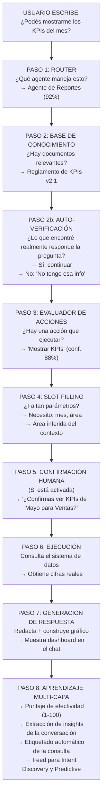
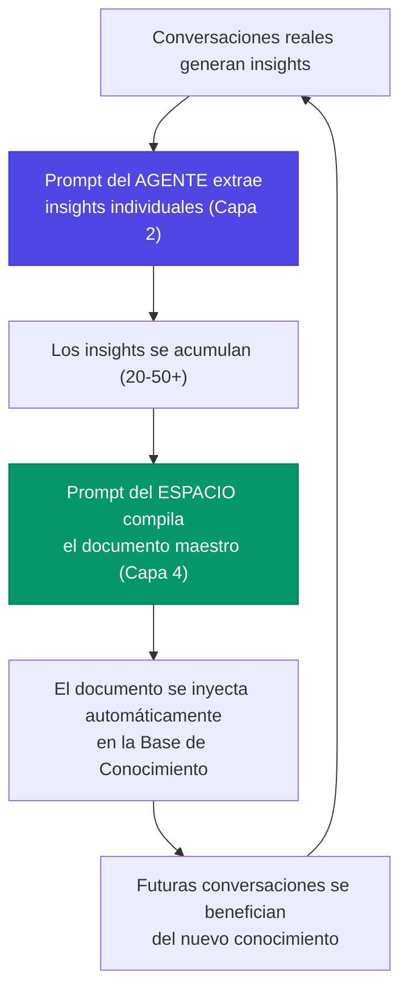

# Las Capacidades de Senda y la Cadena de Pensamiento

> **Versión documentada:** v5.20.13 · **Última revisión:** 2026-05-29

> Este capítulo responde a la pregunta que todo analista de negocio debería poder responder antes de la primera reunión con su cliente: *«¿Qué puede hacer Senda y cómo lo hace?»*.

---

## El Mapa Completo: Todas las Capacidades de Senda

Senda no es una sola función. Es una plataforma compuesta por capacidades que trabajan en conjunto. La tabla siguiente es tu mapa de referencia:

| Capacidad | ¿Qué hace? | ¿Cuándo la usás? |
|---|---|---|
| 🧠 **IA Conversacional** | Comprende el lenguaje natural del usuario y responde con coherencia y contexto | En cada interacción del chat |
| 📚 **Base de Conocimiento (RAG)** | Busca en los documentos de la empresa antes de responder, citando fuentes reales | Cuando el agente necesita información específica de tu organización |
| ⚙️ **Motor de Acciones** | Ejecuta tareas en sistemas externos: crea tickets, actualiza registros, envía emails, genera reportes | Cuando el usuario necesita que se haga algo, no solo que se responda algo |
| 🎨 **Interfaz Generativa (UI)** | Construye componentes visuales interactivos (gráficos, tablas, formularios) directamente en el chat | Para mostrar datos de forma visual sin abrir otra aplicación |
| 🤖 **Automatización y Scheduling (Mission Control)** | Ejecuta tareas en horarios programados o en respuesta a eventos, sin que nadie escriba nada | Para procesos repetitivos que deben ocurrir solos (reportes diarios, alertas, consolidaciones) |
| 🐝 **Arquitectura Multi-Agente** | Un enjambre de agentes especializados coordinados por un Agente Principal que actúa de router | Para organizaciones con múltiples dominios de conocimiento que necesitan especialización |
| 📊 **Analytics y Aprendizaje** | Mide la efectividad de cada respuesta, detecta brechas y consolida aprendizajes de conversaciones reales | Para mejorar continuamente el rendimiento del agente y demostrar ROI |
| 🔗 **Integraciones** | Se conecta a cualquier sistema con una API estándar: SAP, Jira, Salesforce, sistemas propios | Para dar al agente acceso a datos en tiempo real y capacidad de operar sobre ellos |
| 🔌 **MCP (Protocolo Multi-Canal)** | Permite que Senda opere como un agente experto dentro de herramientas externas como Slack, Teams o Claude Desktop | Para llegar a los usuarios en los canales donde ya trabajan |
| 🔒 **Seguridad y Multi-Tenancy** | Aísla completamente los datos de cada empresa; ningún usuario ve datos de otra organización | Siempre, en todo momento — es la capa invisible que garantiza la confidencialidad empresarial |
| 🖼️ **Pipeline Canvas** | Permite diseñar procesos de negocio visualmente arrastrando nodos en un canvas interactivo, y Senda los ejecuta automáticamente | Para crear flujos multi-paso complejos sin escribir código — onboarding, aprobaciones, workflows |
| 🚀 **Chatless UI** | Muestra widgets proactivos con información y acciones relevantes sin que el usuario escriba nada | Para que los usuarios reciban lo que necesitan al abrir Senda, sin necesidad de chatear |
| 🏗️ **Senda Studio** | Genera agentes, acciones y configuraciones completas a partir de una descripción en lenguaje natural | Para crear implementaciones rápidamente describiendo lo que necesitás en una oración |
| 🎯 **Agentes con Objetivos (Goal-Based)** | Agentes que persiguen objetivos de negocio de forma autónoma, ejecutando cadenas de acciones para cumplirlos | Para operaciones complejas donde el agente debe razonar y actuar en múltiples pasos |
| 📈 **Predictive Analytics** | Anticipa tendencias, detecta anomalías y genera pronósticos sobre las métricas de negocio | Para tomar decisiones informadas basadas en predicciones de IA, no solo datos históricos |
| 🛒 **Marketplace de Skills** | Instalar paquetes de capacidades pre-armados (Skill Packs) con agentes, acciones y documentación listos | Para implementar casos de uso frecuentes en minutos, como instalar una app |
| 🔬 **RAG Prep Engine** | Analiza documentos antes de cargarlos y califica su calidad A-F, detectando datos sensibles, inyecciones y problemas de estructura | Antes de cargar cualquier documento nuevo a la Base de Conocimiento |
| 🔍 **Intent Discovery** | Detecta automáticamente patrones de consultas que ningún agente puede resolver y señala las brechas de cobertura | Para cerrar brechas de conocimiento y expandir las capacidades del sistema continuamente |
| 📐 **Adaptive Dashboards** | Genera dashboards personalizados a partir de una descripción en lenguaje natural, combinando múltiples widgets en una vista coherente | Para crear vistas de datos complejas sin programar ni diseñar manualmente |

> 💡 **Para el implementador**: No todas las 19 capacidades se usan en cada proyecto. Una implementación inicial sólida puede apoyarse en IA Conversacional + Base de Conocimiento + Motor de Acciones, e ir sumando el resto progresivamente.

---

## Senda No Es un Chatbot: La Diferencia Que Importa

Cuando presentás Senda en una empresa, el primer obstáculo siempre es la misma pregunta: *«¿Es como el chatbot del banco que nunca entiende nada?»*. La respuesta es no, y la siguiente tabla te da los argumentos:

| Dimensión | Chatbot tradicional | Senda |
|---|---|---|
| **¿Entiende el lenguaje real?** | Solo palabras clave o menús predefinidos | Comprensión real del lenguaje natural, sin importar cómo lo formule el usuario |
| **¿Sabe de mi empresa?** | No. Tiene un script escrito por programadores | Sí. Aprende de los documentos internos que el implementador carga |
| **¿Puede actualizarse sin programar?** | Cada cambio requiere un desarrollador | El implementador funcional actualiza el conocimiento y el comportamiento directamente |
| **¿Ejecuta acciones reales?** | Rara vez, y de forma muy limitada | Sí: crea tickets, actualiza sistemas, genera reportes, envía emails |
| **¿Trabaja sin que nadie hable?** | No | Sí: schedules y observers actúan de forma proactiva |
| **¿Mejora con el tiempo?** | Estático: nunca aprende de sus errores | Sí: cada conversación puede generar aprendizajes que el agente incorpora |
| **¿Hay múltiples especialistas?** | Un único bot para todo | Un enjambre de agentes, cada uno experto en su área |
| **¿Se puede medir el impacto?** | Prácticamente no | Dashboard de ROI con valor acumulado por automatización |
| **¿Es auditable?** | No hay trazabilidad real | Historial completo de cada conversación, acción y resultado |
| **¿Diseña procesos visualmente?** | No | Sí: Pipeline Canvas + Intent Graph para dibujar flujos ejecutables |
| **¿Se auto-configura desde lenguaje natural?** | No | Sí: Senda Studio genera agentes y acciones desde una descripción |
| **¿Funciona sin chat?** | No — requiere que el usuario escriba | Sí: Chatless UI muestra widgets proactivos + Schedules + Observers |
| **¿Anticipa necesidades?** | No — solo responde preguntas | Sí: Predictive Analytics + Chatless triggers anticipan lo que el usuario necesita |
| **¿Tiene marketplace de capacidades?** | No | Sí: Skill Packs Marketplace para instalar integraciones en minutos |
| **¿Los agentes persiguen objetivos autónomos?** | No — solo responden mensajes individuales | Sí: Goal-Based Reasoning ejecuta cadenas de acciones para cumplir objetivos de negocio |

---

## La Cadena de Pensamiento: Qué Pasa Adentro de Senda

Cuando un usuario escribe un mensaje, parece que la respuesta llega instantáneamente. En realidad, en esos pocos segundos Senda ejecuta una cadena de pasos encadenados. Entender esta cadena es la clave para diagnosticar problemas y configurar bien.

Pensá en Senda como un equipo de trabajo invisible que se activa cada vez que alguien escribe:



### Paso 1 — El Router: ¿Qué Especialista Maneja Esto?

El primer trabajo de Senda es decidir quién responde. El Agente Principal lee el mensaje y compara su contenido con los perfiles de todos los sub-agentes del espacio.

**La analogía del recepcionista:** Cuando llegás a la guardia de un hospital, el recepcionista no te atiende él mismo — te deriva al especialista correcto: traumatología, cardiología, pediatría. El Agente Principal de Senda hace exactamente eso.

El resultado de este paso es un **puntaje de confianza**: cuán seguro está el sistema de que el Agente de Reportes es el indicado para esta pregunta. Si la confianza supera el umbral configurado, la derivación es automática. Si no, el router puede pedir clarificación al usuario.

**Lo que esto significa para la experiencia:** El usuario nunca elige a qué agente hablarle. Solo escribe con naturalidad y el sistema lo lleva al lugar correcto.

### Paso 2 — Base de Conocimiento: ¿Qué Sabe el Agente?

Antes de formular su respuesta, el agente busca en sus documentos. Este paso es como abrir el manual antes de contestar una pregunta técnica.

Senda encuentra fragmentos relevantes de los documentos cargados y los pone a disposición del agente para que los use al responder. Si el agente tiene bien organizada su Base de Conocimiento, las respuestas son precisas y citan fuentes reales de la empresa.

**Lo que esto significa para la experiencia:** El usuario siente que habla con alguien que conoce la empresa por dentro, no con un asistente genérico.

### Paso 2b — Auto-Verificación: El Sistema Que No Inventa

Este es uno de los mecanismos más importantes de Senda, y uno de los menos visibles — precisamente porque funciona en silencio, antes de que el usuario reciba cualquier respuesta.

**El problema que resuelve:** Los modelos de inteligencia artificial son capaces de "inventar" respuestas plausibles cuando no tienen la información real. Esta capacidad, llamada técnicamente "alucinación", es el mayor riesgo de usar IA en entornos empresariales. Un agente que inventa datos de facturación, pasos de un proceso o nombres de productos no solo da una mala respuesta — genera desconfianza.

Senda tiene dos capas de defensa diseñadas para eliminar este riesgo:

#### Capa 1 — La Regla Absoluta (activa en todos los agentes)

Todos los agentes de Senda, sin excepción, tienen instrucciones explícitas grabadas en su funcionamiento:

> *Si la respuesta a la pregunta NO está en los documentos de la Base de Conocimiento, la única respuesta válida es informar que no se tiene esa información. Está terminantemente prohibido inventar pasos, ofrecer sugerencias generales o intentar adivinar una solución genérica.*

Esto significa que si un usuario pregunta algo que ningún documento cargado responde, el agente dirá honestamente: *"No tengo información sobre eso en mi base de conocimiento"*. En lugar de inventar una respuesta que suene razonable.

**La analogía:** Un médico de guardia que no conoce el caso dice *"necesito revisar el historial antes de decirte algo"*, no inventa un diagnóstico. Senda hace lo mismo.

#### Capa 2 — Auto-Verificación Reforzada: Chain of Thought (configurable por agente)

Para agentes que manejan información crítica — datos de facturación, procesos regulados, información médica, reglamentos legales — Senda ofrece un mecanismo adicional: la **verificación paso a paso antes de responder**.

Cuando este modo está activo, antes de escribir cualquier palabra al usuario, el agente realiza en silencio el siguiente razonamiento interno:

```
¿Cuál es la pregunta exacta del usuario?
¿Qué dicen los fragmentos de documentos disponibles?
¿Esa información responde la pregunta de forma explícita? Sí o No.
→ Si sí: redacto la respuesta.
→ Si no: informo que no tengo esa información.
```

Este proceso de razonamiento ocurre completamente invisible para el usuario. El servidor intercepta y descarta el bloque de razonamiento interno antes de enviar la respuesta. El usuario solo ve el resultado: una respuesta basada en evidencia, o una admisión honesta de que la información no está disponible.

> 🔍 **¿Cómo se activa?** El implementador puede habilitar este modo en la configuración del agente, en la sección **Estrategia Anti-Alucinaciones**. Es especialmente recomendado para agentes que manejan regulaciones, procesos críticos o datos de clientes. Para la mayoría de los casos de uso, la Capa 1 es suficiente.

#### ¿Qué garantizan estas dos capas juntas?

| Escenario | Sin Senda (IA genérica) | Con Senda (Capa 1 + 2) |
|---|---|---|
| La IA no tiene la información | Inventa una respuesta plausible | Dice que no tiene esa información |
| La información está en un documento | Puede mezclar información real con inventada | Solo usa lo que el documento dice explícitamente |
| El usuario pregunta algo ambiguo | Adivina la intención y responde con confianza | Verifica si los documentos responden la pregunta y, si no, lo aclara |
| El agente cita fuentes | Puede citar fuentes inventadas | Solo cita documentos que realmente cargó el implementador |

> 📊 **Para la presentación ejecutiva:** *"Senda no alucina porque tiene dos frenos: uno que le prohíbe inventar, y uno que le exige verificar antes de hablar. El usuario siempre recibe información real de sus documentos, o una respuesta honesta de que esa información no está disponible."*

**Lo que esto significa para la experiencia:** El usuario puede confiar en que lo que el agente dice viene de los documentos de la empresa. Si el agente no sabe, lo dice. Esa honestidad es la base de la confianza a largo plazo.

### Paso 3 — Evaluador de Acciones: ¿Hay Algo que Hacer?

Simultáneamente con la búsqueda de documentos, Senda analiza si el mensaje del usuario implica ejecutar una acción concreta. No solo responder — *hacer algo*.

Cada acción configurada tiene un **umbral de activación** (entre 0 y 100). Si la confianza del sistema en que el usuario quiere ejecutar esa acción supera el umbral, la acción se activa.

**Ejemplo:** Si la acción «Crear ticket de soporte» tiene umbral 80 y el sistema detecta que el usuario quiere un ticket con 88% de certeza → la acción se dispara. Si la confianza es 72% → no se dispara, y el agente solo responde con texto.

**Lo que esto significa para la experiencia:** El sistema no ejecuta acciones ante la menor insinuación, pero tampoco las bloquea cuando el usuario es claro.

### Paso 4 — Slot Filling: ¿Faltan Datos?

Si se va a ejecutar una acción, Senda verifica si tiene todos los datos necesarios para completarla. Si falta alguno, los solicita al usuario de forma natural — sin formularios, sin pantallas adicionales.

**La analogía del mozo:** Si pedís un café y no aclaraste el tamaño, el mozo pregunta: *«¿Grande o chico?»*. Senda hace lo mismo: si la acción necesita un número de remito y el usuario no lo proporcionó, el agente lo pide en el mismo chat.

Si el dato se puede inferir del contexto (el usuario ya lo mencionó antes en la conversación), Senda lo completa solo sin molestar al usuario.

### Paso 5 — Confirmación Humana (Opcional)

Si la acción está configurada para requerir confirmación, antes de ejecutar Senda le muestra al usuario exactamente qué está a punto de hacer y le pide que apruebe.

**Por qué esto es una ventaja, no una molestia:** Los usuarios confían más en sistemas que les muestran lo que van a hacer antes de hacerlo. Es especialmente importante en acciones que modifican o eliminan datos en sistemas externos.

Este paso es configurable: se puede activar o desactivar por acción, e incluso puede desactivarse después de un período de uso exitoso.

### Paso 6 — Ejecución: La Acción Real

Con todos los datos confirmados, Senda se comunica con el sistema externo y ejecuta la tarea. Crea el ticket, obtiene los datos del ERP, envía el email, actualiza el registro.

En este paso, Senda opera exactamente igual que lo haría un humano con acceso a esos sistemas, pero en segundos y sin errores de tipeo.

### Paso 7 — Generación de Respuesta

Con la información de los documentos y el resultado de la acción en mano, el agente redacta su respuesta. Si los datos lo ameritan, Senda construye automáticamente componentes visuales usando su catálogo de **18 widgets de Generative UI**: gráficos (barras, líneas, áreas, donut), tablas interactivas con ordenamiento y búsqueda, tarjetas de KPI, tableros Kanban, timelines, diagramas de red, calendarios, matrices comparativas, códigos QR, e incluso dashboards adaptativos completos generados desde lenguaje natural.

**Lo que esto significa para la experiencia:** El usuario no recibe un número crudo como respuesta — recibe la información organizada, contextualizada y visualizada con el componente más adecuado para ese tipo de dato.

### Paso 8 — Aprendizaje Multi-Capa: El Sistema Que Se Hace Más Inteligente

Después de cada respuesta, Senda no solo "registra" lo que pasó — ejecuta **4 procesos de inteligencia** en paralelo:

| Proceso | ¿Qué hace? | Resultado |
|---|---|---|
| 📊 **Evaluación de Efectividad** | Califica la respuesta del 1 al 100 según criterios configurables por el implementador | Puntaje que alimenta el dashboard de Analytics |
| 🧠 **Extracción de Insights** | Analiza la conversación y extrae lecciones útiles ("el usuario confundió X con Y", "se descubrió un caso no documentado") | Insights que se acumulan para consolidación |
| 🏷️ **Etiquetado Automático** | Categoriza la conversación según criterios del implementador (tipo de consulta, nivel de complejidad, área temática) | Clasificación para análisis y tendencias |
| 🔍 **Alimentación de Discovery** | Si el agente no pudo resolver la consulta, el mensaje se marca como candidato para Intent Discovery | Feed de datos para detectar brechas |

Estos 4 procesos son configurables: cada agente tiene su propio **Prompt de Aprendizaje**, **Prompt de Efectividad** y **Prompt de Etiquetado** que el implementador define para adaptar QUÉ aprende y CÓMO evalúa. Incluso pueden mejorarse con el botón "✨ Mejorar con IA".

> 💡 **Ejemplo:** Un agente de Soporte IT puede tener un prompt de efectividad que diga *"Calificá alto si el usuario resolvió su problema sin escalar. Calificá bajo si el usuario tuvo que repetir la pregunta."* Mientras que un agente de Ventas puede evaluar *"Calificá alto si se avanzó en el pipeline o se identificó una oportunidad."*

---

## Las 6 Capas de Inteligencia: Cómo Senda Se Hace Más Inteligente

El aprendizaje en Senda no es un proceso único — es un sistema de **6 capas** que trabajan juntas para que cada agente mejore con el tiempo.

### Capa 1 — Calidad Preventiva: RAG Prep Engine

Antes de que un documento entre al sistema, el **RAG Prep Engine** lo analiza y le asigna una calificación A-F. Detecta datos sensibles (emails, DNI, API keys), inyecciones de prompt, problemas de estructura y falta de coherencia con el agente destino.

**Impacto:** Un agente que recibe documentos con calificación A responde mejor que uno alimentado con documentos sin verificar. La calidad de entrada determina la calidad de salida.

### Capa 2 — Aprendizaje Conversacional: Los 3 Prompts del Agente

Cada agente tiene **3 prompts configurables** que se ejecutan después de cada conversación para analizar lo que pasó:

| Prompt | ¿Qué hace? | Ejemplo |
|---|---|---|
| **Prompt de Aprendizaje** | Extrae insights individuales de cada conversación | *"Detectá casos donde el usuario necesitó información que no estaba en los documentos"* |
| **Prompt de Efectividad** | Califica la respuesta del 1 al 100 según criterios del implementador | *"Calificá alto si el usuario resolvió sin escalar, bajo si repitió la pregunta"* |
| **Prompt de Etiquetado** | Categoriza la conversación con etiquetas | *"Clasificá como: consulta técnica, solicitud de servicio, reclamo, o sugerencia"* |

El implementador que personaliza estos 3 prompts tiene agentes que aprenden **exactamente lo que importa para su negocio**, no lo que un modelo genérico decide.

> 💡 **Importante**: El Prompt de Aprendizaje del Agente es solo la primera mitad del ciclo. Extrae insights sueltos de cada conversación. Para que esos insights se conviertan en conocimiento útil, necesitan pasar por la **consolidación** (Capa 4), que usa un prompt diferente configurado a nivel del **Espacio**. Ver [Dominar los Prompts — Arquitectura de 2 Niveles](./03_dominar_los_prompts.md) para la explicación completa.

### Capa 3 — Detección de Brechas: Intent Discovery

El **Intent Discovery Engine** analiza las conversaciones donde el agente no pudo resolver la consulta y agrupa esos mensajes en patrones. El resultado: Senda te dice exactamente qué le piden que no puede resolver.

**Ejemplo real:** *"En las últimas 2 semanas, 47 usuarios preguntaron por el procedimiento de VPN y ningún agente pudo responder. Frecuencia: 3.4 consultas/día."*

El implementador puede aceptar el intent descubierto (y crear documentación para cubrirlo) o descartarlo (si no es relevante).

### Capa 4 — Consolidación Automática (usa el Prompt del Espacio)

Los insights acumulados de la Capa 2 se consolidan periódicamente en un **documento maestro estructurado** que Senda genera automáticamente y lo inyecta de vuelta a la Base de Conocimiento del agente.

> ⚠️ **Distinción clave**: La consolidación NO usa el Prompt de Aprendizaje del Agente (Capa 2). Usa el **Prompt de Aprendizaje del Espacio**, que se configura en el tablero del grupo/espacio. Este prompt define CÓMO redactar el documento final — estructura, tono, formato, reglas de resolución de conflictos. Sin este prompt configurado en el Espacio, la consolidación no puede ejecutarse.



**Frecuencia recomendada:** Cada 2-4 semanas, o cuando se acumulen 20+ aprendizajes.

### Capa 5 — Anticipación: Predictive Analytics

Mientras las capas anteriores miran al pasado, Predictive Analytics mira al **futuro**. Analiza patrones históricos y genera:

- **Pronósticos:** *"Si la tendencia actual continúa, las ventas del próximo mes serán ~$450K"*
- **Detección de anomalías:** *"Las devoluciones de esta semana están un 340% arriba del promedio"*
- **Alertas predictivas:** *"Al ritmo actual, el inventario de producto X se agota en 12 días"*

### Capa 6 — Exploración: Analytics SQL Agent

Para explorar todos los datos de aprendizaje acumulados, el **Analytics SQL Agent** permite hacer preguntas en lenguaje natural que se traducen automáticamente en consultas sobre los datos de uso:

- *"¿Cuántos tickets se resolvieron sin intervención humana este mes?"*
- *"¿Cuáles son los 5 temas más consultados en el espacio de Soporte?"*
- *"¿Qué agente tiene el puntaje de efectividad más alto?"*

Los resultados se muestran con Generative UI (gráficos, tablas, KPIs) directamente en la interfaz.

### El Ciclo Completo: Los 6 Engranajes en Acción

| Momento | ¿Qué ocurre? | ¿Quién actúa? | Capa |
|---|---|---|---|
| **Antes de cargar documentos** | RAG Prep analiza y califica | Implementador | 1️⃣ |
| **Después de cada conversación** | 3 prompts extraen insights, efectividad y etiquetas | Automático | 2️⃣ |
| **Continuamente** | Intent Discovery detecta brechas no resueltas | Automático + Implementador | 3️⃣ |
| **Cada 2-4 semanas** | Consolidación genera documentación nueva | Implementador + Senda | 4️⃣ |
| **Continuamente** | Predictive Analytics anticipa tendencias y anomalías | Automático | 5️⃣ |
| **Bajo demanda** | Analytics SQL Agent explora datos con lenguaje natural | Implementador | 6️⃣ |

**La consecuencia real:** Un agente que lleva 6 meses en producción con las 6 capas activas es **radicalmente** mejor que uno recién configurado. No solo responde mejor — detecta sus propias brechas, anticipa problemas y se fortalece con cada conversación.

> 🔑 **Idea clave**: Senda no aprende «mágicamente». Aprende porque tiene 6 capas de inteligencia diseñadas para capturar, verificar, consolidar y anticipar conocimiento. El implementador que activa y gestiona estas 6 capas tiene agentes que rinden muy por encima del promedio.

---

## Checklist del Capítulo

Antes de pasar al siguiente capítulo, verificá que podés responder estas preguntas:

- [ ] ¿Puedo explicarle a un cliente las 19 capacidades de Senda en menos de 5 minutos?
- [ ] ¿Sé por qué Senda no es lo mismo que un chatbot tradicional?
- [ ] ¿Entiendo para qué sirve el Router y qué es el puntaje de confianza?
- [ ] ¿Sé en qué caso Senda le pide datos adicionales al usuario (Slot Filling)?
- [ ] ¿Entiendo cuándo activar la Confirmación Humana y cuándo no?
- [ ] ¿Puedo explicar por qué Senda no inventa respuestas y cómo funciona la verificación automática?
- [ ] ¿Sé en qué tipo de agente conviene activar el modo de verificación reforzada (Chain of Thought)?
- [ ] ¿Puedo explicar las 6 capas de inteligencia sin usar términos técnicos?
- [ ] ¿Sé qué son los 3 prompts de aprendizaje (aprendizaje, efectividad, etiquetado) y para qué sirve cada uno?
- [ ] ¿Entiendo cómo RAG Prep mejora la calidad del aprendizaje preventivamente?
- [ ] ¿Puedo explicar qué es Intent Discovery y cómo detecta brechas automáticamente?
- [ ] ¿Entiendo cómo Predictive Analytics anticipa tendencias de negocio?
- [ ] ¿Sé qué es el Analytics SQL Agent y cómo explorar datos con lenguaje natural?
- [ ] ¿Puedo explicar el ciclo completo de mejora continua de Senda (los 6 engranajes)?
- [ ] ¿Sé qué debo hacer como implementador para que el agente mejore con el tiempo?

---

> 📖 **Anterior:** [01 — ¿Qué es Senda?](./01_que_es_senda.md)
> 📖 **Siguiente:** [03 — Configurar Espacios y Agentes](./02_configurar_espacios_y_agentes.md)
