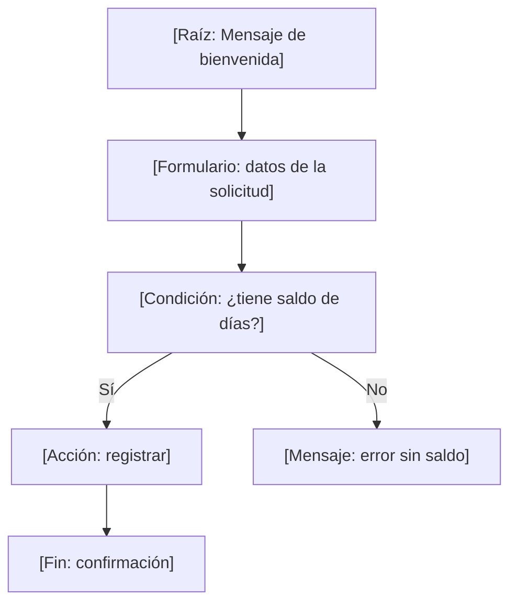
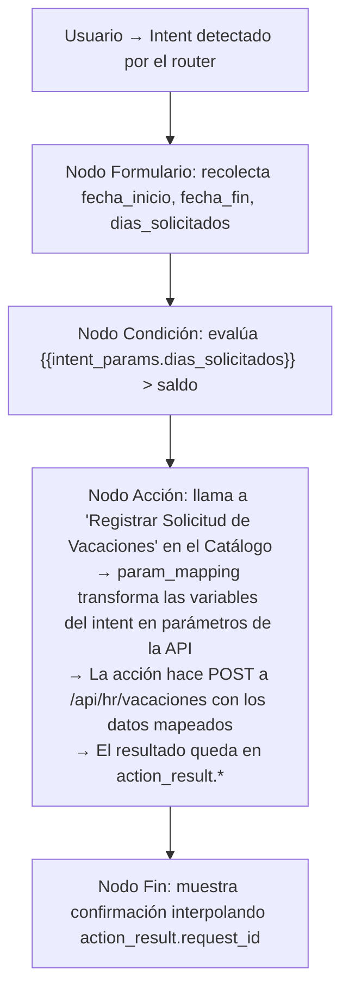
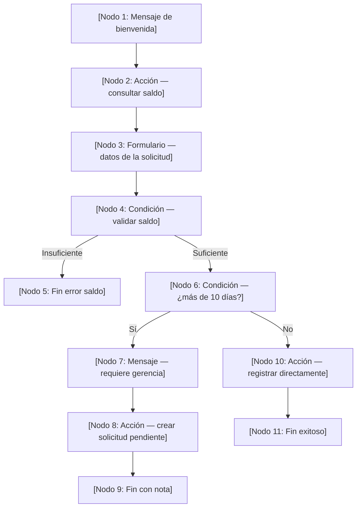

# 04. Intent Graph y Flujos Conversacionales

> **Versión documentada:** v5.6.92 · **Última revisión:** 2026-05-27

El Intent Graph es el motor de conversación determinista de Senda. Cuando el comportamiento generativo de un agente libre no es suficiente para garantizar la correctitud de un proceso crítico, el Intent Graph toma el control y guía al usuario a través de un flujo estructurado con lógica de negocio verificable.

---

## ¿Qué es el Intent Graph?

Un agente de Senda sin Intent Graph responde de forma **generativa**: el LLM infiere la mejor respuesta a partir del contexto, el system prompt y las acciones disponibles. Esto es ideal para consultas abiertas, pero introduce variabilidad no aceptable en procesos como la solicitud de vacaciones, el reporte de incidentes o la aprobación de gastos.

El Intent Graph permite diseñar **flujos conversacionales deterministas**: grafos dirigidos donde cada nodo tiene un tipo, una configuración y transiciones explícitas hacia el siguiente nodo. El LLM sigue siendo el motor de comprensión del lenguaje natural (detecta qué intent quiso decir el usuario), pero una vez dentro del flujo, el grafo controla el progreso paso a paso.

### Los dos modos de conversación

| Característica | Agente Libre (Generativo) | Intent Graph (Determinista) |
|---|---|---|
| **Control del flujo** | LLM decide el próximo paso | El grafo define el próximo nodo |
| **Variabilidad** | Alta — cada respuesta puede diferir | Nula — el flujo es predecible |
| **Validación de datos** | Implícita (el LLM infiere) | Explícita (reglas configuradas) |
| **Corrección de errores** | El LLM reintenta conversacionalmente | El nodo hace retry con mensaje de error específico |
| **Auditabilidad** | Difícil de rastrear paso a paso | Cada nodo deja traza en el historial |
| **Complejidad de config** | Baja — solo system prompt | Alta — requiere diseño del grafo |
| **Flexibilidad** | Total | Limitada al árbol diseñado |

---

## Cuándo Usar Intent Graph vs. Agente Libre

La elección correcta depende de cuatro variables: predictibilidad del input del usuario, criticidad del proceso, número de parámetros a recolectar y necesidad de validación formal.

| Escenario | Recomendación | Justificación |
|---|---|---|
| FAQ y consultas informativas | ❌ Agente libre | El usuario no sigue un script; la variabilidad es el valor |
| Exploración de datos (dashboards, KPIs) | ❌ Agente libre | El usuario puede pedir lo que necesita libremente |
| Solicitud de vacaciones con aprobación | ✅ Intent Graph | Proceso regulado, campos obligatorios, validación de fechas |
| Reporte de incidente de campo | ✅ Intent Graph | Datos estructurados requeridos para el ticket |
| Onboarding paso a paso | ✅ Intent Graph | Secuencia fija de pasos obligatorios |
| Consultas con respuesta abierta | ❌ Agente libre | La respuesta no cabe en un árbol finito |
| Proceso de aprobación multi-nivel | ✅ Intent Graph | El flujo depende de condiciones de negocio verificables |
| Creación de registros complejos en ERP | ✅ Intent Graph + Form Node | Formulario validado > conversación multi-turno |
| Atención de consultas de clientes externos | ❌ Agente libre | Variabilidad excesiva para un grafo |

**Regla práctica:** si podés dibujar el flujo en un diagrama de flujo con menos de 15 nodos, usá Intent Graph. Si el árbol de decisiones es infinito, usá agente libre con una buena directiva.

---

## Arquitectura del Intent Graph

Un Intent Graph está compuesto por:

1. **Nodos**: unidades de interacción atómicas (mensaje, pregunta, formulario, condición, acción, salto, fin)
2. **Transiciones**: conexiones dirigidas entre nodos, etiquetadas con condiciones o respuestas del usuario
3. **Variables de contexto**: datos acumulados durante el flujo, accesibles como `{{intent_params.nombre_campo}}`
4. **Nodo raíz**: el primer nodo que se ejecuta al detectar el intent

El grafo puede tener ramificaciones (nodos de condición con múltiples salidas) pero no debe tener ciclos no controlados. Los únicos ciclos permitidos son los retry de nodos de pregunta cuando la validación falla.



---

## Tipos de Nodos

### Nodo Mensaje

Envía texto estático o con interpolación de variables al usuario. No espera input.

```json
{
  "type": "message",
  "id": "bienvenida",
  "content": "Hola {{intent_params.user_name}}, voy a ayudarte a registrar tu solicitud de vacaciones. Necesito algunos datos.",
  "next": "formulario_solicitud"
}
```

**Variables disponibles para interpolación:**

| Variable | Descripción |
|---|---|
| `{{intent_params.campo}}` | Valor recolectado en un nodo anterior del mismo intent |
| `{{user.name}}` | Nombre del usuario autenticado |
| `{{user.email}}` | Email del usuario |
| `{{tenant.name}}` | Nombre de la empresa/tenant |
| `{{action_result.campo}}` | Campo del resultado de un nodo de acción previo |

El contenido del nodo mensaje soporta Markdown básico (negritas, listas, código inline). Los saltos de línea se respetan.

---

### Nodo Pregunta

Solicita un único dato al usuario. Puede ser texto libre o una respuesta estructurada.

#### Subtipo: texto libre

```json
{
  "type": "question",
  "id": "motivo_licencia",
  "input_type": "text",
  "prompt": "¿Cuál es el motivo de tu solicitud de vacaciones?",
  "param_name": "motivo",
  "required": false,
  "next": "nodo_condicion_dias"
}
```

#### Subtipo: select (lista de opciones)

```json
{
  "type": "question",
  "id": "tipo_licencia",
  "input_type": "select",
  "prompt": "¿Qué tipo de licencia necesitás?",
  "param_name": "tipo_licencia",
  "options": [
    { "label": "Vacaciones anuales", "value": "vacaciones" },
    { "label": "Licencia médica", "value": "medica" },
    { "label": "Licencia sin goce", "value": "sin_goce" },
    { "label": "Estudio", "value": "estudio" }
  ],
  "required": true,
  "next": "formulario_fechas"
}
```

#### Subtipo: date picker

```json
{
  "type": "question",
  "id": "fecha_inicio",
  "input_type": "date",
  "prompt": "¿Desde qué fecha necesitás la licencia?",
  "param_name": "fecha_inicio",
  "validation": {
    "min_date": "today",
    "error_message": "La fecha de inicio no puede ser en el pasado."
  },
  "next": "pregunta_fecha_fin"
}
```

#### Subtipo: number

```json
{
  "type": "question",
  "id": "cantidad_dias",
  "input_type": "number",
  "prompt": "¿Cuántos días de vacaciones necesitás?",
  "param_name": "dias_solicitados",
  "validation": {
    "min": 1,
    "max": 30,
    "integer_only": true,
    "error_message": "Ingresá un número entre 1 y 30."
  },
  "next": "nodo_condicion_saldo"
}
```

Cuando la validación falla en un nodo pregunta, el sistema reenvía el `error_message` y vuelve a presentar el mismo nodo. El contador de reintentos por defecto es 3; al superarlo, el flujo deriva al escape hatch configurado.

---

### Nodo Formulario

El nodo de mayor impacto en la experiencia del usuario. Consolida la recolección de múltiples parámetros en una única interacción visual, eliminando la conversación multi-turno.

```json
{
  "type": "form",
  "id": "formulario_solicitud_vacaciones",
  "title": "Solicitud de Vacaciones",
  "fields": [
    {
      "name": "fecha_inicio",
      "label": "Fecha de inicio",
      "type": "date",
      "required": true,
      "validation": {
        "min_date": "today",
        "error_message": "La fecha no puede ser en el pasado."
      }
    },
    {
      "name": "fecha_fin",
      "label": "Fecha de fin",
      "type": "date",
      "required": true,
      "validation": {
        "after_field": "fecha_inicio",
        "error_message": "La fecha de fin debe ser posterior a la de inicio."
      }
    },
    {
      "name": "dias_solicitados",
      "label": "Días hábiles solicitados",
      "type": "number",
      "required": true,
      "validation": { "min": 1, "max": 30 }
    },
    {
      "name": "responsable_interino",
      "label": "Responsable durante tu ausencia",
      "type": "user_picker",
      "required": true
    },
    {
      "name": "motivo",
      "label": "Motivo (opcional)",
      "type": "textarea",
      "required": false,
      "placeholder": "Podés dejarlo en blanco si preferís."
    },
    {
      "name": "notificar_equipo",
      "label": "Notificar automáticamente a mi equipo",
      "type": "checkbox",
      "default": true
    }
  ],
  "submit_label": "Enviar solicitud",
  "on_complete": "nodo_condicion_saldo",
  "on_cancel": "nodo_cancelacion"
}
```

**Tipos de campo disponibles en Form Node:**

| Tipo | Renderizado | Validaciones soportadas |
|---|---|---|
| `text` | Campo de texto de una línea | `min_length`, `max_length`, `regex` |
| `textarea` | Área de texto multilínea | `min_length`, `max_length` |
| `number` | Input numérico | `min`, `max`, `integer_only` |
| `select` | Dropdown con opciones | Lista de valores válidos |
| `radio_pills` | Botones de opción visual | Lista de valores válidos |
| `checkbox` | Casilla booleana | — |
| `user_picker` | Selector de usuario del tenant | — |
| `date` | Calendario de fecha | `min_date`, `max_date`, `after_field` |
| `date_time` | Selector de fecha y hora | `min_date`, `max_date` |

#### Mensajes de error en formularios

Cada campo puede tener su propio `error_message` por regla de validación. Si el formulario falla validación del lado del servidor (por ejemplo, el sistema externo rechaza la fecha), el nodo puede configurar un mensaje de error global:

```json
{
  "on_server_error": {
    "message": "No pudimos registrar tu solicitud: {{action_result.error_detail}}. Revisá los datos e intentá de nuevo.",
    "allow_retry": true
  }
}
```

#### Slot retry en formularios

Si el usuario cancela o el formulario vence por inactividad (timeout: 10 minutos por defecto), el sistema guarda el estado parcial del formulario. Si el usuario vuelve a iniciar el mismo intent dentro de los 30 minutos siguientes, Senda ofrece retomar desde donde dejó:

```ui-mockup
"Tenés una solicitud de vacaciones incompleta de hace 15 minutos.
¿Querés continuar desde donde estabas o empezar de nuevo?"
[Continuar]  [Empezar de nuevo]
```

---

### Nodo Condición

Evalúa una expresión lógica sobre las variables del contexto y dirige el flujo a diferentes nodos según el resultado. Cada condición puede tener múltiples ramas; la primera que evalúa como verdadera gana.

```json
{
  "type": "condition",
  "id": "nodo_condicion_saldo",
  "branches": [
    {
      "condition": "{{intent_params.dias_solicitados}} > {{action_result.saldo_disponible}}",
      "next": "nodo_error_saldo_insuficiente",
      "label": "Saldo insuficiente"
    },
    {
      "condition": "{{intent_params.dias_solicitados}} > 10",
      "next": "nodo_requiere_aprobacion_gerencia",
      "label": "Requiere aprobación gerencial"
    },
    {
      "condition": "true",
      "next": "nodo_accion_registrar",
      "label": "Flujo estándar"
    }
  ]
}
```

La rama `"condition": "true"` actúa como `default` y se evalúa si ninguna condición anterior fue verdadera.

#### Operadores y expresiones

Las expresiones de condición usan sintaxis de interpolación de doble llave y soportan los siguientes operadores:

| Operador | Sintaxis | Ejemplo |
|---|---|---|
| Igualdad | `==` | `{{intent_params.tipo}} == 'medica'` |
| Desigualdad | `!=` | `{{intent_params.tipo}} != 'vacaciones'` |
| Mayor que | `>` | `{{intent_params.dias}} > 10` |
| Mayor o igual | `>=` | `{{action_result.score}} >= 80` |
| Menor que | `<` | `{{intent_params.dias}} < 1` |
| Menor o igual | `<=` | `{{action_result.balance}} <= 0` |
| Contiene texto | `contains` | `{{intent_params.motivo}} contains 'urgente'` |
| Es nulo | `== null` | `{{intent_params.responsable}} == null` |
| No es nulo | `!= null` | `{{action_result.ticket_id}} != null` |

#### Coerción de tipos

El motor de expresiones aplica coerción automática: si una variable contiene el string `"15"` y se compara con el número `10`, la comparación `> 10` evalúa correctamente como verdadera. Sin embargo, las comparaciones de strings son case-sensitive: `'Medica' != 'medica'`. Usá `.lower()` para normalizar:

```
{{intent_params.tipo.lower()}} == 'medica'
```

#### Manejo de nulos

Si una variable no fue completada en el flujo (campo opcional que el usuario dejó vacío), su valor es `null`. Comparar un nulo con `>` o `<` siempre evalúa `false`. Siempre verificá nulos antes de comparaciones numéricas:

```json
{
  "condition": "{{intent_params.dias}} != null AND {{intent_params.dias}} > 10"
}
```

---

### Nodo Acción

Ejecuta una acción del Catálogo de Acciones de Senda. Los parámetros se mapean desde las variables del contexto del intent.

```json
{
  "type": "action",
  "id": "nodo_accion_registrar",
  "action_name": "Registrar Solicitud de Vacaciones",
  "param_mapping": {
    "employee_id": "{{user.id}}",
    "start_date": "{{intent_params.fecha_inicio}}",
    "end_date": "{{intent_params.fecha_fin}}",
    "days_requested": "{{intent_params.dias_solicitados}}",
    "backup_person_id": "{{intent_params.responsable_interino.id}}",
    "reason": "{{intent_params.motivo}}",
    "notify_team": "{{intent_params.notificar_equipo}}"
  },
  "on_success": "nodo_fin_exitoso",
  "on_error": "nodo_error_sistema",
  "timeout_seconds": 15
}
```

El resultado de la acción queda disponible en el contexto como `{{action_result.*}}`, navegable con notación de punto:

```
{{action_result.request_id}}     → ID de la solicitud creada
{{action_result.approver_name}}  → Nombre del aprobador asignado
{{action_result.error_code}}     → Código de error si falló
```

**Timeout y manejo de errores en nodo acción:**

Si la acción tarda más que `timeout_seconds` (default: 30), el nodo deriva al `on_error`. Se recomienda configurar siempre ambas transiciones.

---

### Nodo Jump

Redirige el flujo a otro intent o a un nodo específico del mismo grafo. Útil para reutilizar sub-flujos o implementar reinicio limpio.

```json
{
  "type": "jump",
  "id": "nodo_salto_ayuda",
  "target_type": "intent",
  "target_id": "ayuda_general",
  "preserve_context": false
}
```

| Campo | Opciones | Descripción |
|---|---|---|
| `target_type` | `"intent"`, `"node"` | Si el salto va a otro intent o a un nodo dentro del mismo grafo |
| `target_id` | string | Slug del intent o ID del nodo de destino |
| `preserve_context` | `true/false` | Si se deben pasar las variables del intent actual al destino |

**Reinicio del mismo intent:**
```json
{
  "type": "jump",
  "target_type": "node",
  "target_id": "bienvenida",
  "preserve_context": false
}
```

---

### Nodo Fin

Cierra el flujo. Puede presentar un mensaje de éxito, error o neutral al usuario.

```json
{
  "type": "end",
  "id": "nodo_fin_exitoso",
  "status": "success",
  "message": "✅ Tu solicitud de vacaciones fue registrada con el ID **{{action_result.request_id}}**. Recibirás una notificación cuando {{action_result.approver_name}} la revise.\n\nTu saldo actualizado de días disponibles: **{{action_result.remaining_balance}}**."
}
```

```json
{
  "type": "end",
  "id": "nodo_cancelacion",
  "status": "neutral",
  "message": "Entendido. Cancelé la solicitud. Si cambiás de opinión, podés iniciar el proceso nuevamente."
}
```

```json
{
  "type": "end",
  "id": "nodo_error_saldo_insuficiente",
  "status": "error",
  "message": "❌ No tenés suficiente saldo de días disponibles. Solicitaste **{{intent_params.dias_solicitados}}** días, pero tu saldo es de **{{action_result.saldo_disponible}}**. Contactá a RRHH para opciones."
}
```

---

## Variables y Contexto Entre Nodos

El contexto del intent es un objeto mutable que persiste durante todo el flujo. Cada nodo puede leer y las respuestas del usuario y los resultados de acciones van acumulándose.

### Fuentes de variables

```
intent_params.*     → Datos recolectados en nodos Pregunta y Formulario
action_result.*     → Resultado del nodo Acción más reciente
user.*              → Datos del usuario autenticado (id, name, email, department)
tenant.*            → Datos del tenant (name, id)
system.*            → Variables del sistema (fecha_hoy, timestamp_ahora)
```

### Notación de acceso a objetos anidados

Si el `user_picker` retorna un objeto de usuario, sus propiedades son accesibles con punto:

```
{{intent_params.responsable_interino.id}}
{{intent_params.responsable_interino.name}}
{{intent_params.responsable_interino.email}}
```

Si el resultado de la acción retorna un array, podés acceder al primer elemento:

```
{{action_result.approvers[0].name}}
```

---

## Conectar el Intent Graph con el Catálogo de Acciones

El Intent Graph y el Catálogo de Acciones son entidades independientes que se conectan exclusivamente a través del **Nodo Acción**. Para que un nodo acción funcione correctamente:

1. La acción debe existir en el Catálogo y estar **activa**
2. El nombre en `action_name` debe coincidir exactamente (case-sensitive) con el nombre de la acción en el catálogo
3. Los parámetros del `param_mapping` deben coincidir con los parámetros declarados en la acción del catálogo
4. Las credenciales referenciadas por la acción deben estar registradas en la Bóveda del tenant

**Flujo de datos completo:**



---

## Activación del Intent: El Router de Intenciones

El router de intenciones es el componente que analiza cada mensaje del usuario y determina si debe activar un Intent Graph o continuar en modo agente libre.

### Cómo se define un trigger de intent

Cada intent tiene una configuración de activación:

```json
{
  "intent_id": "solicitud_vacaciones",
  "display_name": "Solicitar Vacaciones",
  "triggers": {
    "keywords": ["vacaciones", "días libres", "licencia", "ausencia", "permiso"],
    "semantic_description": "El usuario quiere solicitar días de vacaciones, licencia médica, o cualquier tipo de ausencia laboral programada.",
    "min_confidence": 0.75
  },
  "active": true
}
```

El router usa el `semantic_description` para que el LLM evalúe la similitud semántica entre el mensaje del usuario y cada intent registrado. Si la confianza supera `min_confidence`, el Intent Graph se activa. Las `keywords` actúan como boost para el score de confianza.

### Solapamiento de intents

Si dos intents tienen `semantic_description` similares, el router puede tener ambigüedad. Para resolverla:

1. Hacer los `semantic_description` más específicos y diferenciales
2. Aumentar `min_confidence` en ambos intents
3. Agregar ejemplos de frases que NO deben activar el intent en el campo `negative_examples`

---

## Testing: El Simulador de Intent Graph

Antes de activar un Intent Graph en producción, el simulador permite recorrer el flujo completo sin ejecutar acciones reales.

### Cómo usar el simulador

1. En **Configuración → Intent Graph → [nombre del intent]**, click en **🧪 Simular**
2. El simulador abre un chat de prueba sandboxed
3. Escribir mensajes como lo haría el usuario real
4. El panel de debug lateral muestra en tiempo real:
   - Nodo actual activo
   - Variables del contexto (`intent_params.*`)
   - La rama que tomó cada nodo de condición
   - El payload que se enviaría al Catálogo (sin ejecutarlo realmente)

```ui-mockup
DEBUG: Intent Graph — Solicitud de Vacaciones
─────────────────────────────────────────────
Nodo actual:      formulario_solicitud_vacaciones
Variables:
  fecha_inicio:   2026-06-02
  fecha_fin:      2026-06-10
  dias_solicitados: 7
  responsable:    {"id": "u_abc", "name": "María López"}
  motivo:         null

Próximo nodo:     nodo_condicion_saldo
Condición a eval: 7 > {{action_result.saldo_disponible}}
Nota: action_result.saldo_disponible = [simulado: 15]
→ 7 > 15 = FALSE → rama "Flujo estándar"
```

Las acciones en modo simulador no ejecutan la llamada real a la API — retornan el mock configurado en la acción del catálogo (si existe) o un objeto vacío.

---

## Escape Hatches: Cuando el Usuario Sale del Guión

Un escape hatch es un camino de salida del flujo para situaciones no contempladas por el grafo.

### Tipos de escape hatch

**1. Cancelación explícita:** El usuario escribe "cancelar", "salir", "no quiero seguir". El sistema detecta estas frases automáticamente y deriva al nodo de cancelación del intent (si está configurado) o al `nodo_cancelacion` global.

**2. Input fuera de contexto:** El usuario escribe algo que no tiene relación con el flujo activo (ej: pregunta el precio de un producto mientras está a mitad de una solicitud de vacaciones). Comportamiento configurable:

```json
{
  "off_script_behavior": "pause_and_answer"
}
```

| Valor | Comportamiento |
|---|---|
| `"pause_and_answer"` | El agente responde la pregunta y luego ofrece retomar el flujo |
| `"warn_and_continue"` | Avisa al usuario que está en medio de un flujo y vuelve a presentar el nodo actual |
| `"abandon"` | Abandona el flujo y responde como agente libre |

**3. Máximo de reintentos:** Si un nodo de pregunta o formulario falla la validación más de `max_retries` veces (default: 3), el nodo deriva al escape hatch configurado:

```json
{
  "on_max_retries": {
    "next": "nodo_fin_error",
    "message": "Parece que hay un problema con los datos ingresados. Te comunico con el equipo de RRHH para que te ayuden."
  }
}
```

---

## Ejemplo Completo: Solicitud de Vacaciones

### Estructura del grafo



### Configuración completa en JSON

```json
{
  "intent_id": "solicitud_vacaciones",
  "display_name": "Solicitar Vacaciones",
  "triggers": {
    "keywords": ["vacaciones", "licencia", "días libres", "ausencia"],
    "semantic_description": "El usuario quiere solicitar un período de vacaciones, licencia médica o cualquier tipo de ausencia laboral programada.",
    "min_confidence": 0.78
  },
  "off_script_behavior": "pause_and_answer",
  "nodes": [
    {
      "id": "bienvenida",
      "type": "message",
      "content": "Hola **{{user.name}}** 👋 Voy a ayudarte con tu solicitud de vacaciones. Primero déjame consultar tu saldo disponible.",
      "next": "consultar_saldo"
    },
    {
      "id": "consultar_saldo",
      "type": "action",
      "action_name": "Consultar Saldo de Vacaciones",
      "param_mapping": {
        "employee_id": "{{user.id}}"
      },
      "on_success": "formulario_solicitud",
      "on_error": "fin_error_sistema",
      "timeout_seconds": 10
    },
    {
      "id": "formulario_solicitud",
      "type": "form",
      "title": "Solicitud de Vacaciones",
      "preamble": "Tu saldo actual es de **{{action_result.saldo_disponible}} días**. Completá los datos de tu solicitud:",
      "fields": [
        {
          "name": "fecha_inicio",
          "label": "Fecha de inicio",
          "type": "date",
          "required": true,
          "validation": {
            "min_date": "today+1",
            "error_message": "La fecha de inicio debe ser a partir de mañana."
          }
        },
        {
          "name": "fecha_fin",
          "label": "Fecha de fin",
          "type": "date",
          "required": true,
          "validation": {
            "after_field": "fecha_inicio",
            "error_message": "La fecha de fin debe ser posterior a la de inicio."
          }
        },
        {
          "name": "dias_habiles",
          "label": "Días hábiles (sin contar feriados)",
          "type": "number",
          "required": true,
          "validation": { "min": 1, "max": 30, "integer_only": true }
        },
        {
          "name": "responsable",
          "label": "Responsable durante tu ausencia",
          "type": "user_picker",
          "required": true
        },
        {
          "name": "motivo",
          "label": "Motivo (opcional)",
          "type": "textarea",
          "required": false
        },
        {
          "name": "notificar_equipo",
          "label": "Notificar automáticamente a mi equipo por email",
          "type": "checkbox",
          "default": true
        }
      ],
      "submit_label": "Enviar solicitud",
      "on_complete": "condicion_saldo",
      "on_cancel": "fin_cancelacion"
    },
    {
      "id": "condicion_saldo",
      "type": "condition",
      "branches": [
        {
          "condition": "{{intent_params.dias_habiles}} > {{action_result.saldo_disponible}}",
          "next": "fin_error_saldo",
          "label": "Saldo insuficiente"
        },
        {
          "condition": "{{intent_params.dias_habiles}} > 10",
          "next": "aviso_requiere_gerencia",
          "label": "Más de 10 días — requiere aprobación"
        },
        {
          "condition": "true",
          "next": "accion_registrar",
          "label": "Flujo estándar"
        }
      ]
    },
    {
      "id": "aviso_requiere_gerencia",
      "type": "message",
      "content": "Las solicitudes de más de **10 días hábiles** requieren aprobación de tu gerente. La solicitud quedará en estado pendiente hasta que la aprueben.",
      "next": "accion_registrar_pendiente"
    },
    {
      "id": "accion_registrar",
      "type": "action",
      "action_name": "Registrar Solicitud de Vacaciones",
      "param_mapping": {
        "employee_id": "{{user.id}}",
        "start_date": "{{intent_params.fecha_inicio}}",
        "end_date": "{{intent_params.fecha_fin}}",
        "days": "{{intent_params.dias_habiles}}",
        "backup_id": "{{intent_params.responsable.id}}",
        "reason": "{{intent_params.motivo}}",
        "notify_team": "{{intent_params.notificar_equipo}}",
        "requires_approval": false
      },
      "on_success": "fin_exitoso",
      "on_error": "fin_error_sistema"
    },
    {
      "id": "accion_registrar_pendiente",
      "type": "action",
      "action_name": "Registrar Solicitud de Vacaciones",
      "param_mapping": {
        "employee_id": "{{user.id}}",
        "start_date": "{{intent_params.fecha_inicio}}",
        "end_date": "{{intent_params.fecha_fin}}",
        "days": "{{intent_params.dias_habiles}}",
        "backup_id": "{{intent_params.responsable.id}}",
        "reason": "{{intent_params.motivo}}",
        "notify_team": "{{intent_params.notificar_equipo}}",
        "requires_approval": true
      },
      "on_success": "fin_pendiente_aprobacion",
      "on_error": "fin_error_sistema"
    },
    {
      "id": "fin_exitoso",
      "type": "end",
      "status": "success",
      "message": "✅ Tu solicitud fue registrada exitosamente con el ID **{{action_result.request_id}}**.\n\n📅 Período: {{intent_params.fecha_inicio}} al {{intent_params.fecha_fin}}\n👤 Responsable: {{intent_params.responsable.name}}\n\nTu saldo restante será de **{{action_result.remaining_balance}} días**."
    },
    {
      "id": "fin_pendiente_aprobacion",
      "type": "end",
      "status": "success",
      "message": "📋 Tu solicitud (ID **{{action_result.request_id}}**) fue registrada y está **pendiente de aprobación** por {{action_result.approver_name}}. Recibirás una notificación cuando sea revisada."
    },
    {
      "id": "fin_error_saldo",
      "type": "end",
      "status": "error",
      "message": "❌ No tenés saldo suficiente. Solicitaste **{{intent_params.dias_habiles}} días** pero tu saldo disponible es de **{{action_result.saldo_disponible}} días**. Contactá a RRHH para más opciones."
    },
    {
      "id": "fin_cancelacion",
      "type": "end",
      "status": "neutral",
      "message": "Entendido, cancelé la solicitud. Podés iniciarla nuevamente cuando quieras."
    },
    {
      "id": "fin_error_sistema",
      "type": "end",
      "status": "error",
      "message": "❌ Hubo un problema al conectar con el sistema de RRHH. Por favor intentá de nuevo en unos minutos o contactá al equipo de soporte."
    }
  ],
  "root_node": "bienvenida"
}
```

---

## Errores Comunes y Cómo Evitarlos

### Error 1: Bucles infinitos

**Síntoma:** El flujo vuelve al mismo nodo sin avanzar.

**Causa:** Un nodo Jump apunta de regreso a un nodo previo sin una condición de salida, o un nodo de condición tiene todas sus ramas apuntando al mismo nodo.

**Solución:** Asegurarte de que todo ciclo en el grafo pase por un nodo que modifique el estado (incrementa un contador, cambia una variable). Usar el simulador para trazar el flujo antes de activar.

### Error 2: Ausencia de escape hatch

**Síntoma:** El usuario queda atrapado en el flujo si ingresa un dato inesperado o quiere salir.

**Causa:** No se configuró `on_max_retries` en los nodos de pregunta/formulario, ni se configuró `off_script_behavior`.

**Solución:** Siempre configurar `on_max_retries` en formularios y nodos de pregunta con input crítico. Configurar `off_script_behavior: "pause_and_answer"` como default del intent.

### Error 3: Intents solapados

**Síntoma:** El router activa el intent incorrecto ante ciertos mensajes del usuario.

**Causa:** Dos intents tienen `semantic_description` con similitud semántica alta.

**Solución:** Diferenciación explícita en el `semantic_description`. Agregar `negative_examples` al intent que tiene más falsos positivos. Aumentar `min_confidence`.

### Error 4: Variables null en condiciones

**Síntoma:** Una condición siempre evalúa como `false` aunque los datos estén presentes.

**Causa:** El campo es opcional y el usuario lo dejó vacío; la variable tiene valor `null` y la comparación falla silenciosamente.

**Solución:** Siempre verificar nulos antes de comparaciones: `{{intent_params.campo}} != null AND {{intent_params.campo}} > 10`.

### Error 5: Parámetros de acción mal mapeados

**Síntoma:** La acción del catálogo falla con error de parámetros faltantes.

**Causa:** El `param_mapping` del nodo acción usa nombres de variable que no coinciden con los parámetros declarados en la acción del catálogo.

**Solución:** Verificar que cada clave del `param_mapping` coincida exactamente con un nombre de parámetro en el catálogo. Usar el simulador y revisar el payload enviado en el panel de debug.

---

## Checklist del Capítulo

- [ ] ¿Cada intent tiene un `semantic_description` específico y diferenciado?
- [ ] ¿Los `min_confidence` están calibrados (no hay solapamiento entre intents)?
- [ ] ¿Los nodos de formulario tienen `on_complete` y `on_cancel` configurados?
- [ ] ¿Las condiciones verifican nulos antes de comparaciones numéricas?
- [ ] ¿Los `param_mapping` de nodos acción coinciden exactamente con el catálogo?
- [ ] ¿Se configuró `off_script_behavior` para manejar input fuera de contexto?
- [ ] ¿Se configuró `on_max_retries` en formularios y preguntas críticas?
- [ ] ¿Se probó el flujo completo con el simulador (🧪) antes de activar?

---

> 📖 **Anterior:** [03 — Fórmulas, Pipelines y UI Generativa](./03_formulas_pipelines_y_ui.md)
> 📖 **Siguiente:** [05 — Mission Control](./05_mission_control.md)
