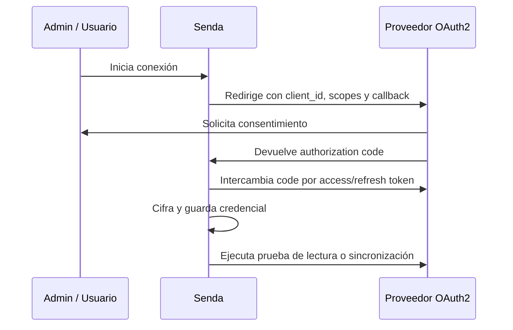

# 07. Integraciones OAuth2, Webhooks y Widgets de Terceros

> **Versión documentada:** v5.6.92 · **Última revisión:** 2026-05-27

> Este capítulo cubre integraciones delegadas con OAuth2, webhooks de entrada y salida, sincronización RAG externa y el estándar técnico para integrar widgets de herramientas de terceros dentro de la interfaz generativa (Generative UI). Mission Control se documenta en profundidad en el capítulo 05; aquí se lo menciona solo cuando participa en flujos de integración.

---

## OAuth2: Integraciones Delegadas

OAuth2 permite que Senda acceda a recursos externos en nombre de un usuario o tenant sin guardar contraseñas directas. Es el patrón recomendado para Google Drive, SharePoint/OneDrive, calendarios, correo y otros sistemas donde el usuario autoriza scopes específicos.

### Cuándo usar OAuth2

| Caso | Usar OAuth2 | Usar API Key / Token de tenant |
|---|---|---|
| Acceso por usuario a Drive, Calendar o Outlook | Sí | No |
| Integración corporativa compartida, como Jira o ERP interno | Depende del proveedor | Sí, si el proveedor entrega token de servicio |
| Sincronización RAG de documentos personales o de equipo | Sí | Solo si existe service account aprobada |
| Webhook público firmado por HMAC | No | Sí, usar signing secret |

### Buenas prácticas de OAuth2

1. Solicitar el mínimo scope posible. No pedir acceso de escritura si la integración solo lee documentos.
2. Separar credenciales de usuario y credenciales de tenant. No mezclar `USER_CREDS` con `TENANT_CREDS`.
3. Cifrar refresh tokens y no exponerlos en logs, payloads de prueba ni capturas.
4. Documentar vigencia, owner, proveedor, scopes aprobados y criterio de revocación.
5. Probar expiración y refresh antes del handover.

### Flujo recomendado



> Advertencia: una integración OAuth2 no queda lista al completar el consentimiento. Debe validarse con una acción o sincronización real, revisar logs y confirmar que el usuario correcto tiene acceso al recurso correcto.

## Webhooks: Entrada vs. Salida

Los webhooks conectan eventos entre Senda y sistemas externos.

| Tipo | Dirección | Ejemplo | Control principal |
|---|---|---|---|
| **Inbound** | Sistema externo → Senda | Un CRM avisa que cambió una oportunidad | Firma HMAC, source id, observer |
| **Outbound** | Senda → Sistema externo | Senda notifica a Slack que falló una acción crítica | URL destino, headers, retry, auditoría |

Un webhook inbound debe diseñarse como una frontera pública: validar firma, normalizar payload, registrar fuente y disparar observers específicos. Un webhook outbound debe tratarse como una acción de integración: credenciales seguras, retries razonables, payload mínimo y logs auditables.

---

## Relación con Mission Control (Cap. 05)

> 📖 Los conceptos de Schedules, Observers, Rollback, ROI Dashboard, Templates y Form Nodes se documentan en profundidad en el **[Cap. 05 — Mission Control](./05_mission_control.md)**. Este capítulo los menciona solo cuando participan en flujos de integración.

**Resumen de qué cubre cada capítulo:**

| Tema | Cap. 05 (Mission Control) | Cap. 07 (Este capítulo) |
|------|--------------------------|------------------------|
| Schedules y Observers | ✅ Documentación completa, wizard, dry run | Solo cuando se integran con webhooks |
| ROI Dashboard | ✅ Configuración, cálculo, exportación | — |
| Templates | ✅ Catálogo completo, instalación | — |
| Rollback | ✅ Procedimiento, limitaciones | — |
| Form Nodes | ✅ 9 tipos de campo, directivas | — |
| OAuth2 | — | ✅ Documentación completa |
| Webhooks inbound/outbound | Mención como trigger de observers | ✅ Documentación completa, HMAC, EventBus |
| Widgets de terceros | — | ✅ Documentación completa, postMessage, manifest |

---

## Integración de Widgets de Terceros (`third_party_widget`)

Para ampliar el catálogo de Generative UI sin necesidad de modificar el código principal de Senda, se define el cargador de widgets de terceros (`third_party_widget`). Este motor permite renderizar páginas web externas dentro de un contenedor iframe completamente aislado y seguro.

### Arquitectura de Seguridad (Sandboxing)

El cargador de widgets monta un elemento `<iframe>` bajo estrictas restricciones de seguridad para evitar vectores de ataque de inyección y XSS (Cross-Site Scripting):
*   **Atributo sandbox**: Se utiliza `sandbox="allow-scripts"`. Queda estrictamente **prohibido** declarar `allow-same-origin`, garantizando que el widget externo se ejecute en un origen opaco y no tenga acceso a `localStorage`, cookies o DOM del host de Senda.
*   **Referrer Policy**: Se configura `referrerPolicy="no-referrer"` para no filtrar credenciales ni tokens del tenant en los headers HTTP del iframe.

### Protocolo de Comunicación (postMessage API)

Dado que las herramientas corren en dominios y orígenes diferentes, la comunicación bidireccional se realiza mediante la API nativa de `window.postMessage`.

#### 1. Inicialización (Host Senda ──▶ Widget Externo)

Cuando el iframe termina de cargarse (`onLoad`), Senda despacha el evento de inicialización `SENDA_WIDGET_INIT`:

```javascript
window.parent.postMessage({
  type: 'SENDA_WIDGET_INIT',
  version: '1.0.0',
  payload: {
    dataset: { /* Datos dinámicos devueltos por la acción */ },
    theme: {
      mode: 'dark', // 'light' | 'dark'
      accentColor: '#6366f1', // Color de acento de Senda
      borderRadius: '1rem' // Estilo de bordes de Senda
    },
    locale: 'es-ES'
  }
}, '*');
```

#### 2. Acciones del Widget (Widget Externo ──▶ Host Senda)

El widget de terceros puede comunicarse con Senda enviando un mensaje con la estructura `SENDA_WIDGET_EVENT`. Senda expone dos acciones soportadas:

##### A. Redimensionar Altura (`resize`)
Indica al host de Senda el tamaño que el widget requiere para evitar barras de scroll dobles. La altura permitida se encuentra limitada entre `100px` y `800px`.
```javascript
window.parent.postMessage({
  type: 'SENDA_WIDGET_EVENT',
  action: 'resize',
  payload: {
    height: 450 // Altura en píxeles
  }
}, '*');
```

##### B. Enviar Mensaje de Chat (`sendMessage`)
Permite al widget enviar un mensaje en texto plano a la conversación activa en nombre del usuario, reactivando al agente de IA con nuevos datos.
```javascript
window.parent.postMessage({
  type: 'SENDA_WIDGET_EVENT',
  action: 'sendMessage',
  payload: {
    text: 'Quiero registrar la reserva seleccionada'
  }
}, '*');
```

### Configuración del Manifest de Widget

Cada widget de terceros debe contar con un archivo de manifiesto `senda-widget.json` en su raíz que describe sus capacidades e integración:

```json
{
  "id": "my-custom-dashboard",
  "name": "Dashboard Operativo Corporativo",
  "version": "1.0.0",
  "description": "Widget para ver métricas de maquinaria industrial en tiempo real.",
  "entryUrl": "https://widgets.empresa.com/industrial-dashboard/index.html",
  "requiredProps": ["machineId", "sensorRange"],
  "capabilities": ["resize", "sendMessage"],
  "security": {
    "cspOrigins": ["https://api.empresa.com"]
  }
}
```

### Configuración de la Acción en el Catálogo

Para usar el cargador en una acción de Senda:
1.  Define el motor de la acción como un **Endpoint HTTP** o **Script**.
2.  En la respuesta JSON de tu API, debes devolver las siguientes claves básicas para el mapeo:
    *   `presentation_type`: Debe valer exactamente `third_party_widget`.
    *   `dataset`: Un objeto que contenga la URL del widget y los datos dinámicos:
        ```json
        {
          "iframeUrl": "https://widgets.empresa.com/industrial-dashboard/index.html",
          "title": "Monitor de Turbina Principal",
          "dataset": {
            "machineId": "TURBINE-09X",
            "sensorRange": "high"
          }
        }
        ```

---

## Checklist del Capítulo

- [ ] ¿Cada integración OAuth2 tiene los scopes mínimos configurados?
- [ ] ¿Los tokens de refresh se almacenan cifrados en la Bóveda?
- [ ] ¿Los webhooks entrantes validan el `signing_secret` del origen?
- [ ] ¿Cada webhook tiene un handler que procesa errores sin romper el flujo?
- [ ] ¿Las URLs de callback están configuradas correctamente en el proveedor externo?
- [ ] ¿Se probó la integración con datos reales en ambiente QA?

---

> 📖 **Anterior:** [06 — MCP Client y MCP Server](./06_mcp_client_y_server.md)  
> 📖 **Siguiente:** [08 — Debugging Técnico](./08_troubleshooting.md)
